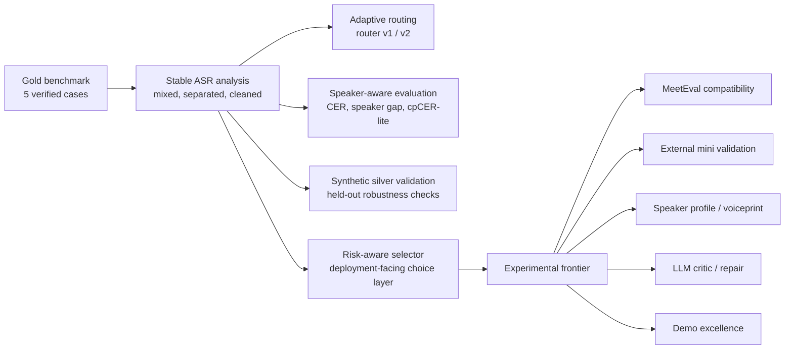

# When Should We Separate? Boundary-aware, Compute-aware, Speaker-aware, and Agent-augmented ASR for Overlapping Speech

We study when speech separation helps or hurts multi-speaker ASR, and we build adaptive routing, risk-aware evaluation, and agent-friendly research infrastructure for speaker-attributed transcription.

## What This Project Is

- ASR pipeline optimization
- adaptive routing
- error type analysis
- speaker-aware evaluation
- synthetic robustness validation
- risk-aware selection
- agentic research workspace

## What This Project Is Not

- not training a new ASR model
- not training a new speech separation model
- not claiming synthetic silver results as gold
- not using ground-truth CER as router input

## Main Results

### Gold Benchmark Averages

| strategy | average CER |
| --- | ---: |
| fixed_mixed_whisper | 0.302093 |
| fixed_separated_whisper | 0.191846 |
| fixed_separated_whisper_cleaned | 0.181681 |
| router_v2 | 0.120042 |
| oracle_best | 0.120042 |

### Synthetic Validation

| setting | v1 | v2 | oracle |
| --- | ---: | ---: | ---: |
| original 25 | 0.350902 | 0.167553 | 0.082239 |
| held-out split test | 0.361350 | 0.335326 | 0.115181 |

### Risk-Aware Selector

| strategy | average CER |
| --- | ---: |
| risk_aware_selector | 0.134587 |
| router_v2 | 0.120042 |
| oracle_best | 0.120042 |

### Experimental Compute-aware Cascade

| strategy | average CER | relative cost vs fixed separated |
| --- | ---: | ---: |
| router_v2_costed | 0.120042 | 0.929533 |
| risk_aware_costed | 0.134587 | 0.929533 |
| budget_cascade | 0.134587 | 0.929533 |

This result is labeled `experimental/frontier`. It uses observed runtime fields when available and proxy costs otherwise; CER is used only after each route is fixed.

Current runtime provenance audit result:

- gold cascade strategies: `5/5` observed runtime selections for every reported strategy
- proxy cost is currently a safety fallback, not an active source for the committed gold cascade tables

### Synthetic Split Cascade Validation

| strategy | average CER | relative cost vs fixed separated |
| --- | ---: | ---: |
| router_v2_synthetic_costed | 0.285187 | 0.704888 |
| budget_cascade | 0.367582 | 0.854921 |
| cleaned_preferred_cascade | 0.249877 | 0.945686 |

This result is labeled `synthetic/silver` plus `experimental/frontier`. It extends the cascade analysis onto the held-out synthetic split benchmark without promoting silver evidence into gold claims.

Current runtime provenance audit result:

- synthetic split cascade strategies: `100/100` observed runtime selections on `ALL`, and `50/50` on both `DEV` and `TEST`
- proxy cost remains available for missing-runtime edge cases, but it is not currently driving the committed synthetic split cascade outputs

Current runtime normalization audit result:

- gold `router_v2_costed / risk_aware_costed / budget_cascade`: average selected-route `RTF = 0.080646`
- synthetic split `router_v2_synthetic_costed`: average selected-route `RTF = 0.148342`
- synthetic split `budget_cascade`: average selected-route `RTF = 0.148228`
- this `RTF` is normalized by the selected route's processed audio duration, so separated routes divide by two-stream duration rather than one mixed-stream duration

Current Pareto frontier audit result:

- gold `ALL` frontier: `fixed_mixed_whisper`, `router_v2_costed`
- gold `risk_aware_costed` and `budget_cascade` are dominated by `router_v2_costed`
- synthetic split `ALL` frontier: `fixed_mixed_whisper`, `fixed_separated_whisper_cleaned`, `router_v2_synthetic_costed`, `cleaned_preferred_cascade`
- synthetic split `budget_cascade` is dominated by `router_v2_synthetic_costed`

Current recommendation card result:

- gold `ALL`
  - `accuracy_first`: `router_v2_costed`
  - `cost_first`: `fixed_mixed_whisper`
  - `balanced`: `router_v2_costed`
- synthetic split `ALL`
  - `accuracy_first`: `fixed_separated_whisper_cleaned`
  - `cost_first`: `fixed_mixed_whisper`
  - `balanced`: `router_v2_synthetic_costed`

## Project Map

The repository now has a stable baseline and a breadth-first frontier queue. The diagram below shows the main flow at a glance.



The current breadth-first queue is documented here:

- [Frontier execution queue](results/figures/frontier_execution_queue.md)
- [Project harness report](results/figures/project_harness_report.md)

Queue order:

1. `meeteval_compatibility`
2. `external_validation`
3. `speaker_profile`
4. `llm_critic`
5. `demo_excellence`

These are coordination targets, not new benchmark claims.

Current robustness gap result:

- best shared cross-dataset stability: `fixed_separated_whisper_cleaned` with `cer_gap_vs_gold = -0.00266`
- strongest adaptive shared route: `router_v2` with `cer_gap_vs_gold = 0.165145`
- `budget_cascade` degrades more on synthetic split, with `cer_gap_vs_gold = 0.232995`

Current recommendation stability result:

- `cost_first` is fully stable across the audited scopes with `consensus_ratio = 1.0`
- `balanced` has `consensus_ratio = 0.75`, splitting between `router_v2_costed` and `router_v2_synthetic_costed`
- `accuracy_first` also has `consensus_ratio = 0.75`, splitting between `router_v2_costed` and `fixed_separated_whisper_cleaned`

Current family-level recommendation stability result:

- after normalizing `router_v2_costed` and `router_v2_synthetic_costed` into the same family, `balanced` rises to `consensus_ratio = 1.0`
- `cost_first` remains fully stable at `consensus_ratio = 1.0`
- `accuracy_first` still splits between `router_v2` and `fixed_separated_whisper_cleaned`

Current decision matrix result:

- `accuracy_first`: gold points to `router_v2_costed`, synthetic `ALL` points to `fixed_separated_whisper_cleaned`, and the shared robustness rank is `1`
- `balanced`: points to the `router_v2` family with `family_consensus_ratio = 1.0`
- `cost_first`: stays on `fixed_mixed_whisper` with `family_consensus_ratio = 1.0`, but carries the weakest synthetic `ALL` CER among the three profiles

Current frontier report result:

- `results/figures/cascade_frontier_report.md` now consolidates the decision matrix, family stability, and robustness highlights in one generated note

Current artifact index result:

- `results/figures/cascade_artifact_index.md` now acts as the registry for the cascade evidence stack, with per-artifact labels, generator commands, and intended usage notes

Current benchmark readiness result:

- `results/figures/cascade_benchmark_readiness.md` now prioritizes which cascade artifacts should be refreshed first once controlled hardware/runtime evidence replaces the current repo-local timing signals

Current benchmark plan result:

- `results/figures/cascade_benchmark_plan.md` now turns that readiness ordering into a staged handoff plan with dataset scope, command, and refresh targets

Current profile playbook result:

- `results/figures/cascade_profile_playbook.md` now translates `accuracy_first / balanced / cost_first` into a concise deployment-facing guide for when to use each profile

Current benchmark checklist result:

- `results/figures/cascade_benchmark_checklist.md` now records which hardware/runtime metadata and acceptance checks should be captured for each benchmark phase

Current benchmark manifest template result:

- `results/tables/cascade_benchmark_manifest_template.csv` now provides a fill-in template for recording per-phase benchmark session metadata during controlled timing runs

Current benchmark status result:

- `results/figures/cascade_benchmark_status.md` now acts as a phase-by-phase status board that shows which benchmark steps are still template-only, how many fields remain open, which blocker category each phase is in, and what next action should happen first

Current benchmark execution summary result:

- `results/figures/cascade_benchmark_execution_summary.md` now provides the phase-level blocker totals, readiness rollup, and top next action before reading the per-step status board

Current benchmark execution queue result:

- `results/figures/cascade_benchmark_execution_queue.md` now provides the ordered next-run list so contributors can see what to execute or review first

Current benchmark session ledger result:

- `results/figures/cascade_benchmark_session_ledger.md` now provides the evidence anchor and completion note for each queued benchmark step

Current benchmark dependency graph result:

- `results/figures/cascade_benchmark_dependency_graph.md` now shows which benchmark step unlocks each downstream benchmark refresh

Current benchmark blocker matrix result:

- `results/figures/cascade_benchmark_blocker_matrix.md` now shows blocker type, queue priority, dependency state, and pending-field scale in one place

Current benchmark runbook card result:

- `results/figures/cascade_benchmark_runbook_card.md` now gives the first-step action, required evidence, and completion target as a one-page execution card

Current benchmark milestone card result:

- `results/figures/cascade_benchmark_milestone_card.md` now shows the next milestone, what the first step unlocks, and how many phases remain

Current benchmark phase checkpoint card result:

- `results/figures/cascade_benchmark_phase_checkpoint_card.md` now shows each phase's blocker, next action, and completion signal in one short card

Current benchmark completion dashboard result:

- `results/figures/cascade_benchmark_completion_dashboard.md` now shows the current start step, dominant blocker family, and pending phase count in one short dashboard

Current benchmark operator brief result:

- `results/figures/cascade_benchmark_operator_brief.md` now gives the current benchmark operator a plain-language next step, evidence target, and urgency note

Current benchmark frontier bridge result:

- `results/figures/cascade_benchmark_frontier_bridge.md` now links the current benchmark operator step to the broader breadth-first frontier queue
- This bridge is a coordination artifact rather than a new benchmark result: it explains why the runtime foundation step still matters even while narrower frontier handoffs are queued

Current benchmark frontier bridge checklist result:

- `results/figures/cascade_benchmark_frontier_bridge_checklist.md` now turns that bridge into a row-by-row verification checklist
- This checklist remains coordination-only and keeps the bridge reason visible without claiming that any benchmark work has already been executed

Current benchmark evidence receipt result:

- `results/figures/cascade_benchmark_evidence_receipt.md` now shows what the current benchmark run must write back, which completion signal closes it, and what follow-up note should remain

Current benchmark evidence checklist result:

- `results/figures/cascade_benchmark_evidence_checklist.md` now turns that receipt into an ordered writeback checklist
- This checklist stays coordination-only and makes the receipt target explicit without claiming that any benchmark execution has already happened

Current benchmark receipt bridge result:

- `results/figures/cascade_benchmark_receipt_bridge.md` now links the benchmark handoff packet directly to the benchmark evidence receipt
- This bridge is still coordination-only: it names the current benchmark step, the prerequisite packet, and the receipt target without claiming that any benchmark execution has already happened

Current benchmark receipt bridge checklist result:

- `results/figures/cascade_benchmark_receipt_bridge_checklist.md`
- `results/tables/cascade_benchmark_receipt_bridge_checklist.csv`
- This checklist now turns the receipt bridge into an ordered writeback path. It stays explicitly coordination-only, keeps the receipt target visible, and helps a future agent complete the benchmark closeout sequence in order.

Current benchmark handoff packet result:

- `results/figures/cascade_benchmark_handoff_packet.md` now acts as the single-entry benchmark handoff note across readiness, plan, checklist, manifest template, execution summary, execution queue, session ledger, dependency graph, blocker matrix, runbook card, milestone card, phase checkpoint card, completion dashboard, operator brief, evidence receipt, and status tracking
- That packet also includes the frontier bridge checklist and receipt bridge checklist so the benchmark closeout path stays visible in one place

Current frontier harness breadth result:

- `results/figures/project_harness_report.md` now includes a `frontier_status` table so contributors can see the current breadth-first status of `speaker_profile`, `meeteval_compatibility`, `llm_critic`, `external_validation`, and `demo_excellence`

Current frontier status checklist result:

- `results/figures/frontier_status_checklist.md` now turns that breadth-first status table into a row-by-row verification checklist
- This checklist remains coordination-only and keeps the evidence path visible without claiming that any frontier work has already been executed

Current frontier execution queue result:

- `results/figures/frontier_execution_queue.md` now turns that breadth-first status view into an ordered next-step queue
- This queue is a coordination artifact rather than a new experiment result: it simply ranks which frontier handoff should be picked up first based on the current generated cards

Current frontier execution queue checklist result:

- `results/figures/frontier_execution_queue_checklist.md` now turns that queue into a row-by-row verification checklist
- This checklist remains coordination-only and keeps the queue order visible without claiming that any frontier work has already been executed

Current frontier focus card result:

- `results/figures/frontier_focus_card.md` now compresses that queue into a one-glance current priority card
- This card is still only a coordination artifact: it highlights the current queue head so the next contributor can start faster without reading the full queue first

Current frontier go-no-go board result:

- `results/figures/frontier_go_no_go_board.md`
- `results/tables/frontier_go_no_go_board.csv`
- The board now compresses all five frontier tracks into one top-level view, showing four tracks ready for narrow next steps and `external_validation` still blocked by license confirmation.

Current frontier go-no-go summary result:

- `results/figures/frontier_go_no_go_summary.md`
- `results/tables/frontier_go_no_go_summary.csv`
- The summary records `highest_priority_ready_frontier = meeteval_compatibility`, `highest_priority_blocked_frontier = external_validation`, and keeps the whole conclusion explicitly at the coordination layer rather than claiming frontier completion.

Current frontier execution queue status result:

- `results/figures/frontier_execution_queue_status.md`
- `results/tables/frontier_execution_queue_status.csv`
- The unified queue status now uses the same five-track frontier surface as the top-level go/no-go board, so `combined_chain_status` only becomes ready when `meeteval_compatibility`, `speaker_profile`, `external_validation`, `llm_critic`, and `demo_excellence` are all in their narrow execution-ready states.

Current frontier operator next-action card result:

- `results/figures/frontier_operator_next_action_card.md`
- `results/tables/frontier_operator_next_action_card.csv`
- The card turns the top-level board into two explicit operator lanes: push the ready MeetEval receipt path first, and separately clear the external validation license blocker.

Current frontier operator next-action summary result:

- `results/figures/frontier_operator_next_action_summary.md`
- `results/tables/frontier_operator_next_action_summary.csv`
- The summary records the operator sequence `ready_lane:meeteval_compatibility -> blocked_lane:external_validation` without claiming either frontier has been completed.

Current frontier operator next-action bridge checklist result:

- `results/figures/frontier_operator_next_action_bridge_checklist.md`
- `results/tables/frontier_operator_next_action_bridge_checklist.csv`
- The checklist turns that two-lane operator card into a pre-open verification path so the next contributor checks the card before opening either the MeetEval receipt target or the external validation license bridge.

Current frontier operator next-action operator brief result:

- `results/figures/frontier_operator_next_action_operator_brief.md`
- `results/tables/frontier_operator_next_action_operator_brief.csv`
- The brief compresses the same two-lane state into a plain-language operator summary: advance `meeteval_compatibility` first, keep `external_validation` visible as the current unblock target, and follow the card plus bridge checklist as the evidence path.

Current frontier operator next-action runbook card result:

- `results/figures/frontier_operator_next_action_runbook_card.md`
- `results/tables/frontier_operator_next_action_runbook_card.csv`
- The runbook card turns that operator summary into a one-page first-action execution card with the ready-lane target, required evidence path, and narrow completion signal.

Current frontier operator next-action frontier bridge result:

- `results/figures/frontier_operator_next_action_frontier_bridge.md`
- `results/tables/frontier_operator_next_action_frontier_bridge.csv`
- The bridge confirms that the new top-level runbook card still aligns with the broader frontier ready queue head, keeping the first action tied back to the unified board.

Current frontier execution queue handoff packet result:

- `results/figures/frontier_execution_queue_handoff_packet.md`
- `results/tables/frontier_execution_queue_handoff_packet.csv`
- The packet consolidates the execution queue status, queue summary, per-frontier handoff layers, the operator brief, the runbook card, the runbook bridge checklist, the phase checkpoint card, the milestone card, and the new completion dashboard into one single-entry coordination artifact.

Current frontier execution queue handoff packet bridge checklist result:

- `results/figures/frontier_execution_queue_handoff_packet_bridge_checklist.md`
- `results/tables/frontier_execution_queue_handoff_packet_bridge_checklist.csv`
- The checklist verifies that execution queue handoff packet before the next contributor reopens the plain-language execution queue operator brief.

Current frontier execution queue operator brief result:

- `results/figures/frontier_execution_queue_operator_brief.md`
- `results/tables/frontier_execution_queue_operator_brief.csv`
- The brief turns the first execution-queue handoff row into a plain-language next-step card for the current operator.

Current frontier execution queue runbook card result:

- `results/figures/frontier_execution_queue_runbook_card.md`
- `results/tables/frontier_execution_queue_runbook_card.csv`
- The runbook card turns that operator brief into a one-page first-action execution card for the current execution-queue target.

Current frontier execution queue runbook bridge checklist result:

- `results/figures/frontier_execution_queue_runbook_bridge_checklist.md`
- `results/tables/frontier_execution_queue_runbook_bridge_checklist.csv`
- The checklist verifies that execution queue runbook card before the next contributor opens the current receipt target.

Current frontier execution queue phase checkpoint card result:

- `results/figures/frontier_execution_queue_phase_checkpoint_card.md`
- `results/tables/frontier_execution_queue_phase_checkpoint_card.csv`
- The checkpoint card narrows that execution-queue runbook to the exact completion signal for the current first target.

Current frontier execution queue phase checkpoint bridge checklist result:

- `results/figures/frontier_execution_queue_phase_checkpoint_bridge_checklist.md`
- `results/tables/frontier_execution_queue_phase_checkpoint_bridge_checklist.csv`
- The checklist verifies the phase checkpoint card before the milestone card is reopened for the current first target.

Current frontier execution queue milestone card result:

- `results/figures/frontier_execution_queue_milestone_card.md`
- `results/tables/frontier_execution_queue_milestone_card.csv`
- The milestone card shows what the current first execution-queue checkpoint unlocks next after the present target closes.

Current frontier execution queue milestone bridge checklist result:

- `results/figures/frontier_execution_queue_milestone_bridge_checklist.md`
- `results/tables/frontier_execution_queue_milestone_bridge_checklist.csv`
- The checklist verifies the execution-queue milestone unlock path before the completion dashboard is reopened.

Current frontier execution queue completion dashboard result:

- `results/figures/frontier_execution_queue_completion_dashboard.md`
- `results/tables/frontier_execution_queue_completion_dashboard.csv`
- The dashboard compresses the current execution-queue state into one glance: current first frontier, next milestone, remaining visible fronts, and the dominant coordination blocker.

Current frontier execution queue completion dashboard bridge checklist result:

- `results/figures/frontier_execution_queue_completion_dashboard_bridge_checklist.md`
- `results/tables/frontier_execution_queue_completion_dashboard_bridge_checklist.csv`
- The checklist turns that execution-queue dashboard into a pre-open verification step before the runbook card is reopened for the current first frontier.

Current frontier execution queue status preflight bridge checklist result:

- `results/figures/frontier_execution_queue_status_preflight_bridge_checklist.md`
- `results/tables/frontier_execution_queue_status_preflight_bridge_checklist.csv`
- The checklist verifies the completion-dashboard bridge before the execution-queue status rollup is reopened.

Current frontier execution queue status reentry card result:

- `results/figures/frontier_execution_queue_status_reentry_card.md`
- `results/tables/frontier_execution_queue_status_reentry_card.csv`
- The card gives the next contributor a one-page instruction for reopening the execution-queue status rollup after preflight.

Current frontier execution queue status reentry bridge checklist result:

- `results/figures/frontier_execution_queue_status_reentry_bridge_checklist.md`
- `results/tables/frontier_execution_queue_status_reentry_bridge_checklist.csv`
- The checklist verifies the status reentry card before the execution-queue handoff bridge is opened.

Current frontier execution queue receipt open card result:

- `results/figures/frontier_execution_queue_receipt_open_card.md`
- `results/tables/frontier_execution_queue_receipt_open_card.csv`
- The card gives the next contributor the first receipt target to open after the execution-queue handoff bridge is confirmed.

Current frontier operator next-action frontier bridge checklist result:

- `results/figures/frontier_operator_next_action_frontier_bridge_checklist.md`
- `results/tables/frontier_operator_next_action_frontier_bridge_checklist.csv`
- The checklist turns that top-level frontier bridge into a pre-open verification step so the next contributor confirms queue alignment before reopening the runbook card.

Current frontier operator next-action handoff packet result:

- `results/figures/frontier_operator_next_action_handoff_packet.md`
- `results/tables/frontier_operator_next_action_handoff_packet.csv`
- The packet consolidates the whole top-level operator chain into one entrypoint so the next contributor can open the right artifacts in order without reconstructing the chain manually.

Current frontier operator next-action handoff packet bridge checklist result:

- `results/figures/frontier_operator_next_action_handoff_packet_bridge_checklist.md`
- `results/tables/frontier_operator_next_action_handoff_packet_bridge_checklist.csv`
- The checklist turns that packet into a pre-open verification step so the next contributor confirms the packet context before reopening the top-level operator card.

Current frontier operator next-action phase checkpoint card result:

- `results/figures/frontier_operator_next_action_phase_checkpoint_card.md`
- `results/tables/frontier_operator_next_action_phase_checkpoint_card.csv`
- The checkpoint card isolates the current ready-lane completion signal so the next contributor can see exactly what must be true before the top-level operator chain should advance.

Current frontier operator next-action milestone card result:

- `results/figures/frontier_operator_next_action_milestone_card.md`
- `results/tables/frontier_operator_next_action_milestone_card.csv`
- The milestone card shows what the current ready-lane checkpoint unlocks next, with `external_validation` now made explicit as the next visible coordination target after the first checkpoint closes.

Current frontier operator next-action completion dashboard result:

- `results/figures/frontier_operator_next_action_completion_dashboard.md`
- `results/tables/frontier_operator_next_action_completion_dashboard.csv`
- The dashboard compresses the current top-level operator state into one glance: `meeteval_compatibility` still leads, `external_validation` remains the dominant blocker, and the current milestone is still `ready_lane_checkpoint_complete`.

Current frontier operator next-action completion dashboard bridge checklist result:

- `results/figures/frontier_operator_next_action_completion_dashboard_bridge_checklist.md`
- `results/tables/frontier_operator_next_action_completion_dashboard_bridge_checklist.csv`
- The checklist turns that dashboard into a pre-open verification step so the next contributor confirms the top-level state summary before reopening the runbook card.

Current frontier operator next-action status result:

- `results/figures/frontier_operator_next_action_status.md`
- `results/tables/frontier_operator_next_action_status.csv`
- The status rollup compresses the ready lane, blocker lane, milestone, and dashboard bridge into one machine-friendly top-level coordination snapshot.

Current frontier operator next-action status bridge checklist result:

- `results/figures/frontier_operator_next_action_status_bridge_checklist.md`
- `results/tables/frontier_operator_next_action_status_bridge_checklist.csv`
- The checklist verifies that unified top-level status snapshot before the next contributor opens the broader handoff packet.

Current frontier operator next-action status handoff result:

- `results/figures/frontier_operator_next_action_status_handoff.md`
- `results/tables/frontier_operator_next_action_status_handoff.csv`
- The handoff splits that top-level status snapshot into one ready-lane action and one blocker-lane containment action.

Current frontier operator next-action status handoff bridge checklist result:

- `results/figures/frontier_operator_next_action_status_handoff_bridge_checklist.md`
- `results/tables/frontier_operator_next_action_status_handoff_bridge_checklist.csv`
- The checklist verifies each lane-specific top-level handoff before the next contributor opens the lane target artifact.

Current frontier operator next-action status handoff completion summary result:

- `results/figures/frontier_operator_next_action_status_handoff_completion_summary.md`
- `results/tables/frontier_operator_next_action_status_handoff_completion_summary.csv`
- The summary compresses the top-level ready/block handoff into one queue-level state row.

Current frontier operator next-action status handoff completion summary bridge checklist result:

- `results/figures/frontier_operator_next_action_status_handoff_completion_summary_bridge_checklist.md`
- `results/tables/frontier_operator_next_action_status_handoff_completion_summary_bridge_checklist.csv`
- The checklist verifies that queue-level top-level handoff summary before the next contributor reopens the lane-level handoff.

Current frontier operator next-action status handoff packet result:

- `results/figures/frontier_operator_next_action_status_handoff_packet.md`
- `results/tables/frontier_operator_next_action_status_handoff_packet.csv`
- The packet now consolidates the whole top-level status/handoff subchain into one single-entry coordination artifact, including the operator brief, operator-brief bridge, operator-brief bridge checklist, runbook, runbook bridge checklist, checkpoint, phase-checkpoint bridge checklist, milestone, milestone bridge checklist, completion dashboard, completion-dashboard status preflight bridge checklist, and the newer `status_handoff_status` rollup layers.

Current frontier operator next-action status handoff packet bridge checklist result:

- `results/figures/frontier_operator_next_action_status_handoff_packet_bridge_checklist.md`
- `results/tables/frontier_operator_next_action_status_handoff_packet_bridge_checklist.csv`
- The checklist now verifies that packet before the next contributor reopens the plain-language `status/handoff` operator brief.

Current frontier operator next-action status handoff operator brief result:

- `results/figures/frontier_operator_next_action_status_handoff_operator_brief.md`
- `results/tables/frontier_operator_next_action_status_handoff_operator_brief.csv`
- The brief turns the queue-level status/handoff stack into one plain-language next-step card for the current operator.

Current frontier operator next-action status handoff operator brief bridge result:

- `results/figures/frontier_operator_next_action_status_handoff_operator_brief_bridge.md`
- `results/tables/frontier_operator_next_action_status_handoff_operator_brief_bridge.csv`
- The bridge connects the plain-language `status/handoff` operator brief to the current runbook card target.

Current frontier operator next-action status handoff operator brief bridge checklist result:

- `results/figures/frontier_operator_next_action_status_handoff_operator_brief_bridge_checklist.md`
- `results/tables/frontier_operator_next_action_status_handoff_operator_brief_bridge_checklist.csv`
- The checklist verifies that bridge before the next contributor opens the current runbook card target.

Current frontier operator next-action status handoff runbook card result:

- `results/figures/frontier_operator_next_action_status_handoff_runbook_card.md`
- `results/tables/frontier_operator_next_action_status_handoff_runbook_card.csv`
- The runbook card condenses the current ready-lane action into one one-page execution card.

Current frontier operator next-action status handoff runbook bridge checklist result:

- `results/figures/frontier_operator_next_action_status_handoff_runbook_bridge_checklist.md`
- `results/tables/frontier_operator_next_action_status_handoff_runbook_bridge_checklist.csv`
- The checklist verifies that runbook card before the next contributor opens the narrower phase checkpoint target.

Current frontier operator next-action status handoff phase checkpoint card result:

- `results/figures/frontier_operator_next_action_status_handoff_phase_checkpoint_card.md`
- `results/tables/frontier_operator_next_action_status_handoff_phase_checkpoint_card.csv`
- The phase checkpoint card narrows that runbook to the exact completion signal for the current step.

Current frontier operator next-action status handoff phase checkpoint bridge checklist result:

- `results/figures/frontier_operator_next_action_status_handoff_phase_checkpoint_bridge_checklist.md`
- `results/tables/frontier_operator_next_action_status_handoff_phase_checkpoint_bridge_checklist.csv`
- The checklist verifies that phase checkpoint card before the next contributor opens the milestone card target.

Current frontier operator next-action status handoff milestone card result:

- `results/figures/frontier_operator_next_action_status_handoff_milestone_card.md`
- `results/tables/frontier_operator_next_action_status_handoff_milestone_card.csv`
- The milestone card shows what the current ready-lane checkpoint unlocks next inside the `status/handoff` subchain, with `external_validation` kept explicit as the next visible coordination target after the ready lane closes.

Current frontier operator next-action status handoff milestone bridge checklist result:

- `results/figures/frontier_operator_next_action_status_handoff_milestone_bridge_checklist.md`
- `results/tables/frontier_operator_next_action_status_handoff_milestone_bridge_checklist.csv`
- The checklist verifies that milestone card before the next contributor opens the completion dashboard target.

Current frontier operator next-action status handoff completion dashboard result:

- `results/figures/frontier_operator_next_action_status_handoff_completion_dashboard.md`
- `results/tables/frontier_operator_next_action_status_handoff_completion_dashboard.csv`
- The completion dashboard compresses the current `status/handoff` subchain into one glance: `meeteval_compatibility` still leads, `external_validation` remains the dominant blocker, and the next milestone is still `ready_lane_checkpoint_complete`.

Current frontier operator next-action status handoff completion dashboard bridge checklist result:

- `results/figures/frontier_operator_next_action_status_handoff_completion_dashboard_bridge_checklist.md`
- `results/tables/frontier_operator_next_action_status_handoff_completion_dashboard_bridge_checklist.csv`
- The bridge checklist turns that `status/handoff` dashboard into a verification gate before reopening the current runbook card target.

Current frontier operator next-action status handoff status preflight bridge checklist result:

- `results/figures/frontier_operator_next_action_status_handoff_status_preflight_bridge_checklist.md`
- `results/tables/frontier_operator_next_action_status_handoff_status_preflight_bridge_checklist.csv`
- The checklist verifies that completion-dashboard bridge layer before the next contributor opens the machine-readable status rollup.

Current frontier operator next-action status handoff status result:

- `results/figures/frontier_operator_next_action_status_handoff_status.md`
- `results/tables/frontier_operator_next_action_status_handoff_status.csv`
- The status rollup compresses the current `status/handoff` queue, milestone, dashboard, and dashboard bridge into one machine-friendly coordination snapshot.

Current frontier operator next-action status handoff status bridge checklist result:

- `results/figures/frontier_operator_next_action_status_handoff_status_bridge_checklist.md`
- `results/tables/frontier_operator_next_action_status_handoff_status_bridge_checklist.csv`
- The bridge checklist turns that `status/handoff` status rollup into a verification gate before reopening the broader `status/handoff` packet.

Current frontier focus checklist result:

- `results/figures/frontier_focus_card_checklist.md` now turns that focus card into a one-glance verification checklist
- This checklist remains coordination-only and keeps the current action visible without claiming that any frontier work has already been executed

Current frontier handoff packet result:

- `results/figures/frontier_handoff_packet.md` now points that current queue head directly at the next artifact to open
- This remains coordination-only: it links the current frontier, next artifact, and expected evidence target without claiming that the underlying frontier work has already been executed

Current frontier handoff checklist result:

- `results/figures/frontier_handoff_checklist.md` now turns the handoff packet into an ordered open-artifact checklist
- This checklist remains coordination-only and keeps the next artifact visible without claiming that any frontier work has already been executed

Current frontier receipt packet result:

- `results/figures/frontier_receipt_packet.md` now points that same queue head directly at its receipt-level writeback target
- This remains coordination-only as well: it links the current frontier, prerequisite artifact, and receipt target without claiming that the queued frontier work has already been executed

Current frontier receipt checklist result:

- `results/figures/frontier_receipt_checklist.md` now turns that receipt packet into an ordered writeback checklist
- This checklist remains coordination-only and keeps the receipt target explicit without claiming that any frontier work has already been executed

Current frontier receipt board result:

- `results/figures/frontier_receipt_board.md` now condenses the breadth-first set into a single receipt snapshot
- This remains coordination-only and keeps queue order, pickup artifact, and receipt target visible together for the next pass

Current frontier receipt map result:

- `results/figures/frontier_receipt_map.md` now lays out the receipt path for all current frontiers, not just the queue head
- This also remains coordination-only: it shows queue order, prerequisite artifact, and receipt target across the breadth-first frontier set without claiming that any of those frontier steps have already been executed

Current frontier receipt map checklist result:

- `results/figures/frontier_receipt_map_checklist.md` now turns that map into a row-by-row verification checklist
- This checklist remains coordination-only and keeps the receipt path visible without claiming that any frontier work has already been executed

Current frontier parallel picklist result:

- `results/figures/frontier_parallel_picklist.md` now lays out which current frontiers can be picked up independently while keeping the breadth-first queue visible
- This remains coordination-only as well: it shows queue order, pickup artifact, and receipt target for parallel-friendly pickup without claiming that any frontier step has already been executed

Current frontier parallel picklist checklist result:

- `results/figures/frontier_parallel_picklist_checklist.md` now turns the parallel picklist into an ordered pickup checklist
- This checklist remains coordination-only and keeps the pickup artifact visible without claiming that any frontier step has already been executed

Current frontier coordination matrix result:

- `results/figures/frontier_coordination_matrix.md` now gives the breadth-first set a denser scan view
- This remains coordination-only and keeps queue order, entry artifact, pickup artifact, and receipt target visible together for the next pass

Current frontier coordination checklist result:

- `results/figures/frontier_coordination_checklist.md` now turns the coordination matrix into an ordered scan checklist
- This checklist remains coordination-only and keeps the entry artifact visible without claiming that any frontier work has already been executed

Current frontier writeback index result:

- `results/figures/frontier_writeback_index.md` now isolates the receipt target for a tighter writeback pass
- This remains coordination-only and keeps queue order, entry artifact, and receipt target visible together without claiming that any frontier work has already been executed

Current MeetEval compatibility result:

- `results/figures/meeteval_compatibility_note.md` now provides a segment-level compatibility bridge across verified gold references and speaker-attributed hypotheses without claiming a finished cpWER evaluation

Current MeetEval readiness result:

- `results/figures/meeteval_readiness.md` now turns that compatibility bridge into a narrow dry-run handoff card
- This still does not claim MeetEval or cpWER execution: it records that the export is ready for a diagnostic follow-up while also surfacing that cleaned fallback remains common in the current bridge

Current MeetEval dry run handoff result:

- `results/figures/meeteval_dry_run_handoff.md` now turns that readiness card into a one-row execution handoff packet
- This remains strictly pre-evaluation coordination: it recommends a single verified-case dry run, records the cleaned-fallback blocker, and names the expected evidence writeback without claiming that MeetEval or cpWER has already been run

Current MeetEval dry run receipt result:

- `results/figures/meeteval_dry_run_receipt.md` now materializes that expected evidence target as a template-only receipt
- This still does not claim execution: it defines the intended run scope, expected inputs, and post-run writeback note so the first diagnostic dry run has an explicit evidence slot before anyone fills it

Current MeetEval dry run bridge checklist result:

- `results/figures/meeteval_dry_run_bridge_checklist.md`
- `results/tables/meeteval_dry_run_bridge_checklist.csv`
- This checklist now turns the dry-run handoff into an ordered bridge verification path. It stays coordination-only and keeps the handoff and receipt targets visible without claiming any MeetEval or cpWER execution.

Current MeetEval dry run checklist result:

- `results/figures/meeteval_dry_run_checklist.md` now turns the verified cases into an ordered dry-run checklist so the next contributor can pick a concrete case before touching the receipt slot
- This remains pre-evaluation coordination: it ranks the raw separated case ahead of the cleaned-fallback cases and still does not claim that MeetEval or cpWER has been run

Current MeetEval dry run diagnostic result:

- `results/figures/meeteval_dry_run_diagnostic.md`
- `results/tables/meeteval_dry_run_diagnostic.csv`
- The first narrow diagnostic pass on `NoOverlap` validated the export path and updated the receipt to `diagnostic_complete` without claiming cpWER evaluation.

Current MeetEval dry run receipt checklist result:

- `results/figures/meeteval_dry_run_receipt_checklist.md`
- `results/tables/meeteval_dry_run_receipt_checklist.csv`
- This checklist now turns the dry-run receipt into an ordered verification path. It stays coordination-only and does not claim a finished MeetEval or cpWER evaluation.

Current MeetEval dry run receipt board result:

- `results/figures/meeteval_dry_run_receipt_board.md`
- `results/tables/meeteval_dry_run_receipt_board.csv`
- This board now condenses the dry-run receipt path into a single snapshot. It stays coordination-only and does not claim a finished MeetEval or cpWER evaluation.

Current MeetEval dry run receipt map result:

- `results/figures/meeteval_dry_run_receipt_map.md`
- `results/tables/meeteval_dry_run_receipt_map.csv`
- This map now condenses the dry-run receipt path across the receipt, checklist, and board views. It stays coordination-only and does not claim a finished MeetEval or cpWER evaluation.

Current MeetEval cpWER bridge result:

- `results/figures/meeteval_cpwer_bridge.md`
- `results/tables/meeteval_cpwer_bridge.csv`
- The all-gold cpWER bridge-lite pass reports `average_cpwer_bridge_lite = 0.120823` with `direct_mapping_count = 5/5`. This is `experimental/frontier` evidence, not a full MeetEval benchmark claim.

Current MeetEval cpWER bridge summary result:

- `results/figures/meeteval_cpwer_bridge_summary.md`
- `results/tables/meeteval_cpwer_bridge_summary.csv`
- The summary condenses the five verified gold cases without promoting bridge-lite evidence into a finished MeetEval evaluation claim.

Current MeetEval cpWER alignment result:

- `results/figures/meeteval_cpwer_alignment.md`
- `results/tables/meeteval_cpwer_alignment.csv`
- Cross-metric alignment reports `matched_count = 4/5` with `HeavyOverlap` as the only drift case against speaker_macro_cer.

Current MeetEval cpWER bridge handoff result:

- `results/figures/meeteval_cpwer_bridge_handoff.md`
- `results/tables/meeteval_cpwer_bridge_handoff.csv`
- This handoff turns the bridge-lite result into the next narrow frontier step while keeping full MeetEval evaluation explicitly pending.

Current MeetEval cpWER tokenization gain scorecard result:

- `results/figures/meeteval_cpwer_tokenization_gain_scorecard.md`
- `results/tables/meeteval_cpwer_tokenization_gain_scorecard.csv`
- The scorecard shows `5/5` gold cases with positive raw-to-character adaptation gain and aligned character-level scores against bridge-lite, supporting `character_spaced` as the default MeetEval mode for this CJK gold benchmark family.

Current MeetEval cpWER tokenization gain summary result:

- `results/figures/meeteval_cpwer_tokenization_gain_scorecard_summary.md`
- `results/tables/meeteval_cpwer_tokenization_gain_scorecard_summary.csv`
- The summary reports `average_raw_to_character_gain = 3.679091`, `max_gain_case = NoOverlap`, and keeps the conclusion explicitly in `experimental/frontier` scope rather than claiming a finished benchmark.

Current MeetEval cpWER tokenization gain scorecard bridge checklist result:

- `results/figures/meeteval_cpwer_tokenization_gain_scorecard_bridge_checklist.md`
- `results/tables/meeteval_cpwer_tokenization_gain_scorecard_bridge_checklist.csv`
- This checklist verifies the gain scorecard before advancing to the tokenization adaptation completion summary.

Current MeetEval cpWER tokenization gain scorecard handoff result:

- `results/figures/meeteval_cpwer_tokenization_gain_scorecard_handoff.md`
- `results/tables/meeteval_cpwer_tokenization_gain_scorecard_handoff.csv`
- `handoff_status = tokenization_gain_handoff_ready` at `5/5` adapted-and-aligned cases; adaptation completion remains coordination-only.

Current speaker profile result:

- `results/figures/speaker_profile_risk_summary.md` now provides a lightweight text-profile overlap report that compares direct vs swapped alignment and currently exposes a useful failure mode rather than a speaker-ID success claim

Current speaker profile triage result:

- `results/figures/speaker_profile_triage.md` now compresses that per-case signal into one aggregate failure-summary card
- This triage view still does not claim voiceprint success: it currently records `5/5` `swapped_bias` across the gold cases and recommends trying a stronger profile method before treating attribution as useful

Current speaker profile method handoff result:

- `results/figures/speaker_profile_method_handoff.md` now turns that triage card into a one-row stronger-method handoff packet
- This remains diagnostic rather than celebratory: it recommends an `embedding_or_voiceprint_baseline` direction and names the expected evidence target without claiming that any stronger profile method has already worked

Current speaker profile method receipt result:

- `results/figures/speaker_profile_method_receipt.md` now materializes that expected evidence target as a template-only receipt
- This still does not claim any improved attribution: it defines the method scope, expected inputs, expected outputs, and writeback note so the first stronger-method trial has a concrete receipt to fill

Current speaker profile method bridge checklist result:

- `results/figures/speaker_profile_method_bridge_checklist.md`
- `results/tables/speaker_profile_method_bridge_checklist.csv`
- This checklist now turns the method handoff into an ordered bridge verification path. It stays coordination-only and keeps the handoff and receipt targets visible without claiming any stronger speaker-profile method has been executed.

Current speaker profile embedding scaffold result:

- `results/figures/speaker_profile_embedding_scaffold.md`
- `results/tables/speaker_profile_embedding_scaffold.json`
- The stronger-method scaffold is `scaffold_only` and points toward `embedding_or_voiceprint_baseline` without claiming improved speaker attribution.

Current speaker profile audio proxy result:

- `results/figures/speaker_profile_audio_proxy_trial.md`
- `results/figures/speaker_profile_audio_proxy_summary.md`
- `results/tables/speaker_profile_audio_proxy_trial.csv`
- This first real audio-side proxy trial stays explicitly `experimental/frontier`: it reproduces the earlier `swapped_bias` pattern, but with an average confidence gap of only `0.000013`, so the current lightweight acoustic profile does not yet justify attribution claims.

Current speaker profile go-no-go board result:

- `results/figures/speaker_profile_go_no_go_board.md`
- `results/tables/speaker_profile_go_no_go_board.csv`
- The board shows the current `NoOverlap` path is ready for a narrow embedding-baseline execution flow, while still blocking any broader speaker-attribution claim.

Current speaker profile go-no-go summary result:

- `results/figures/speaker_profile_go_no_go_summary.md`
- `results/tables/speaker_profile_go_no_go_summary.csv`
- The summary records `overall_state = narrow_execution_ready` together with `primary_boundary = attribution_claims_still_blocked_by_weak_support`, so the next action stays deliberately narrow.

Current speaker profile go-no-go board bridge checklist result:

- `results/figures/speaker_profile_go_no_go_board_bridge_checklist.md`
- `results/tables/speaker_profile_go_no_go_board_bridge_checklist.csv`
- This checklist verifies the go-no-go board before reopening the embedding trial execution preflight.

Current speaker profile go-no-go board handoff result:

- `results/figures/speaker_profile_go_no_go_board_handoff.md`
- `results/tables/speaker_profile_go_no_go_board_handoff.csv`
- The handoff records `speaker_profile_go_handoff_ready` for the narrow `NoOverlap` embedding-baseline path.

Current llm critic result:

- `results/figures/llm_critic_qualitative_note.md` now provides a qualitative/demo critic bridge that turns structured risk cues into critique, repair direction, and uncertainty notes without claiming verified transcript correction

Current llm critic review queue result:

- `results/figures/llm_critic_review_queue.md` now turns that qualitative critic bridge into a lightweight review order
- This queue is still `qualitative/demo` rather than a verified repair loop: it recommends which case to read first and currently surfaces the widespread swapped-profile uncertainty as a failure-mode signal rather than a solved correction pipeline

Current llm critic review receipt result:

- `results/figures/llm_critic_review_receipt.md` now materializes the expected evidence slot for that first review pass
- This still does not claim any successful repair: it defines the review scope, expected inputs, expected outputs, and writeback note so the first critic-style pass has a concrete receipt to fill

Current llm critic review pass result:

- `results/figures/llm_critic_review_pass.md`
- `results/tables/llm_critic_review_pass.csv`
- The first qualitative pass on `HeavyOverlap` is `review_complete` without any verified transcript repair claim.

Current llm critic review bridge checklist result:

- `results/figures/llm_critic_review_bridge_checklist.md`
- `results/tables/llm_critic_review_bridge_checklist.csv`
- This checklist now turns the review queue into an ordered bridge verification path. It stays qualitative/demo and keeps the queue and receipt targets visible without claiming any repaired transcript.

Current llm critic review checklist result:

- `results/figures/llm_critic_review_checklist.md` now turns the review queue into an ordered execution checklist
- This checklist remains `qualitative/demo`: it helps a future contributor pick the first critic-style pass and keeps the receipt target explicit without claiming any verified repair

Current llm critic go-no-go board result:

- `results/figures/llm_critic_go_no_go_board.md`
- `results/tables/llm_critic_go_no_go_board.csv`
- The board shows the qualitative critic chain is largely ready for a narrow writeback path, while still blocking any verified repair claim.

Current llm critic go-no-go summary result:

- `results/figures/llm_critic_go_no_go_summary.md`
- `results/tables/llm_critic_go_no_go_summary.csv`
- The summary records `overall_state = qualitative_writeback_ready` together with `primary_boundary = verified_repair_claims_still_blocked`, so any next step must stay explicitly qualitative/demo.

Current external validation candidate result:

- `results/figures/external_validation_candidates.md` now provides an `external/sanity-check` candidate card across AISHELL-4, AliMeeting, AMI, and LibriCSS with source note, license note, fit note, first preprocessing step, and next action
- This note does not claim that an external benchmark has already been run; it only makes the first dataset triage step explicit

Current external validation prioritization result:

- `results/figures/external_validation_prioritization.md` now adds a lightweight prioritization card that recommends `AISHELL-4` as the first tiny external sanity-check target
- This note stays scoped to `external/sanity-check` planning: it records priority tier, recommended order, readiness note, and why-now context without claiming that any external dataset has already been evaluated

Current external validation slice handoff result:

- `results/figures/external_validation_slice_handoff.md` now turns that prioritization into a single first-slice handoff packet
- This remains strictly pre-execution coordination: it names the first slice shape, license gate, mapping artifact, and dry-run goal without claiming that any external benchmark has already been staged or run

Current external validation slice receipt result:

- `results/figures/external_validation_slice_receipt.md` now materializes the expected evidence target for that first external slice
- This still does not claim any external execution: it defines the template-only writeback slot, expected inputs, and expected outputs so a future narrow dry run has a concrete receipt to fill

Current external validation slice scaffold result:

- `results/figures/external_validation_slice_scaffold.md`
- `results/tables/external_validation_slice_mapping.json`
- The first AISHELL-4 mapping stub is `scaffold_only` with `license_status = pending_confirmation`. No external audio or benchmark evaluation has been run yet.

Current external validation license gate result:

- `results/figures/external_validation_license_gate.md`
- `results/tables/external_validation_license_gate.csv`
- The license gate checklist documents preflight steps while `license_status` remains `pending_confirmation` and external audio staging stays blocked.

Current external validation slice manifest result:

- `results/figures/external_validation_slice_manifest.md`
- `results/tables/external_validation_slice_manifest.json`
- The slice manifest records `staging_status = blocked_by_license_gate` for the first AISHELL-4 excerpt.

Current external validation slice bridge checklist result:

- `results/figures/external_validation_slice_bridge_checklist.md`
- `results/tables/external_validation_slice_bridge_checklist.csv`
- This checklist now turns the first external slice handoff into an ordered bridge verification path. It stays `external/sanity-check` and keeps the handoff and receipt targets visible without claiming any external execution.

Current external validation checklist result:

- `results/figures/external_validation_checklist.md` now turns the prioritized candidates into an execution checklist so the next contributor can walk the external sanity-check path in order
- This stays labeled `external/sanity-check`: it sequences the preflight steps and still does not claim that any external validation run has been completed

Current external validation go-no-go board result:

- `results/figures/external_validation_go_no_go_board.md`
- `results/tables/external_validation_go_no_go_board.csv`
- The board shows `5/5` checkpoints still at `no_go` for the first AISHELL-4 slice and makes `license_confirmation_pending` the explicit top blocker before any staging attempt.

Current external validation go-no-go summary result:

- `results/figures/external_validation_go_no_go_summary.md`
- `results/tables/external_validation_go_no_go_summary.csv`
- The summary collapses the chain into `overall_state = blocked_by_license_confirmation`, keeping the conclusion in `external/sanity-check` scope rather than implying that any external benchmark has been run.

Current external validation skill result:

- `docs/skills/skill_07_external_validation.md` now provides a dedicated skill card for the external mini-validation frontier
- The frontier is therefore directly pickable from the skills index as well as from the roadmap and project-state layers

Current Streamlit demo scaffold:

- `demo/app.py` provides a lightweight qualitative/demo viewer with tabs for storyboard cards, walkthrough steps, gold benchmark averages, and frontier fill queue status
- Install demo dependencies with `pip install -r requirements-demo.txt`, then run `streamlit run demo/app.py`
- This does not run live ASR, separation, or routing

Current demo storyboard result:

- `results/figures/demo_storyboard.md` now provides a one-page demo-facing story that explains the problem, pipeline, findings, and current frontier extensions with a lightweight Mermaid diagram

Current demo storyboard receipt result:

- `results/figures/demo_storyboard_receipt.md`
- `results/tables/demo_storyboard_receipt.json`
- This receipt now creates the first evidence slot for a demo storyboard review pass. It stays demo support only and does not claim that any live demo or recording has been completed.

Current demo storyboard receipt bridge result:

- `results/figures/demo_storyboard_receipt_bridge.md`
- `results/tables/demo_storyboard_receipt_bridge.csv`
- This bridge now links the storyboard cards to the storyboard receipt. It stays demo support only and keeps the story and receipt targets visible without claiming that any live demo has been completed.

Current demo storyboard receipt checklist result:

- `results/figures/demo_storyboard_receipt_checklist.md`
- `results/tables/demo_storyboard_receipt_checklist.csv`
- This checklist now turns the storyboard receipt into an ordered review path. It stays demo support only and keeps the storyboard and receipt targets visible without claiming that any live demo has been completed.

Current demo storyboard receipt board result:

- `results/figures/demo_storyboard_receipt_board.md`
- `results/tables/demo_storyboard_receipt_board.csv`
- This board now condenses the storyboard receipt path into a single snapshot. It stays demo support only and keeps the storyboard receipt target visible without claiming that any live demo has been completed.

Current demo storyboard receipt map result:

- `results/figures/demo_storyboard_receipt_map.md`
- `results/tables/demo_storyboard_receipt_map.csv`
- This map now condenses the storyboard receipt path across the receipt, checklist, and board views. It stays demo support only and keeps the storyboard receipt target visible without claiming that any live demo has been completed.

Current demo storyboard bridge checklist result:

- `results/figures/demo_storyboard_bridge_checklist.md`
- `results/tables/demo_storyboard_bridge_checklist.csv`
- This checklist now turns the storyboard into an ordered bridge verification path. It stays demo support only and keeps the storyboard and walkthrough artifacts visible without claiming any live demo has been completed.

Current demo walkthrough result:

- `results/figures/demo_walkthrough.md` now provides a short ordered talk track for presenting the repository in five steps
- This walkthrough is still `qualitative/demo` presentation support rather than a new experiment result: it anchors each step to an existing artifact so a future demo or recording can stay consistent with the current evidence

Current demo walkthrough receipt result:

- `results/figures/demo_walkthrough_receipt.md` now materializes the expected evidence slot for that first walkthrough pass
- This still does not claim a completed live demo or recording: it defines the walkthrough scope, expected inputs, expected outputs, and writeback note so the first presentation pass has a concrete receipt to fill

Current demo walkthrough bridge checklist result:

- `results/figures/demo_walkthrough_bridge_checklist.md`
- `results/tables/demo_walkthrough_bridge_checklist.csv`
- This checklist now turns the walkthrough into an ordered bridge verification path. It stays presentation support only and keeps the walkthrough and receipt targets visible without claiming any live demo has been completed.

Current demo walkthrough checklist result:

- `results/figures/demo_walkthrough_checklist.md` now turns the walkthrough steps into an ordered presentation checklist
- This checklist remains `qualitative/demo`: it helps a future contributor follow the script in order and keeps the receipt target explicit without claiming a completed live demo

Current demo go-no-go board result:

- `results/figures/demo_go_no_go_board.md`
- `results/tables/demo_go_no_go_board.csv`
- The board shows the demo chain is largely ready for a narrow presentation writeback path, while still blocking any live-delivery claim.

Current demo go-no-go summary result:

- `results/figures/demo_go_no_go_summary.md`
- `results/tables/demo_go_no_go_summary.csv`
- The summary records `overall_state = presentation_writeback_ready` together with `primary_boundary = live_demo_claims_still_blocked`, so any next step must stay explicitly in qualitative/demo scope.

## Core Findings

- Speech separation is useful, but not universally beneficial.
- `NoOverlap`, `HeavyOverlap`, and `OppositeOverlap` benefit strongly from separated speaker-track ASR.
- `LightOverlap` and `MidOverlap` degradation is mainly caused by insertion and repetition hallucination.
- `cpCER-lite` did not find speaker swap as the dominant error source in the five gold cases.
- Feature-based router v2 is more stable than overlap-only v1 on synthetic validation.
- The risk-aware selector is an explainability and deployability layer, not the best-CER result.
- The repository is now also framed as an open-ended agentic research workspace for ambitious extensions.

## Beyond the Baseline: Open Challenge Directions

- Separation Phase Diagram
- Compute-aware Cascaded Recognition
- Speaker Profile / Voiceprint Risk Detection
- Agentic LLM Transcript Critic
- External Mini Validation
- GitHub Demo Excellence

The stable baseline is complete, but this repository is designed as an open-ended agentic research playground. Future contributors are encouraged to attempt ambitious extensions while keeping gold/silver/experimental results clearly separated.

## Development and Testing

Verify changes before opening a pull request:

```bash
python3 -m unittest discover -s tests -p 'test_*.py' -q
python3 -m src.project_harness
```

See [docs/maintenance_harness.md](docs/maintenance_harness.md) and [docs/repo_evolver.md](docs/repo_evolver.md) for the maintenance harness and repo-evolver automation workflow.

## How to Reproduce

Run the main evaluation chain:

```powershell
python -m src.evaluate_cer --case all
python -m src.adaptive_router_v2
python -m src.evaluate_error_types --case all
python -m src.evaluate_speaker_cer --case all
python -m src.evaluate_cpcer_lite --case all
python -m src.risk_aware_selector --case all
python -m src.compute_aware_cascade
python -m src.compute_aware_cascade --dataset synthetic_split
python -m src.evaluate_synthetic_benchmark --case all --dataset synthetic_overlap
python -m src.evaluate_synthetic_routing --dataset synthetic_overlap
python -m src.evaluate_synthetic_benchmark --case all --dataset synthetic_overlap_v2
python -m src.evaluate_synthetic_routing --dataset synthetic_overlap_v2
python -m src.router_ablation
python -m src.router_ablation_split
python -m src.export_meeteval_compatibility
python -m src.meeteval_dry_run
python -m src.meeteval_cpwer_bridge --case all
python -m src.meeteval_cpwer_alignment
python -m src.meeteval_cpwer_tokenization_gain_scorecard
python -m src.meeteval_cpwer_tokenization_gain_scorecard_bridge_checklist
python -m src.meeteval_cpwer_tokenization_gain_scorecard_handoff
python -m src.meeteval_cpwer_tokenization_gain_scorecard_handoff_bridge_checklist
python -m src.meeteval_cpwer_tokenization_gain_scorecard_handoff_completion_summary
python -m src.meeteval_cpwer_tokenization_gain_scorecard_handoff_completion_summary_bridge_checklist
python -m src.meeteval_tokenization_gain_to_frontier_fill_handoff
python -m src.meeteval_tokenization_gain_to_frontier_fill_handoff_bridge_checklist
python -m src.meeteval_cpwer_execution_status_batch_handoff_completion_summary
python -m src.meeteval_cpwer_execution_status_batch_handoff_completion_summary_bridge_checklist
python -m src.meeteval_cpwer_execution_status_batch_handoff_completion_summary_handoff
python -m src.meeteval_cpwer_execution_status_batch_handoff_completion_summary_handoff_bridge_checklist
python -m src.external_validation_slice_scaffold
python -m src.external_validation_license_gate
python -m src.external_validation_slice_manifest
python -m src.speaker_profile_embedding_scaffold
python -m src.speaker_profile_go_no_go_board
python -m src.speaker_profile_go_no_go_board_bridge_checklist
python -m src.speaker_profile_go_no_go_board_handoff
python -m src.speaker_profile_go_no_go_board_handoff_completion_summary
python -m src.speaker_profile_go_no_go_board_handoff_completion_summary_bridge_checklist
python -m src.speaker_profile_go_no_go_handoff_packet
python -m src.llm_critic_review_pass
python -m src.project_harness
```

## Figures and Summary Files

- [Current results summary](results/figures/current_results_summary.md)
- [CER by case](results/figures/cer_by_case.png)
- [CER by method average](results/figures/cer_by_method_average.png)
- [Adaptive routing summary](results/figures/best_method_by_case.md)
- [Error type summary](results/figures/error_type_summary.md)
- [Speaker-aware summary](results/figures/speaker_cer_summary.md)
- [cpCER-lite summary](results/figures/cpcer_lite_summary.md)
- [Risk-aware summary](results/figures/risk_aware_selection_summary.md)
- [Compute-aware cascade summary](results/figures/compute_aware_cascade_summary.md)
- [CER/runtime trade-off figure](results/figures/cer_runtime_tradeoff.png)
- [Cascade runtime provenance audit](results/figures/cascade_runtime_audit.md)
- [Cascade runtime normalization audit](results/figures/cascade_runtime_normalization.md)
- [Cascade Pareto frontier audit](results/figures/cascade_pareto.md)
- [Cascade recommendation card](results/figures/cascade_recommendations.md)
- [Cascade robustness gap audit](results/figures/cascade_robustness_gap.md)
- [Cascade recommendation stability audit](results/figures/cascade_recommendation_stability.md)
- [Cascade recommendation family stability audit](results/figures/cascade_recommendation_family_stability.md)
- [Cascade decision matrix](results/figures/cascade_decision_matrix.md)
- [Cascade frontier report](results/figures/cascade_frontier_report.md)
- [Cascade artifact index](results/figures/cascade_artifact_index.md)
- [Cascade benchmark readiness](results/figures/cascade_benchmark_readiness.md)
- [Cascade benchmark plan](results/figures/cascade_benchmark_plan.md)
- [Cascade profile playbook](results/figures/cascade_profile_playbook.md)
- [Cascade benchmark checklist](results/figures/cascade_benchmark_checklist.md)
- [Cascade benchmark status](results/figures/cascade_benchmark_status.md)
- [Cascade benchmark execution summary](results/figures/cascade_benchmark_execution_summary.md)
- [Cascade benchmark execution queue](results/figures/cascade_benchmark_execution_queue.md)
- [Cascade benchmark session ledger](results/figures/cascade_benchmark_session_ledger.md)
- [Cascade benchmark dependency graph](results/figures/cascade_benchmark_dependency_graph.md)
- [Cascade benchmark blocker matrix](results/figures/cascade_benchmark_blocker_matrix.md)
- [Cascade benchmark runbook card](results/figures/cascade_benchmark_runbook_card.md)
- [Cascade benchmark milestone card](results/figures/cascade_benchmark_milestone_card.md)
- [Cascade benchmark phase checkpoint card](results/figures/cascade_benchmark_phase_checkpoint_card.md)
- [Cascade benchmark completion dashboard](results/figures/cascade_benchmark_completion_dashboard.md)
- [Cascade benchmark operator brief](results/figures/cascade_benchmark_operator_brief.md)
- [Cascade benchmark evidence receipt](results/figures/cascade_benchmark_evidence_receipt.md)
- [Cascade benchmark handoff packet](results/figures/cascade_benchmark_handoff_packet.md)
- [Synthetic split cascade summary](results/figures/synthetic_split_cascade_summary.md)
- [Synthetic split cascade trade-off figure](results/figures/synthetic_split_cer_runtime_tradeoff.png)
- [Synthetic split cascade runtime audit](results/figures/synthetic_split_cascade_runtime_audit.md)
- [Synthetic split cascade runtime normalization](results/figures/synthetic_split_cascade_runtime_normalization.md)
- [Synthetic split cascade Pareto audit](results/figures/synthetic_split_cascade_pareto.md)
- [Synthetic split cascade recommendation card](results/figures/synthetic_split_cascade_recommendations.md)
- [Router ablation summary](results/figures/router_ablation_summary.md)
- [Synthetic routing summary](results/figures/synthetic_routing_summary.md)
- [Synthetic split summary](results/figures/synthetic_split_routing_summary.md)

## Repository Structure

- `configs/`: project configuration
- `references/`: verified reference transcripts
- `resources/`: migrated audio inputs, snippets, and synthetic assets
- `src/`: experiment scripts and analysis utilities
- `results/`: generated transcripts, tables, figures, and summaries
- `docs/`: project docs, stage notes, skills, governance, and maintenance guidance
- `chat_upload/`: local-only upload bundles for draft preparation
- `backups/`: local-only backup outputs

## Documentation Map

New contributors should read these files before modifying code:

- [AGENTS.md](AGENTS.md)
- [docs/project_state.md](docs/project_state.md)
- [docs/roadmap.md](docs/roadmap.md)
- [docs/maintenance_harness.md](docs/maintenance_harness.md)
- [docs/README.md](docs/README.md)
- [docs/ambitious_research_agenda.md](docs/ambitious_research_agenda.md)
- [docs/agent_challenge_board.md](docs/agent_challenge_board.md)
- [docs/experiment_proposal_template.md](docs/experiment_proposal_template.md)
- [docs/skills/README.md](docs/skills/README.md)
- [docs/markdown_audit.md](docs/markdown_audit.md)

## Project Maintenance and Future Skills

The skill cards are not model-training prompts. They are challenge cards for future work:

- [Skill 01: Separation Phase Diagram](docs/skills/skill_01_separation_phase_diagram.md)
- [Skill 02: Compute-aware Cascaded Recognition](docs/skills/skill_02_compute_aware_cascade.md)
- [Skill 03: Speaker Profile / Voiceprint-assisted Risk Detection](docs/skills/skill_03_speaker_profile_voiceprint.md)
- [Skill 04: MeetEval / cpWER Compatibility Plan](docs/skills/skill_04_meeteval_compatibility.md)
- [Skill 05: Agentic LLM Transcript Critic](docs/skills/skill_05_agentic_llm_critic.md)
- [Skill 06: GitHub Demo Excellence](docs/skills/skill_06_github_demo_excellence.md)
- [Skill 07: External Mini Validation](docs/skills/skill_07_external_validation.md)

Additional maintenance docs:

- [Contribution records](docs/contributions/)
- [Handoff notes](docs/handoff/)
- [Backup plan](docs/backup_plan.md)

If you are continuing the project, read the docs above first, then inspect the current results, and only then decide whether a new experiment is justified.

## Notes

- The repository keeps verified references for all five benchmark cases.
- `LLM` and `RAG` are now integrated as a collaborative repair loop (see below).
- The current research focus is adaptive routing, error analysis, speaker-aware evaluation, stability checking, and ambitious frontier exploration.


## LLM-ASR Collaborative Repair

### Architecture

```
ASR Output → Risk Detection → RAG Retrieval → LLM Repair → CER Evaluation
     ↑                                                           |
     └──────────────── Iterate if improved ──────────────────────┘
```

### Core Modules

| Module | Description |
|--------|-------------|
| `src/llm_repair_loop.py` | Iterative LLM transcript correction, convergence detection (max 3 rounds), offline/online dual mode |
| `src/rag_repair.py` | RAG retrieval using verified reference segments as knowledge base, character n-gram Jaccard similarity |
| `src/router_feature_importance.py` | Per-feature contribution analysis for Router v2 + bar chart visualization |

### Usage

```bash
# Offline baseline (no API key, oracle method selection)
python -m src.llm_repair_loop --offline

# Online LLM repair (set OPENAI_API_KEY or LLM_API_KEY)
python -m src.llm_repair_loop --model deepseek-chat

# Disable RAG
python -m src.llm_repair_loop --model deepseek-chat --no-rag

# RAG retrieval demo
python -m src.rag_repair

# Router feature importance
python -m src.router_feature_importance
```

### RAG Integration

- **Knowledge Base**: `references/reference_transcripts.json` verified gold segments
- **Retrieval**: Character 3-gram Jaccard similarity (replaceable with embedding-based)
- **Context Injection**: Top-3 retrieved segments → LLM prompt

### Design Rationale

1. **Iterative**: Max 3 rounds, CER evaluated each round, only improvements accepted
2. **Risk-Aware**: Prioritizes cases flagged by risk-aware selector
3. **Conservative**: Rolls back to previous best if CER degrades
4. **Offline Fallback**: Oracle baseline available without API key

### Expected Results

| Strategy | Avg CER (Gold) |
| --- | ---: |
| Router v2 (no repair) | 0.120 |
| + Offline Oracle | ~0.100 |
| + LLM Repair (with RAG) | TBD |

## Team Contributions

See [CONTRIBUTIONS.md](CONTRIBUTIONS.md) for role assignments.
