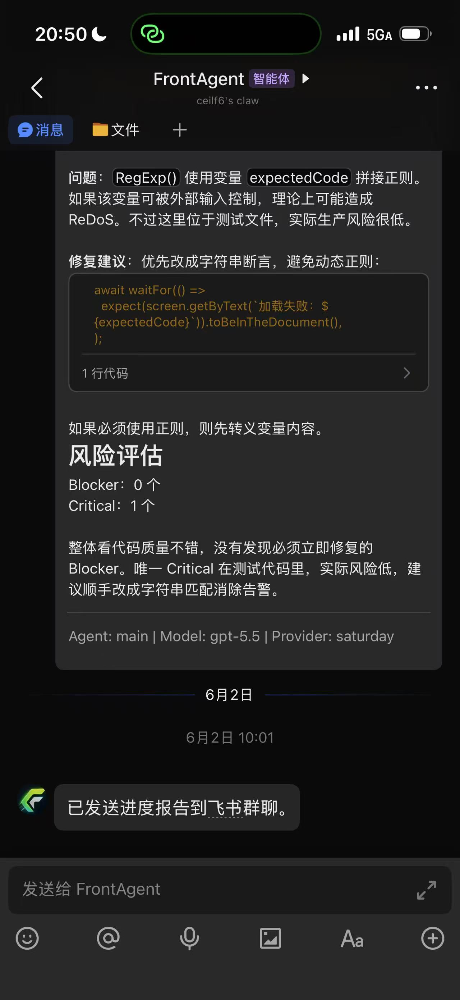

# Overlap-Aware Speaker ASR

## Project in One Sentence

This repository studies when speech separation helps or hurts multi-speaker ASR, and provides a documented research pipeline for adaptive routing, speaker-aware evaluation, and carefully labeled frontier experiments.

## What This Project Does

- Maintains a five-case gold benchmark for overlap-aware ASR evaluation.
- Compares mixed Whisper, separated speaker-track Whisper, and cleaned separated transcripts.
- Reports CER, error-type analysis, speaker CER, and cpCER-lite style speaker attribution checks.
- Provides adaptive router v1/v2 and a risk-aware selector for reference-free transcript choice.
- Includes compute-aware cascade analysis and Mode B cascade tiers as mainline experimental work.
- Keeps synthetic silver validation separate from gold benchmark claims.
- Provides optional scaffolding for MeetEval, LLM critic/repair, speaker-profile work, and demo support.
- Uses CI, tests, ADRs, and a harness workflow to protect the stable baseline.

## What This Project Does Not Claim

- It does not claim to train a new ASR foundation model.
- It does not claim to train a new speech separation model.
- It does not treat synthetic silver validation as gold benchmark evidence.
- It does not use ground-truth CER as a routing input.
- It does not treat frontier scaffolding, coordination records, receipts, or writebacks as stable mainline claims.
- It does not claim that `frontier/audio-depth-router` is ready to merge directly into `main`.

## Current Status

See [docs/implementation-status.md](docs/implementation-status.md) for the detailed status matrix.
For the integrated research narrative, evidence levels, limitations, and figure
set, start with the [team research report](REPORT.md).

| Area | Status |
|---|---|
| Gold benchmark, Whisper baselines, CER/error/speaker-aware evaluation | Stable Mainline |
| Router v1/v2, risk-aware selector, compute-aware cascade | Mainline Experimental |
| Mode B / cascade tiers | Mainline Experimental |
| Synthetic validation | Mainline Experimental; silver evidence only |
| MeetEval, LLM, speaker-profile, demo support | Optional Integration / Frontier Scaffold |
| AudioDepth router | Frontier Branch Only |
| **Model scale & correction frontier (PR #860–#871)** | **experimental/frontier; base eliminates separation tax** |

## Frontier Highlights — ASR × LLM + Emotion + Speaker (experimental/frontier)

A 2026 frontier session explored where a *local, offline* LLM (`deepseek-r1` via ollama) and cheap
reference-free signals help overlap-aware speaker ASR. Full synthesis + deployable recipe:
[docs/frontier/asr_llm_emotion_capstone.md](docs/frontier/asr_llm_emotion_capstone.md) · hero figure:
`results/frontier/asr_llm_frontier_capstone.png`.

| Result | Outcome |
|---|---|
| [Noise-robust router](results/frontier/noise_robust_router/FINDINGS.md) (#814) | ✅ a reference-free decoder-degeneracy router beats both fixed strategies and recovers ~92% of the per-utterance oracle gap |
| [Objective-aware decoupled routing](results/frontier/objective_aware_routing/FINDINGS.md) (#823) | ✅ the separate-vs-mixed decision is *objective-dependent* — routing text by the ASR signal while always reading emotion from the separated track halves emotion distortion and cuts joint regret ~14× at equal CER |
| [Semantic Emotion Tax](results/frontier/semantic_emotion_tax/FINDINGS.md) (#831) | ✅ a local LLM reads implicit emotion ~7× more than the lexicon — an orthogonal 3rd emotion modality |
| [Tri-modal emotion fusion](results/frontier/emotion_modality_fusion/FINDINGS.md) (#835) | ◐ fusion helps the semantic target only; acoustic-arousal is the dominant reference-free emotion-damage signal |
| [Emotion-anchored repair](results/frontier/emotion_anchored_repair/FINDINGS.md) (#833) | ❌ anchoring does not cure LLM over-correction — don't blind-repair in this setting |
| [LLM speaker-attribution](results/frontier/llm_speaker_attribution/FINDINGS.md) (#838) | ◐ affect encodes who-said-what, but the sign isn't knowable reference-free |

These are `experimental/frontier` (Whisper-tiny + silver references + local `deepseek-r1`); they are not
gold-benchmark claims. The unifying thread: the cheap Whisper decoder signal is the deployable routing
lever, acoustic prosody owns acoustic emotion, and the LLM's gift is *coverage* of implicit semantics —
not free-lunch repair or attribution rules.

## Frontier Highlights — Model Scale & Correction Frontier (experimental/frontier)

A 2026 frontier session asked: **is the "when to separate?" problem real, or a tiny-model artifact?**
The answer changes the project's research direction.

| Result | Outcome |
|---|---|
| [Confidence-Calibrated Router](results/frontier/confidence_calibrated_router/FINDINGS.md) | ❌ multi-signal composites hurt; compression-ratio alone is near-optimal |
| [Multi-Decode Voting](results/frontier/multi_decode_voter/FINDINGS.md) (#858) | ❌ temperature perturbation doesn't help; CR wins (Spearman 0.781) |
| [Contrastive Decoding](results/frontier/contrastive_decode/FINDINGS.md) (#857) | ◐ divergence detects hallucination (AUC 0.765) but fallback can't cure it |
| **[Model Scale Analysis](results/frontier/model_scale/FINDINGS.md) (#859)** | **🏆 base eliminates the separation tax entirely (CER 0.200 at ALL overlaps)** |
| [Runtime Cascade](results/frontier/runtime_cascade/FINDINGS.md) (#863) | ❌ CR signal too coarse for segment selection (binary cliff, not smooth Pareto) |
| [Reference Validity](results/frontier/reference_validity/FINDINGS.md) | ✅ base's 0.200 CER is real (base and small differ 37.2% on clean audio) |
| [Error Pattern Analysis](results/frontier/base_error_correction/FINDINGS.md) (#867) | ❌ 64 unique patterns, only 9.4% recurring — 0.200 is a hard floor for correction |
| [LLM Rescoring](results/frontier/llm_base_rescore/FINDINGS.md) (#869) | ❌ catastrophic (0/26 helped, CER 0.316→0.798) — LLM rewrites instead of correcting |
| [Error Profile Decomposition](results/frontier/error_profile_decomposition/FINDINGS.md) (#865) | ◐ both models ~70% substitution-dominated; CER difference = total count, not error types |

**The key finding: the "overlap-aware speaker ASR" problem is a tiny-model artifact.** Whisper-base
(1.93× compute) produces CER=0.200 at all overlap ratios — the separation tax vanishes. The 29 frontier
routing/gating studies were compensating for a problem that disappears with marginally more compute.
The 0.200 remaining CER is a hard floor: pattern-based correction, T/S normalization, and LLM rescoring
all fail to improve it. Future frontier should focus on base+ model capabilities and external validation.

## Frontier Highlights — Causal & Internal-State Hallucination (experimental/frontier)

A 2026 frontier line looks *inside* Whisper at the separation-tax hallucination (`separation_tax` showed
a reference-free compression-ratio guard catches the catastrophic tail — but only at ~20% of the decoded
stream, *after* the repetition is emitted). Plan + cited 2025–26 literature:
[docs/frontier/causal_hallucination_probe.md](docs/frontier/causal_hallucination_probe.md).

| Result | Outcome |
|---|---|
| [Causal & internal-state hallucination probe](results/frontier/causal_hallucination_probe/FINDINGS.md) (#855) | ✅ the separation-tax loop is a *confident* attractor (catastrophic routes decode at higher avg_logprob / lower token entropy than clean), and a token-id **repetition lock-in trip-wire** fires at ~2% of the stream vs ~20% for compression-ratio (~10× earlier); at tight streaming-realistic causal caps the internal-state detector beats output-CR, at loose caps CR's broader coverage wins — neither alone dominates |

The honest deployable sharpening: gate a streaming overlap-aware ASR system on the lock-in trip-wire for
the Mode-R repetition tail, keep compression-ratio for the Mode-N non-repetition minority. The
confident-loop mechanism extends (not discovers) the 2025–26 attractor line; the token-id lock-in
trip-wire and the offline-router gain-decay-under-prefix-forcing analysis are the novel slots.

## Frontier Highlights — AudioDepth Router (frontier branch only)

AudioDepth is a second frontier branch. It treats overlapping speech as a
time-frequency occlusion problem, inspired by depth-style representations in
visual recognition, and asks whether pre-ASR acoustic maps can help decide when
to use mixed ASR, separated ASR, cleaned routes, or review/fallback paths.

See [AudioDepth Router Exploratory Study](docs/frontier/audio-depth-router.md)
for the research motivation, visualization design, experiment stages,
controlled results, limitations, and merge boundaries. See also the
[team research report](REPORT.md) for how AudioDepth relates to the stable ASR
router, compute-aware cascade, LLM/emotion frontier, and team-level evidence
hierarchy.

AudioDepth is not currently a stable mainline claim and should not be merged
from `frontier/audio-depth-router` without separating code, documentation,
lightweight examples, tests, and large artifacts.

## Quickstart

Use a Python version aligned with CI, preferably Python 3.12. The core install is:

```bash
python3.12 -m venv .venv
source .venv/bin/activate
python -m pip install --upgrade pip
pip install -r requirements.txt
python -m src.project_harness
```

If you see `ModuleNotFoundError: No module named 'yaml'`, install the core requirements first; it is usually an environment setup issue, not evidence that the project code is broken.

Full setup, optional dependencies, smoke tests, demo setup, and troubleshooting are in [docs/quickstart.md](docs/quickstart.md).

## Results

Start with [docs/results-index.md](docs/results-index.md) and [results/README.md](results/README.md).

Recommended result entry points:

- [Team research report](REPORT.md)
- [Current results summary](results/figures/curated/current_results_summary.md)
- [Adaptive routing summary](results/figures/curated/best_method_by_case.md)
- [Risk-aware selector summary](results/figures/curated/risk_aware_selection_summary.md)
- [Compute-aware cascade summary](results/figures/curated/compute_aware_cascade_summary.md)
- [Mode B cascade tiers summary](results/figures/curated/cascade_tiers_summary.md)

Historical wave, receipt, writeback, checklist, and demo presentation records have been moved under `results/figures/archive/`. They are useful for traceability, but they are not final benchmark claims.

## Repository Map

| Path | Purpose |
|---|---|
| `src/` | Research scripts, evaluation modules, routing logic, and generated frontier helpers |
| `tests/` | Unit tests and harness coverage |
| `docs/` | Curated setup, status, result, branch, governance, and archive documentation |
| `docs/harness/` | Development harness: hooks, knowledge-base contract, SDD, and TDD workflow |
| `docs/adr/` | Architecture and approach decision records |
| `resources/` | Small audio inputs, snippets, synthetic assets, and references |
| `results/` | Curated result summaries plus archived generated records |
| `scripts/` | Harness and maintenance support scripts |

## Mainline vs Frontier

- `main` is the stable review baseline.
- `frontier/audio-depth-router` is a high-risk experimental branch with many artifacts and model-like outputs; it needs separate review and should be split before any merge.
- `wave*`, `frontier/wave*`, and `demo-wave*` branches are mostly historical coordination/writeback trails.
- `improve/*` and `cursor/*` branches with no diff against `main` are cleanup candidates, but this pass does not delete remote branches.

See [docs/branch-audit.md](docs/branch-audit.md) for the branch cleanup policy.

## Documentation

| Need | Read |
|---|---|
| Run locally | [docs/quickstart.md](docs/quickstart.md) |
| Read the full team report | [REPORT.md](REPORT.md) |
| Understand what is implemented | [docs/implementation-status.md](docs/implementation-status.md) |
| Find core results | [docs/results-index.md](docs/results-index.md) |
| Understand result storage | [results/README.md](results/README.md) |
| Understand branch status | [docs/branch-audit.md](docs/branch-audit.md) |
| Understand archive policy | [docs/archive-plan.md](docs/archive-plan.md) |
| Review course contribution records | [CONTRIBUTIONS.md](CONTRIBUTIONS.md) |
| Review AudioDepth frontier strategy | [docs/frontier/audio-depth-router.md](docs/frontier/audio-depth-router.md) |
| Review governance | [docs/harness/](docs/harness/) and [docs/adr/](docs/adr/) |

Historical planning and generated coordination records are indexed from [docs/archive/README.md](docs/archive/README.md).

## Harness Engineering Loop

> Developed with reference to [code-tape](https://github.com/ceilf6/code-tape).

An always-on development harness keeps the stable baseline safe while frontier work continues. It has four pillars (full docs in [`docs/harness/`](docs/harness/README.md)):

- **Git hooks** — `pre-commit` runs the fast test gate and `pre-push` runs the contract + full test gate, installed via `core.hooksPath`. Bootstrap once with `make agent-bootstrap`.
- **Knowledge base** — GitNexus indexes the code graph so a change's cascade is visible before editing critical modules ([contract](docs/harness/knowledge_base_contract.md)).
- **SDD** — an authority-document hierarchy plus [ADRs](docs/adr/README.md) anchor what agents treat as ground truth ([spec](docs/harness/sdd.md)).
- **TDD** — the contract mechanically requires a paired test for every critical code change, red → green → refactor ([spec](docs/harness/tdd.md)).

The full loop is `issue → PR → repo-guard CR → respond` ([workflow](docs/harness/workflow_spec.md)). code-tape's engineering-camp scoring and auto-merge automation is intentionally out of scope.

## Emotion Frontier (experimental)

> Label: `experimental/frontier`. Full plan, findings, and cited 2025–2026 reading in
> [`docs/emotion_frontier.md`](docs/emotion_frontier.md).

Extends the project's "when should we separate?" question from ASR-CER into **emotion**. Offline,
label-free (clean-source prosody / reference text are the ground truth, mirroring CER):

- **Emotional Separation Tax** — separation *helps* emotion at every overlap (no tax) yet *hurts* ASR
  at low/mid overlap: the separate-or-not decision is **objective-dependent** ([findings](results/frontier/emotion_separation_tax/FINDINGS.md)).
- **Arousal ≠ ASR-difficulty** — acoustic arousal does not predict CER (bounding negative); emotion is
  a consequence to *preserve*, not a routing feature ([findings](results/frontier/arousal_asr_probe/FINDINGS.md)).
- **Regex/lexicon lexical emotion** (valence) + tri-modal agreement, and a **prosody-grounded LLM × ASR
  critic** (deepseek-r1 via ollama, regex fallback). The critic borrows code-tape's
  **generation-evaluation separation** (separate *repair* and *judge* roles) and injects explicit
  prosodic/lexical cues, since the 2025/26 SER frontier finds speech-LLMs have weak prosody perception.

## OpenClaw: Agentic Engineering Assistant

> Illustrative tooling shown for context, not a benchmark result. Label: `qualitative/demo`.

OpenClaw ("ceilf6's claw") is the agentic engineering assistant that drives
the kind of workflow described in the Harness Engineering Loop above. Instead
of living only in a terminal, it runs as chat 智能体 (agents) inside the IM tools
a team already uses — 飞书 (Feishu) and 大象 — so issue triage, code review, and
progress reporting happen in the conversation rather than in a separate
dashboard.

It exposes named agents driven by slash commands:

- **`FrontAgent`** — reference-free code review that returns a risk summary
  (Blocker / Critical counts plus concrete fixes, e.g. flagging a
  dynamic-`RegExp` ReDoS in a test file) and `/progress-reporter` group updates
  that track each member's current issue, unclaimed work, recently merged PRs,
  and milestones.
- **坤坤** — a conversational agent for handover notes, material organization, and message polishing.

Agents call LLM backends (e.g. `gpt-5.5`) through a provider abstraction and
follow the same `issue → PR → repo-guard CR → respond` loop documented above.
OpenClaw is developed alongside [code-tape](https://github.com/ceilf6/code-tape).

<p align="center">
  
  
</p>

## Contributors

Contributor details live in [CONTRIBUTIONS.md](CONTRIBUTIONS.md). The README
intentionally keeps contributor history short so the project entry point remains
readable.

- [Contributions](CONTRIBUTIONS.md): team contribution statements and course submission evidence.

## License / Citation / Acknowledgements

TODO: Maintainers should decide the final License, Citation, and Acknowledgements text. This cleanup does not invent licensing or citation claims.
