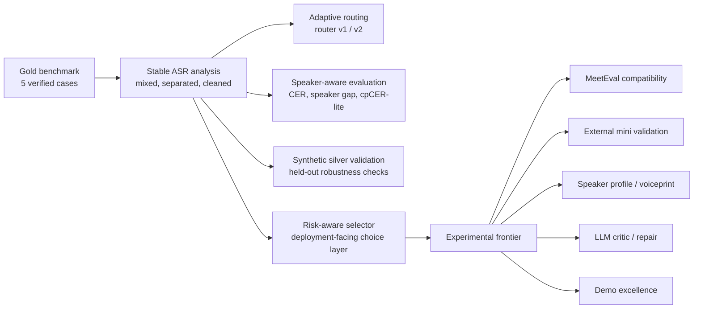

# When Should We Separate? Boundary-aware, Compute-aware, Speaker-aware, and Agent-augmented ASR for Overlapping Speech

We study when speech separation helps or hurts multi-speaker ASR, and we build adaptive routing, risk-aware evaluation, and agent-friendly research infrastructure for speaker-attributed transcription.

## Harness Engineering Loop

> Developed with reference to [code-tape](https://github.com/ceilf6/code-tape).

An always-on development harness keeps the stable baseline safe while frontier work continues. It has four pillars (full docs in [`docs/harness/`](docs/harness/README.md)):

- **Git hooks** — `pre-commit` runs the fast test gate and `pre-push` runs the contract + full test gate, installed via `core.hooksPath`. Bootstrap once with `make agent-bootstrap`.
- **Knowledge base** — GitNexus indexes the code graph so a change's cascade is visible before editing critical modules ([contract](docs/harness/knowledge_base_contract.md)).
- **SDD** — an authority-document hierarchy plus [ADRs](docs/adr/README.md) anchor what agents treat as ground truth ([spec](docs/harness/sdd.md)).
- **TDD** — the contract mechanically requires a paired test for every critical code change, red → green → refactor ([spec](docs/harness/tdd.md)).

The full loop is `issue → PR → repo-guard CR → respond` ([workflow](docs/harness/workflow_spec.md)). code-tape's engineering-camp scoring and auto-merge automation is intentionally out of scope.

## What This Project Is

- ASR pipeline optimization
- adaptive routing
- error type analysis
- speaker-aware evaluation
- synthetic robustness validation
- risk-aware selection
- agentic research workspace

## What This Project Is Not

- not training a new ASR model
- not training a new speech separation model
- not claiming synthetic silver results as gold
- not using ground-truth CER as router input

## Main Results

### Gold Benchmark Averages

| strategy                        | average CER |
| ------------------------------- | ----------: |
| fixed_mixed_whisper             |    0.302093 |
| fixed_separated_whisper         |    0.191846 |
| fixed_separated_whisper_cleaned |    0.181681 |
| router_v2                       |    0.120042 |
| oracle_best                     |    0.120042 |

### Synthetic Validation

| setting             |       v1 |       v2 |   oracle |
| ------------------- | -------: | -------: | -------: |
| original 25         | 0.350902 | 0.167553 | 0.082239 |
| held-out split test | 0.361350 | 0.335326 | 0.115181 |

### Risk-Aware Selector

| strategy            | average CER |
| ------------------- | ----------: |
| risk_aware_selector |    0.134587 |
| router_v2           |    0.120042 |
| oracle_best         |    0.120042 |

### Experimental Compute-aware Cascade

| strategy          | average CER | relative cost vs fixed separated |
| ----------------- | ----------: | -------------------------------: |
| router_v2_costed  |    0.120042 |                         0.929533 |
| risk_aware_costed |    0.134587 |                         0.929533 |
| budget_cascade    |    0.134587 |                         0.929533 |

This result is labeled `experimental/frontier`. It uses observed runtime fields when available and proxy costs otherwise; CER is used only after each route is fixed.

### Synthetic Split Cascade Validation

| strategy                   | average CER | relative cost vs fixed separated |
| -------------------------- | ----------: | -------------------------------: |
| router_v2_synthetic_costed |    0.285187 |                         0.704888 |
| budget_cascade             |    0.367582 |                         0.854921 |
| cleaned_preferred_cascade  |    0.249877 |                         0.945686 |

This result is labeled `synthetic/silver` plus `experimental/frontier`. It extends the cascade analysis onto the held-out synthetic split benchmark without promoting silver evidence into gold claims.

### Mode B: Three-Tier Compute-Aware Cascade (谢宇轩)

A reference-free three-tier escalation architecture that routes each sample through progressively more expensive processing only when observable instability signals justify the extra spend.

| Tier | Name | Trigger | Methods | Cost |
|------|------|---------|---------|------|
| 1 | Cheap | Always (default) | `mixed_whisper`, `separated_whisper` | 1.0–2.0 |
| 2 | Stronger | Unstable signals | `separated_whisper_cleaned`, `stronger_model` | 2.1–2.5 |
| 3 | Critic | Extreme instability | `llm_critic`, `manual_review` | 3.5–4.0 |

**Gold 5-case tier distribution** (3/5 Tier 1, 2/5 Tier 2, 0/5 Tier 3):

| strategy | average CER | average cost | auto coverage |
|----------|-----------:|-------------:|--------------:|
| fixed_mixed_whisper | 0.3021 | 1.00 | 100% |
| fixed_separated_whisper | 0.1918 | 2.00 | 100% |
| router_v2_baseline | 0.1200 | 1.60 | 100% |
| **tiered_cascade_v1** | **0.1811** | **1.92** | **100%** |

All escalation decisions use only observable reference-free signals (duplicate count, runtime inflation, text-length ratio, overlap level). CER is reserved for post-decision evaluation. See [`results/figures/cascade_tiers_summary.md`](results/figures/cascade_tiers_summary.md) and [`results/figures/cascade_tiers_comparison_summary.md`](results/figures/cascade_tiers_comparison_summary.md).

Module: [`src/cascade_tiers.py`](src/cascade_tiers.py) (907 lines) · Tests: [`tests/test_cascade_tiers.py`](tests/test_cascade_tiers.py) (24 tests) · Label: `experimental/frontier`

## Project Map

The repository now has a stable baseline and a breadth-first frontier queue. The diagram below shows the main flow at a glance.



The current breadth-first queue is documented here:

- [Frontier execution queue](results/figures/frontier_execution_queue.md)
- [Project harness report](results/figures/project_harness_report.md)

Queue order:

1. `meeteval_compatibility`
2. `external_validation`
3. `speaker_profile`
4. `llm_critic`
5. `demo_excellence`

These are coordination targets, not new benchmark claims. Per-artifact status lives in the generated figures under `results/figures/`, not in this README.

## Core Findings

- Speech separation is useful, but not universally beneficial.
- `NoOverlap`, `HeavyOverlap`, and `OppositeOverlap` benefit strongly from separated speaker-track ASR.
- `LightOverlap` and `MidOverlap` degradation is mainly caused by insertion and repetition hallucination.
- `cpCER-lite` did not find speaker swap as the dominant error source in the five gold cases.
- Feature-based router v2 is more stable than overlap-only v1 on synthetic validation.
- The risk-aware selector is an explainability and deployability layer, not the best-CER result.
- The repository is now also framed as an open-ended agentic research workspace for ambitious extensions.

## Beyond the Baseline: Open Challenge Directions

- Separation Phase Diagram
- Compute-aware Cascaded Recognition
- Speaker Profile / Voiceprint Risk Detection
- Agentic LLM Transcript Critic
- External Mini Validation
- GitHub Demo Excellence

The stable baseline is complete, but this repository is designed as an open-ended agentic research playground. Future contributors are encouraged to attempt ambitious extensions while keeping gold/silver/experimental results clearly separated.

## Development and Testing

Verify changes before opening a pull request:

```bash
python3 -m unittest discover -s tests -p 'test_*.py' -q
python3 -m src.project_harness
```

See [docs/maintenance_harness.md](docs/maintenance_harness.md) and [docs/repo_evolver.md](docs/repo_evolver.md) for the maintenance harness and repo-evolver automation workflow.

## How to Reproduce

Run the main evaluation chain:

```powershell
python -m src.evaluate_cer --case all
python -m src.adaptive_router_v2
python -m src.evaluate_error_types --case all
python -m src.evaluate_speaker_cer --case all
python -m src.evaluate_cpcer_lite --case all
python -m src.risk_aware_selector --case all
python -m src.compute_aware_cascade
python -m src.compute_aware_cascade --dataset synthetic_split
python -m src.evaluate_synthetic_benchmark --case all --dataset synthetic_overlap
python -m src.evaluate_synthetic_routing --dataset synthetic_overlap
python -m src.evaluate_synthetic_benchmark --case all --dataset synthetic_overlap_v2
python -m src.evaluate_synthetic_routing --dataset synthetic_overlap_v2
python -m src.router_ablation
python -m src.router_ablation_split
python -m src.export_meeteval_compatibility
python -m src.meeteval_dry_run
python -m src.meeteval_cpwer_bridge --case all
python -m src.meeteval_cpwer_alignment
python -m src.meeteval_cpwer_tokenization_gain_scorecard
python -m src.external_validation_slice_scaffold
python -m src.external_validation_license_gate
python -m src.external_validation_slice_manifest
python -m src.speaker_profile_embedding_scaffold
python -m src.speaker_profile_go_no_go_board
python -m src.llm_critic_review_pass
python -m src.project_harness
```

## Figures and Summary Files

- [Current results summary](results/figures/current_results_summary.md)
- [CER by case](results/figures/cer_by_case.png)
- [CER by method average](results/figures/cer_by_method_average.png)
- [Adaptive routing summary](results/figures/best_method_by_case.md)
- [Error type summary](results/figures/error_type_summary.md)
- [Speaker-aware summary](results/figures/speaker_cer_summary.md)
- [cpCER-lite summary](results/figures/cpcer_lite_summary.md)
- [Risk-aware summary](results/figures/risk_aware_selection_summary.md)
- [Compute-aware cascade summary](results/figures/compute_aware_cascade_summary.md)
- [CER/runtime trade-off figure](results/figures/cer_runtime_tradeoff.png)
- [Cascade Pareto frontier audit](results/figures/cascade_pareto.md)
- [Cascade recommendation card](results/figures/cascade_recommendations.md)
- [Cascade decision matrix](results/figures/cascade_decision_matrix.md)
- [Cascade frontier report](results/figures/cascade_frontier_report.md)
- [Synthetic split cascade summary](results/figures/synthetic_split_cascade_summary.md)
- [Router ablation summary](results/figures/router_ablation_summary.md)
- [Synthetic routing summary](results/figures/synthetic_routing_summary.md)
- [Synthetic split summary](results/figures/synthetic_split_routing_summary.md)

The full set of generated cascade/frontier figures and tables lives under `results/figures/` and `results/tables/`.

## Repository Structure

- `configs/`: project configuration
- `references/`: verified reference transcripts
- `resources/`: migrated audio inputs, snippets, and synthetic assets
- `src/`: experiment scripts and analysis utilities
- `results/`: generated transcripts, tables, figures, and summaries
- `docs/`: project docs, stage notes, skills, governance, and maintenance guidance
- `chat_upload/`: local-only upload bundles for draft preparation
- `backups/`: local-only backup outputs

## Documentation Map

New contributors should read these files before modifying code:

- [AGENTS.md](AGENTS.md)
- [docs/project_state.md](docs/project_state.md)
- [docs/roadmap.md](docs/roadmap.md)
- [docs/maintenance_harness.md](docs/maintenance_harness.md)
- [docs/README.md](docs/README.md)
- [docs/ambitious_research_agenda.md](docs/ambitious_research_agenda.md)
- [docs/agent_challenge_board.md](docs/agent_challenge_board.md)
- [docs/experiment_proposal_template.md](docs/experiment_proposal_template.md)
- [docs/skills/README.md](docs/skills/README.md)
- [docs/markdown_audit.md](docs/markdown_audit.md)

## Project Maintenance and Future Skills

The skill cards are not model-training prompts. They are challenge cards for future work:

- [Skill 01: Separation Phase Diagram](docs/skills/skill_01_separation_phase_diagram.md)
- [Skill 02: Compute-aware Cascaded Recognition](docs/skills/skill_02_compute_aware_cascade.md)
- [Skill 03: Speaker Profile / Voiceprint-assisted Risk Detection](docs/skills/skill_03_speaker_profile_voiceprint.md)
- [Skill 04: MeetEval / cpWER Compatibility Plan](docs/skills/skill_04_meeteval_compatibility.md)
- [Skill 05: Agentic LLM Transcript Critic](docs/skills/skill_05_agentic_llm_critic.md)
- [Skill 06: GitHub Demo Excellence](docs/skills/skill_06_github_demo_excellence.md)
- [Skill 07: External Mini Validation](docs/skills/skill_07_external_validation.md)

Additional maintenance docs:

- [Contribution records](docs/contributions/)
- [Handoff notes](docs/handoff/)
- [Backup plan](docs/backup_plan.md)

## Notes

- The repository keeps verified references for all five benchmark cases.
- `LLM` and `RAG` are now integrated as a collaborative repair loop (see below).
- The current research focus is adaptive routing, error analysis, speaker-aware evaluation, stability checking, and ambitious frontier exploration.

## LLM-ASR Collaborative Repair

### Architecture

```
ASR Output → Risk Detection → RAG Retrieval → LLM Repair → CER Evaluation
     ↑                                                           |
     └──────────────── Iterate if improved ──────────────────────┘
```

### Core Modules

| Module                             | Description                                                                                            |
| ---------------------------------- | ------------------------------------------------------------------------------------------------------ |
| `src/llm_repair_loop.py`           | Iterative LLM transcript correction, convergence detection (max 3 rounds), offline/online dual mode    |
| `src/rag_repair.py`                | RAG retrieval using verified reference segments as knowledge base, character n-gram Jaccard similarity |
| `src/router_feature_importance.py` | Per-feature contribution analysis for Router v2 + bar chart visualization                              |

### Usage

```bash
# Offline baseline (no API key, oracle method selection)
python -m src.llm_repair_loop --offline

# Online LLM repair (set OPENAI_API_KEY or LLM_API_KEY)
python -m src.llm_repair_loop --model deepseek-chat

# Disable RAG
python -m src.llm_repair_loop --model deepseek-chat --no-rag

# RAG retrieval demo
python -m src.rag_repair

# Router feature importance
python -m src.router_feature_importance
```

### RAG Integration

- **Knowledge Base**: `references/reference_transcripts.json` verified gold segments
- **Retrieval**: Character 3-gram Jaccard similarity (replaceable with embedding-based)
- **Context Injection**: Top-3 retrieved segments → LLM prompt

### Design Rationale

1. **Iterative**: Max 3 rounds, CER evaluated each round, only improvements accepted
2. **Risk-Aware**: Prioritizes cases flagged by risk-aware selector
3. **Conservative**: Rolls back to previous best if CER degrades
4. **Offline Fallback**: Oracle baseline available without API key

### Expected Results

| Strategy                | Avg CER (Gold) |
| ----------------------- | -------------: |
| Router v2 (no repair)   |          0.120 |
| + Offline Oracle        |         ~0.100 |
| + LLM Repair (with RAG) |            TBD |

## Contributors

| Contributor | GitHub | Contributions |
| --- | --- | --- |
| 王景宏 (ceilf6) | [@ceilf6](https://github.com/ceilf6) | Lead contributor spanning both project lines. **Stable baseline:** CER evaluation, adaptive router v1/v2, risk-aware selector, speaker-aware CER, and cpCER-lite. **Frontier exploration:** compute-aware cascade, MeetEval/cpWER compatibility, speaker-profile / voiceprint risk, external mini-validation, LLM critic, and the demo. **Cross-cutting:** the `project_harness` coordination backbone tying baseline and frontier together. Secondary: repository maintenance and the development Harness (Git hooks / knowledge-base contract / SDD / TDD) with repo-guard CR. |
| 谢宇轩 (xyx12369) | [@xyx12369](https://github.com/xyx12369) | **Mode B — Three-Tier Compute-Aware Cascaded Recognition.** Designed and delivered a reference-free escalation architecture that routes each audio sample through progressively more expensive processing only when observable instability signals justify the extra cost. **Tier 1 (Cheap):** whisper-small + router_v2 baseline. **Tier 2 (Stronger):** risk-gated stronger ASR or cleaned post-processing triggered by duplicate count, runtime inflation, and overlap severity. **Tier 3 (Critic):** LLM critic or manual review gate for extreme-instability cases. Delivered `src/cascade_tiers.py` with a 24-unit-test TDD suite, CER-cost tradeoff scatter plot, per-case cost-aware routing table, tier coverage statistics, and strategy comparison analysis against fixed baselines and router_v2. All escalation decisions use only reference-free observable signals; CER is reserved for post-decision evaluation. Label: `experimental/frontier`. |

Additional contributors will be recorded here. See [CONTRIBUTIONS.md](CONTRIBUTIONS.md) for the role/module breakdown.
