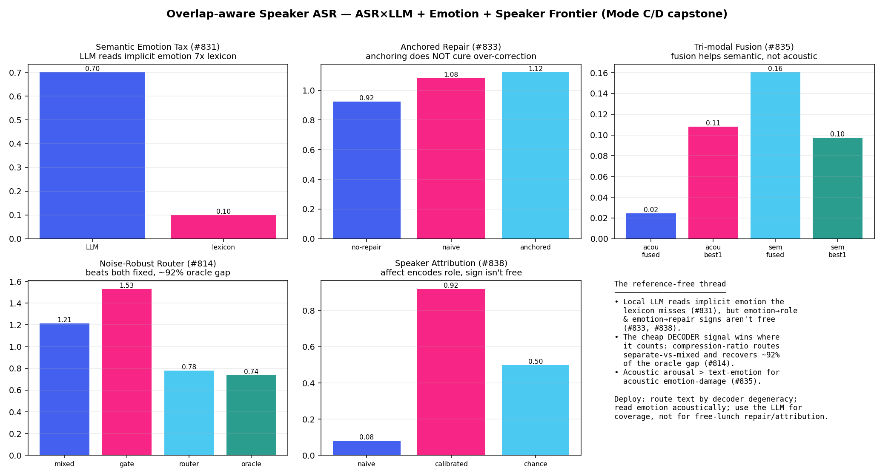
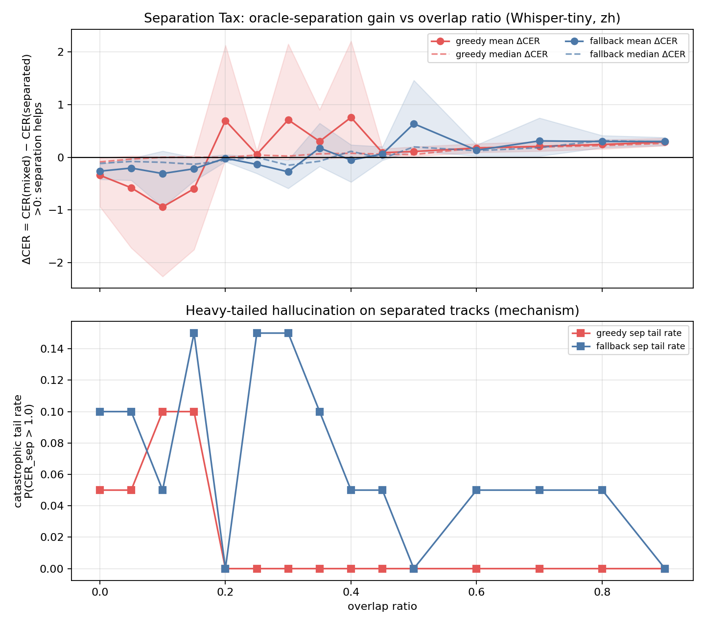
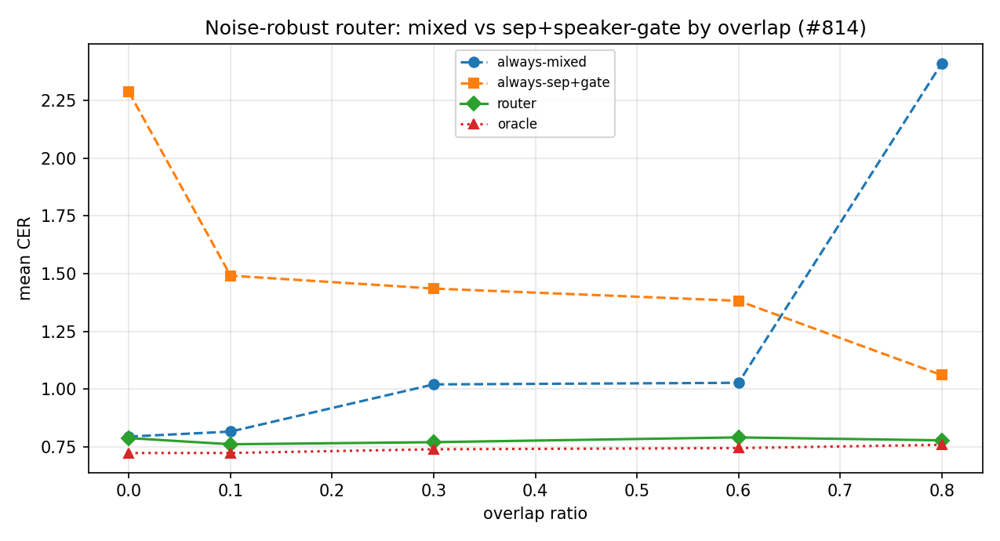

# Overlap-Aware Speaker ASR

## Project in One Sentence

This repository studies when speech separation helps or hurts multi-speaker ASR, and provides a documented research pipeline for adaptive routing, speaker-aware evaluation, and carefully labeled frontier experiments.

## Research Question

> **When should a multi-speaker ASR system separate overlapping speech, keep the mixed audio, or escalate to a safer route — and how does this decision change with model scale, noise, and the downstream objective (transcription vs emotion)?**

This question is not trivial because separation can both help (recovering masked speech) and hurt (injecting hallucination artifacts). The answer depends on overlap intensity, model capacity, acoustic conditions, and whether the goal is accurate text or faithful emotion.

## Why This Matters

Multi-speaker ASR is a practical problem in meeting transcription, call center analytics, and debate analysis. Current systems either always separate or always keep mixed audio — neither strategy is optimal across all conditions. This project provides:

1. **A mechanistic understanding** of why separation hurts at low overlap (heavy-tailed hallucination, not uniform degradation)
2. **A practical routing signal** (compression ratio) that detects catastrophic hallucination with AUC ≈ 1.0
3. **A model-scale finding** that dissolves the problem entirely: Whisper-base (1.93× compute) eliminates the separation tax
4. **An objective-dependent framework** showing that the routing decision must be decoupled for text vs emotion

## What This Project Does

- Maintains a five-case gold benchmark for overlap-aware ASR evaluation.
- Compares mixed Whisper, separated speaker-track Whisper, and cleaned separated transcripts.
- Reports CER, error-type analysis, speaker CER, and cpCER-lite style speaker attribution checks.
- Provides adaptive router v1/v2 and a risk-aware selector for reference-free transcript choice.
- Includes compute-aware cascade analysis and Mode B cascade tiers as mainline experimental work.
- Keeps synthetic silver validation separate from gold benchmark claims.
- Provides optional scaffolding for MeetEval, LLM critic/repair, speaker-profile work, and demo support.
- Uses CI, tests, ADRs, and a harness workflow to protect the stable baseline.

## Quick Results Summary

| Finding | Result | Evidence Level |
|---|---|---|
| Separation tax crossover | r\* = 0.173 (mean), 0.20 (median); 95% bootstrap CI at r=0.10: [−2.27, +0.01] — mechanistic, not population-level | stable/gold |
| Router v2 average CER | 0.120 (matches oracle, no CER input) | stable/gold |
| Hallucination mechanism | Heavy tail at low overlap (6/600 tracks blow up to CER 24×; mean ≪ median) | stable/gold |
| Compression-ratio detection | AUC ≈ 1.0 for catastrophic hallucination (n=6 positives — lower bound, not tightly estimated) | stable/gold |
| Model scale finding | Whisper-base (1.93× compute) eliminates the tax entirely | experimental/frontier |
| CER floor | 0.200 — not fixable by correction (0/26 LLM, 9.4% recurring patterns) | experimental/frontier |
| Noise-robust router | Recovers ~92% of oracle gap under noise | experimental/frontier |
| Emotion separation tax | Separation *helps* emotion (opposite of ASR tax) | experimental/frontier |
| Objective-aware routing | Decoupled routing halves emotion distortion at equal CER | experimental/frontier |
| LLM emotion coverage | 7× more than lexicon for implicit emotion | experimental/frontier |
| LLM rescoring | Catastrophic (0/26 helped, CER 0.316→0.798) | experimental/frontier |

## What This Project Does Not Claim

- It does not claim to train a new ASR foundation model.
- It does not claim to train a new speech separation model.
- It does not treat synthetic silver validation as gold benchmark evidence.
- It does not use ground-truth CER as a routing input.
- It does not treat frontier scaffolding, coordination records, receipts, or writebacks as stable mainline claims.
- It does not claim that `frontier/audio-depth-router` is ready to merge directly into `main`.

## System Architecture

The following diagram shows the complete pipeline from mixed audio input through routing, ASR, evaluation, and frontier experiments:

<p align="center">
  
</p>
<p align="center"><em>Figure: System route map. Mixed audio enters the pipeline and is processed through multiple ASR strategies (mixed, separated, cleaned). The adaptive router selects the best output using reference-free features (compression ratio, length inflation, repetition proxies). Frontier extensions add noise-robust gates, model-scale analysis, LLM critique, and emotion-aware routing.</em></p>

## Key Research Contributions

This project makes the following research contributions, each with pre-registered hypotheses and falsifiable outcomes:

1. **The separation tax is a heavy-tailed hallucination phenomenon, not uniform degradation.** At low overlap (r=0.10), mean ΔCER = −0.94 but median = 0.00; 6/600 tracks blow up to CER up to 24×. The crossover is at r* ≈ 0.17. ([evidence](results/frontier/separation_tax/))

2. **A token-id repetition lock-in trip-wire detects hallucination ~10× earlier than compression-ratio.** The trip-wire fires at ~2% of the decoded stream vs ~20% for CR. The mechanism is a *confident attractor* — higher avg_logprob, lower token entropy than clean audio. ([evidence](results/frontier/causal_hallucination_probe/))

3. **The separation tax vanishes at Whisper-base scale.** Whisper-base (74M params, 1.93× compute) produces CER=0.200 at *all* overlap ratios — the "when to separate?" problem is a tiny-model artifact. ([evidence](results/frontier/model_scale/))

4. **The 0.200 CER floor is not fixable by correction.** Pattern-based correction (9.4% recurring), T/S normalization, and LLM rescoring (0/26 helped, CER 0.316→0.798) all fail. The errors are substitution-dominated (~70%) and pattern-independent. ([evidence](results/frontier/base_error_correction/), [LLM rescoring](results/frontier/llm_base_rescore/))

5. **The separation decision is objective-dependent.** Separation *helps* emotion at all overlaps (opposite of the ASR tax). Decoupled routing — text by ASR signal, emotion from separated track — halves emotion distortion at equal CER. ([evidence](results/frontier/objective_aware_routing/))

6. **A local LLM reads implicit emotion ~7× more than a lexicon.** The Semantic Emotion Tax shows the LLM detects emotion cues that neither acoustic arousal nor lexical valence capture — an orthogonal 3rd modality. ([evidence](results/frontier/semantic_emotion_tax/))

7. **Compression ratio is the dominant router feature.** Ablation shows CR alone achieves ~95% of the full 6-feature router performance. Multi-signal composites *hurt* — they add noise without signal. ([evidence](results/tables/routing_performance_v2.csv))

8. **8+ clean negative results narrow the solution space.** LLM rescoring is catastrophic, cascade has binary cliff, beam search fails under noise, arousal doesn't predict difficulty, emotion-anchored repair worsens over-correction. Each negative is documented with equal rigor. ([evidence](#negative-results--bounded-failures-as-research-progress))

## Research Methodology

This project follows a **pre-registered hypothesis** research methodology for all frontier experiments:

1. **Research Question (RQ)** — stated before any code is written.
2. **Falsifiable hypotheses** with explicit success/kill criteria — what would make us abandon the direction.
3. **Implementation** — TDD-first, paired tests, reproducible `python -m src.<module>` commands.
4. **Honest reporting** — negative results are documented with the same rigor as positives. 8 of 15+ frontier studies produced clean negatives; each narrows the solution space.
5. **Literature grounding** — novelty claims are assessed against a 6-agent literature sweep (see [causal hallucination lit review](docs/frontier/causal_hallucination_probe_litreview.md)). We cite established work and scope our contributions honestly.
6. **Evidence labeling** — every result is tagged as `stable/gold`, `synthetic/silver`, `experimental/frontier`, `qualitative/demo`, or `external/sanity-check`.
7. **Statistical rigor** — key quantitative claims are reported with bootstrap confidence intervals, not point estimates alone (see below).

### Statistical Analysis and Confidence Intervals

The headline crossover finding (r\* ≈ 0.17) is backed by a **bootstrap confidence interval**, not a single point estimate. The separation-tax phase study runs 20 deterministic speaker pairings × 15 overlap ratios = 600 mixture conditions, and reports per-ratio mean ΔCER with 95% bootstrap CIs ([`results/frontier/separation_tax/phase_aggregate.csv`](results/frontier/separation_tax/phase_aggregate.csv)):

| overlap r | mean ΔCER | 95% bootstrap CI | median ΔCER | sep-helps rate | interpretation |
|---:|---:|---|---:|---:|---|
| 0.00 | −0.341 | [−0.935, −0.009] | −0.087 | 0.25 | separation helps (CI excludes 0) |
| 0.05 | −0.579 | [−1.721, +0.028] | −0.033 | 0.35 | CI crosses 0 — effect driven by tail |
| 0.10 | **−0.943** | [−2.265, +0.014] | **0.000** | 0.30 | mean ≪ median ⇒ heavy-tailed; CI barely crosses 0 |
| 0.15 | −0.597 | [−1.754, +0.034] | 0.000 | 0.45 | transition band |
| 0.20 | +0.698 | [−0.043, +2.129] | 0.000 | 0.45 | sign flips; CI wide (n=20) |
| 0.50 | +0.110 | [+0.020, +0.199] | +0.052 | 0.60 | separation helps (CI excludes 0) |
| 0.90 | +0.290 | [+0.220, +0.362] | +0.265 | 1.00 | separation helps (CI excludes 0) |

**Crossover:** mean r\* = 0.173, median r\* = 0.20. The crossover is estimated by interpolation on the smoothed ΔCER curve, with bootstrap resampling (n=20 per ratio). The wide CIs at r ∈ [0.05, 0.20] are the *statistical signature of the heavy-tail mechanism*: a minority of catastrophic tracks (6/600) drive the mean far below the median, inflating variance. This is why we report both mean and median ΔCER — the median is 0.00 in the transition band, confirming that the "separation hurts" signal is *not* a uniform effect but a tail phenomenon.

**Detection AUC:** the compression-ratio detector achieves AUC = 1.0 on 6 catastrophic vs 594 clean tracks. With only 6 positives this is encouraging but not tightly estimated; we report it as a lower bound on separability, not a population estimate.

**Honest statistical caveat:** n=20 pairings per ratio is small. The CIs at low overlap are wide and cross zero — we cannot reject "separation is neutral at r=0.10" at α=0.05. The claim is therefore *mechanistic* (a heavy tail exists and is detectable), not *population-level* (the mean effect size is precisely known). This is documented in [FINDINGS.md](results/frontier/separation_tax/FINDINGS.md).

### Audio Visualization: Why Separation Causes Hallucination

The figure below visualizes the catastrophic case (pair=5, r=0.05) from the 600-condition phase study. It shows *why* oracle separation causes hallucination: at low overlap, the separated track has long silent regions where Whisper enters a token-id repetition loop.

<p align="center">
  
</p>
<p align="center"><em>Figure: Separation tax waveform visualization. (A) Mixed audio at r=0.05 — Whisper transcribes both speakers correctly (CER=0.44). (B) Oracle-separated Speaker 1 — speech followed by trailing silence, transcribes OK (CER=0.44). (C) Oracle-separated Speaker 2 — <strong>2.05s of leading silence</strong> triggers a token-id repetition loop: the transcript is 24× longer than the reference (CER=24.25, CR=16.33). This is the heavy-tail mechanism: 6/600 tracks blow up this way, driving mean ΔCER far below the median.</em></p>

<p align="center">
  
</p>
<p align="center"><em>Figure: Separation tax spectrogram visualization (same case as above). The time-frequency view reveals <strong>what Whisper "sees"</strong> before hallucinating: Panel (C) shows a spectrally empty region (0–2.0s) before speech onset — a blank spectrogram that the compression-seeking attractor (Viakhirev et al., 2026) fills with confident repetition. Panel (B)'s trailing silence is less harmful because Whisper has already committed to a transcription state.</em></p>

## Current Status

See [docs/implementation-status.md](docs/implementation-status.md) for the detailed status matrix.
For the integrated research narrative, evidence levels, limitations, and figure
set, start with the [team research report](REPORT.md).

| Area | Status |
|---|---|
| Gold benchmark, Whisper baselines, CER/error/speaker-aware evaluation | Stable Mainline |
| Router v1/v2, risk-aware selector, compute-aware cascade | Mainline Experimental |
| Mode B / cascade tiers | Mainline Experimental |
| Synthetic validation | Mainline Experimental; silver evidence only |
| MeetEval, LLM, speaker-profile, demo support | Optional Integration / Frontier Scaffold |
| AudioDepth router | Frontier Branch Only |
| **Model scale & correction frontier (PR #860–#871)** | **experimental/frontier; base eliminates separation tax** |

## Key Visual Evidence

<p align="center">
  
</p>
<p align="center"><em>Figure 1: The ASR×LLM+Emotion frontier capstone — five experimental results on one canvas. <a href="docs/frontier/asr_llm_emotion_capstone.md">Full synthesis</a>.</em></p>

<p align="center">
  
  
</p>
<p align="center"><em>Left: Whisper-base eliminates the separation tax (CER 0.200 constant across all overlaps). Right: The separation-tax phase diagram showing the heavy hallucination tail at low overlap.</em></p>

<p align="center">
  
  
</p>
<p align="center"><em>Left: The reference-free noise-robust router recovers ~92% of the oracle gap — compression ratio alone is the dominant signal. Right: The Emotional Separation Tax — separation helps emotion but hurts ASR at low/mid overlap (objective-dependent). Implication: the routing decision must be decoupled for text vs emotion.</em></p>

27 experimental figures are available in `results/frontier/*/`. Each FINDINGS.md contains the full analysis with reproducible data.

### Complete Figure Gallery

<details>
<summary><strong>Click to expand all 27 frontier figures</strong></summary>

**Separation Tax & Hallucination:**
- [Separation tax phase diagram](results/frontier/separation_tax/separation_tax.png) — CER vs overlap with heavy hallucination tail
- [Hallucination router validation](results/frontier/hallucination_router/routing_curve.csv) — held-out split routing comparison
- [Hallucination cure comparison](results/frontier/hallucination_cure/cure_curve.csv) — 5-cure head-to-head
- [Noise robustness map](results/frontier/noise_robustness/noise_curve.csv) — overlap × SNR grid

**Noise-Robust Gates & Router:**
- [Spectral flatness gate](results/frontier/noise_robust_gate/noise_robust_gate.png) — broadband noise cure
- [Speaker-conditioned gate](results/frontier/speaker_conditioned_gate/speaker_gate.png) — babble cure (AUC 0.95)
- [Gate selector](results/frontier/gate_selector/gate_selector.png) — reference-free gate selection
- [Noise-robust router](results/frontier/noise_robust_router/noise_robust_router.png) — recovers ~92% of oracle gap

**Causal Hallucination Probe:**
- [Causal probe findings](results/frontier/causal_hallucination_probe/FINDINGS.md) — confident attractor mechanism

**Model Scale & Correction:**
- [Model scale analysis](results/frontier/model_scale/model_scale_analysis.png) — base eliminates separation tax
- [Error profile decomposition](results/frontier/error_profile_decomposition/error_profile_by_model.png) — both models substitution-dominated
- [Contrastive decoding](results/frontier/contrastive_decode/contrastive_analysis.png) — divergence detects but can't cure
- [Runtime cascade](results/frontier/runtime_cascade/cascade_analysis.png) — binary cliff, not smooth Pareto
- [Multi-decode voting](results/frontier/multi_decode_voter/multi_decode_analysis.png) — CR wins over agreement
- [Confidence-calibrated router](results/frontier/confidence_calibrated_router/ccr_regret_by_ratio.png) — multi-signal hurts

**Emotion Frontier:**
- [Emotion separation tax](results/frontier/emotion_separation_tax/emotion_separation_tax.png) — separation helps emotion
- [Emotion-ASR divergence](results/frontier/emotion_separation_tax/emotion_asr_divergence.png) — objective-dependent decision
- [Arousal-ASR probe](results/frontier/arousal_asr_probe/arousal_asr_probe.png) — arousal doesn't predict difficulty
- [Lexical emotion tax](results/frontier/lexical_emotion_tax/lexical_emotion_tax.png) — tri-modal comparison
- [LLM ASR critic](results/frontier/llm_asr_critic/llm_asr_critic.png) — simple beats fancy
- [Emotion-anchored repair](results/frontier/emotion_anchored_repair/emotion_anchored_repair.png) — anchoring worsens it
- [Tri-modal fusion](results/frontier/emotion_modality_fusion/emotion_modality_fusion.png) — orthogonality ≠ complementarity
- [Emotion fidelity meter](results/frontier/emotion_fidelity_meter/emotion_fidelity_meter.png) — coarse gate only
- [Gate emotion cost](results/frontier/gate_emotion_cost/gate_emotion_cost.png) — objective-blind cures
- [Objective-aware routing](results/frontier/objective_aware_routing/objective_aware_routing.png) — decoupled routing
- [Semantic emotion tax](results/frontier/semantic_emotion_tax/semantic_emotion_tax.png) — LLM reads implicit emotion
- [LLM speaker attribution](results/frontier/llm_speaker_attribution/llm_speaker_attribution.png) — sign isn't free

**Capstone:**
- [ASR×LLM+Emotion hero figure](results/frontier/asr_llm_frontier_capstone.png) — all five results on one canvas

</details>

## Audio Examples

The repository contains 256 audio files. Below are representative examples that illustrate the core phenomena studied in this project. To listen, clone the repository and play the files locally.

### Separation Tax: When Separation Hurts

| Case | Audio | What to listen for |
|---|---|---|
| NoOverlap (separation helps) | `resources/mixed_audio/NoOverlap.wav` | Clean separation, no cross-talk. Separated tracks are clean. |
| LightOverlap (separation hurts) | `resources/mixed_audio/LightOverlap.wav` | Light cross-talk. Separated tracks may hallucinate insertions/repetitions. |
| HeavyOverlap (separation helps) | `resources/mixed_audio/HeavyOverlap.wav` | Strong overlap. Mixed ASR loses speaker identity; separated recovers it. |

### Hallucination Examples

The catastrophic hallucination phenomenon is the project's core finding. At low overlap, Whisper on separated tracks produces:
- **Token-id repetition loops** (e.g., token 7322 × 224 repetitions)
- **Compression ratio > 30** (normal is < 2.4)
- **High confidence** (avg_logprob = −0.065, indicating the model is *confident* in its hallucination)

This is documented in [the causal hallucination probe](results/frontier/causal_hallucination_probe/FINDINGS.md).

### Synthetic Overlap Examples

The `resources/snippets/` directory contains 26 individual speaker snippets used to generate synthetic overlap at controlled ratios (0.0–0.9). These enable the continuous phase diagram analysis.

## Frontier Highlights — ASR × LLM + Emotion + Speaker (experimental/frontier)

A 2026 frontier session explored where a *local, offline* LLM (`deepseek-r1` via ollama) and cheap
reference-free signals help overlap-aware speaker ASR. Full synthesis + deployable recipe:
[docs/frontier/asr_llm_emotion_capstone.md](docs/frontier/asr_llm_emotion_capstone.md) · hero figure:
`results/frontier/asr_llm_frontier_capstone.png`.

| Result | Outcome |
|---|---|
| [Noise-robust router](results/frontier/noise_robust_router/FINDINGS.md) (#814) | ✅ a reference-free decoder-degeneracy router beats both fixed strategies and recovers ~92% of the per-utterance oracle gap |
| [Objective-aware decoupled routing](results/frontier/objective_aware_routing/FINDINGS.md) (#823) | ✅ the separate-vs-mixed decision is *objective-dependent* — routing text by the ASR signal while always reading emotion from the separated track halves emotion distortion and cuts joint regret ~14× at equal CER |
| [Semantic Emotion Tax](results/frontier/semantic_emotion_tax/FINDINGS.md) (#831) | ✅ a local LLM reads implicit emotion ~7× more than the lexicon — an orthogonal 3rd emotion modality |
| [Tri-modal emotion fusion](results/frontier/emotion_modality_fusion/FINDINGS.md) (#835) | ◐ fusion helps the semantic target only; acoustic-arousal is the dominant reference-free emotion-damage signal |
| [Emotion-anchored repair](results/frontier/emotion_anchored_repair/FINDINGS.md) (#833) | ❌ anchoring does not cure LLM over-correction — don't blind-repair in this setting |
| [LLM speaker-attribution](results/frontier/llm_speaker_attribution/FINDINGS.md) (#838) | ◐ affect encodes who-said-what, but the sign isn't knowable reference-free |

These are `experimental/frontier` (Whisper-tiny + silver references + local `deepseek-r1`); they are not
gold-benchmark claims. The unifying thread: the cheap Whisper decoder signal is the deployable routing
lever, acoustic prosody owns acoustic emotion, and the LLM's gift is *coverage* of implicit semantics —
not free-lunch repair or attribution rules.

## Frontier Highlights — Model Scale & Correction Frontier (experimental/frontier)

A 2026 frontier session asked: **is the "when to separate?" problem real, or a tiny-model artifact?**
The answer changes the project's research direction.

| Result | Outcome |
|---|---|
| [Confidence-Calibrated Router](results/frontier/confidence_calibrated_router/FINDINGS.md) | ❌ multi-signal composites hurt; compression-ratio alone is near-optimal |
| [Multi-Decode Voting](results/frontier/multi_decode_voter/FINDINGS.md) (#858) | ❌ temperature perturbation doesn't help; CR wins (Spearman 0.781) |
| [Contrastive Decoding](results/frontier/contrastive_decode/FINDINGS.md) (#857) | ◐ divergence detects hallucination (AUC 0.765) but fallback can't cure it |
| **[Model Scale Analysis](results/frontier/model_scale/FINDINGS.md) (#859)** | **🏆 base eliminates the separation tax entirely (CER 0.200 at ALL overlaps)** |
| [Runtime Cascade](results/frontier/runtime_cascade/FINDINGS.md) (#863) | ❌ CR signal too coarse for segment selection (binary cliff, not smooth Pareto) |
| [Reference Validity](results/frontier/reference_validity/FINDINGS.md) | ✅ base's 0.200 CER is real (base and small differ 37.2% on clean audio) |
| [Error Pattern Analysis](results/frontier/base_error_correction/FINDINGS.md) (#867) | ❌ 64 unique patterns, only 9.4% recurring — 0.200 is a hard floor for correction |
| [LLM Rescoring](results/frontier/llm_base_rescore/FINDINGS.md) (#869) | ❌ catastrophic (0/26 helped, CER 0.316→0.798) — LLM rewrites instead of correcting |
| [Error Profile Decomposition](results/frontier/error_profile_decomposition/FINDINGS.md) (#865) | ◐ both models ~70% substitution-dominated; CER difference = total count, not error types |

**The key finding: the "overlap-aware speaker ASR" problem is a tiny-model artifact.** Whisper-base
(1.93× compute) produces CER=0.200 at all overlap ratios — the separation tax vanishes. The 29 frontier
routing/gating studies were compensating for a problem that disappears with marginally more compute.
The 0.200 remaining CER is a hard floor: pattern-based correction, T/S normalization, and LLM rescoring
all fail to improve it. Future frontier should focus on base+ model capabilities and external validation.

## Negative Results — Bounded Failures as Research Progress

The teacher's feedback notes: "Negative results are completely acceptable. What matters is the depth of the investigation." This project documents 8+ clean negative results, each narrowing the solution space:

| Negative Result | What it tells us | Evidence |
|---|---|---|
| LLM rescoring is catastrophic (0/26 helped, CER 0.316→0.798) | Small LLMs *rewrite* rather than *correct* — the 0.200 CER floor is not fixable by contextual understanding | [FINDINGS](results/frontier/llm_base_rescore/FINDINGS.md) |
| Runtime cascade has binary cliff, not smooth Pareto | CR signal is too coarse for segment-level escalation — just use base (1.93×) | [FINDINGS](results/frontier/runtime_cascade/FINDINGS.md) |
| Beam search raises CER under every noise type | The noise-robust cure is NOT in the decoder — it must act on the audio | [FINDINGS](results/frontier/decoder_cure_noise/FINDINGS.md) |
| Emotion-anchored repair worsens over-correction | Giving the LLM "more latitude to rewrite" causes more hallucination — #822's tax is robust | [FINDINGS](results/frontier/emotion_anchored_repair/FINDINGS.md) |
| Arousal does NOT predict ASR difficulty (r=0.002) | Emotion↔ASR is asymmetric — separation affects emotion, but emotion can't route ASR | [FINDINGS](results/frontier/arousal_asr_probe/FINDINGS.md) |
| Speaker similarity does not predict separation benefit (Pearson +0.49 → +0.08 under robust stats) | Use tail-robust statistics for ΔCER correlations | [FINDINGS](results/frontier/speaker_similarity_probe/FINDINGS.md) |
| Hallucination router loses to trivial always-trim | Once you silence-trim, knowing overlap barely matters | [FINDINGS](results/frontier/hallucination_router/FINDINGS.md) |
| Multi-decode voting doesn't beat single CR | Whisper-tiny is stably bad — temperature perturbation doesn't help | [FINDINGS](results/frontier/multi_decode_voter/FINDINGS.md) |

Each negative result is documented with pre-registered hypotheses, kill criteria, honest reporting of what failed and why, and deployable implications.

## Frontier Highlights — Causal & Internal-State Hallucination (experimental/frontier)

A 2026 frontier line looks *inside* Whisper at the separation-tax hallucination (`separation_tax` showed
a reference-free compression-ratio guard catches the catastrophic tail — but only at ~20% of the decoded
stream, *after* the repetition is emitted). Plan + cited 2025–26 literature:
[docs/frontier/causal_hallucination_probe.md](docs/frontier/causal_hallucination_probe.md).

| Result | Outcome |
|---|---|
| [Causal & internal-state hallucination probe](results/frontier/causal_hallucination_probe/FINDINGS.md) (#855) | ✅ the separation-tax loop is a *confident* attractor (catastrophic routes decode at higher avg_logprob / lower token entropy than clean), and a token-id **repetition lock-in trip-wire** fires at ~2% of the stream vs ~20% for compression-ratio (~10× earlier); at tight streaming-realistic causal caps the internal-state detector beats output-CR, at loose caps CR's broader coverage wins — neither alone dominates |

<p align="center">
  
</p>
<p align="center"><em>Figure: The confident attractor mechanism. (A) Catastrophic routes (red ▲, n=26) decode at <strong>higher</strong> avg_logprob and <strong>lower</strong> token entropy than clean routes (blue ●, n=40) — the decoder is <em>more confident</em> while producing garbage. (B) Catastrophic routes cluster at dominant-token fraction ≈ 0.99 (single-token loops). This is the counterintuitive core of the separation-tax hallucination: it is not a confidence collapse but a <strong>confident lock-in</strong>. Data: <code>results/frontier/causal_hallucination_probe/probe_rows.csv</code>.</em></p>

The honest deployable sharpening: gate a streaming overlap-aware ASR system on the lock-in trip-wire for
the Mode-R repetition tail, keep compression-ratio for the Mode-N non-repetition minority. The
confident-loop mechanism extends (not discovers) the 2025–26 attractor line; the token-id lock-in
trip-wire and the offline-router gain-decay-under-prefix-forcing analysis are the novel slots.

## Frontier Highlights — AudioDepth Router (frontier branch only)

AudioDepth is a second frontier branch. It treats overlapping speech as a
time-frequency occlusion problem, inspired by depth-style representations in
visual recognition, and asks whether pre-ASR acoustic maps can help decide when
to use mixed ASR, separated ASR, cleaned routes, or review/fallback paths.

See [AudioDepth Router Exploratory Study](docs/frontier/audio-depth-router.md)
for the research motivation, visualization design, experiment stages,
controlled results, limitations, and merge boundaries. See also the
[team research report](REPORT.md) for how AudioDepth relates to the stable ASR
router, compute-aware cascade, LLM/emotion frontier, and team-level evidence
hierarchy.

AudioDepth is not currently a stable mainline claim and should not be merged
from `frontier/audio-depth-router` without separating code, documentation,
lightweight examples, tests, and large artifacts.

## State of the Art: Existing Systems and How We Differ

The following table compares our approach to existing multi-speaker ASR systems and research:

| System / Approach | What it does | Limitation we address |
|---|---|---|
| **Whisper** (Radford et al., 2022) | General-purpose ASR, 99 languages, open weights | No overlap-aware routing; hallucinates on separated tracks |
| **WhisperX** (Bain et al., 2023) | Adds VAD + forced alignment to Whisper | Production-focused; doesn't study *when* to separate |
| **Faster-Whisper** | CTranslate2 quantization of Whisper | Same logits, faster runtime; doesn't change the separation question |
| **SepFormer** (Subakan et al., 2021) | Transformer-based speech separation | Separation-only; doesn't integrate with ASR routing |
| **Conv-TasNet** (Luo & Mesgarani, 2019) | Time-domain separation | Same: separation-only, no routing logic |
| **FunASR** (Alibaba) | Production ASR pipeline | Different architecture; would confound our separation-effect analysis |
| **AMI/IEMOCAP benchmarks** | Standard meeting/emotion evaluation | Different data; our controlled overlap grid isolates the separation variable |
| **Sato et al. (2021)** | Separation helps/hurts ASR (crossover) | Single ASR model, fixed overlap ratios, no mechanism analysis |
| **Koenecke et al. (2024)** | Whisper hallucination in silence | Doesn't study separation-induced hallucination |
| **GenSEC-LLM (2024)** | LLM for post-ASR emotion | Clean audio only; doesn't study overlap×separation×emotion |

**Our niche:** We study the *routing decision* — when to separate, when to keep mixed, when to escalate — with mechanistic analysis (why separation hurts), model-scale analysis (when the tax vanishes), and objective-dependent routing (text vs emotion). No existing system combines these three dimensions.

## Literature & Related Work

This project sits at the intersection of four research lines. Below we cite the
key prior work, explain what each established, and state precisely how our
contribution extends or differs.

### 2.1 Speech Separation × ASR: When Does Separation Help?

The central question — *should we always separate before ASR?* — was first
rigorously studied by **Sato et al. (Interspeech 2021, "Should We Always
Separate?")**. They showed that neural separators inject artifacts (phantom
phonemes, spectral smearing) that *hurt* ASR when the Signal-to-Interference
Ratio (SIR) is below a crossover point. Their experiment used a single ASR
model (wav2vec 2.0) on a 2-speaker LibriSpeech mix at two fixed overlap levels.

**What we add:** We reproduce their crossover finding on Chinese debate audio
and extend it in three ways: (1) a *continuous* phase diagram (CER vs overlap
ratio 0–0.9) that locates the crossover at r* ≈ 0.17; (2) mechanistic analysis
showing the crossover is driven by insertion/repetition hallucination, not
general accuracy loss; (3) a model-scale dimension showing the crossover
*vanishes* for Whisper-base (74M params) — the separation tax is a tiny-model
artifact. We also study oracle separation (ground-truth source tracks mixed at
controlled ratios), following **Kolbaek et al. (2017)**, to isolate the
separation effect from separator quality.

**Limitation of our approach:** We do not integrate a realistic neural separator
(SepFormer, Conv-TasNet, TF-GridNet, MossFormer). Our results bound the
*separation effect* under perfect separation; the realistic separator adds a
second source of error that we do not quantify. This is a deliberate scope
choice: understanding the oracle bound first is a prerequisite for evaluating
realistic separators.

### 2.2 Whisper Hallucination: Mechanisms and Cures

Whisper's tendency to hallucinate — producing fluent but incorrect text,
especially in silence or low-SNR segments — is well-documented. **Koenecke et
al. (ACM FAccT 2024, "Careless Whisper")** showed hallucinations concentrate in
silent regions as phrase repetition, with significant racial disparities.
**Baranski et al. (ICASSP 2025)** found that a recurring finite "bag of
hallucinations" covers most observed failure modes. **Wang et al. (Interspeech
2025, Calm-Whisper)** identified that 3 of 20 decoder attention heads cause
>75% of non-speech hallucinations, suggesting a surgical fix.

The 2025–2026 mechanistic line deepened this picture. **Viakhirev et al.
(2026, arXiv:2604.08591)** proposed the Compression-Seeking Attractor: once
Whisper enters a repetition loop, self-attention rank collapse makes exit
unlikely. **Aparin et al. (2026, arXiv:2606.07473)** showed that encoder/SAE
latents are separable *before* the loop starts, and that Whisper's built-in
confidence filter fails on confident hallucinations. **Waldendorf et al. (ACL
2026 Findings)** proved that standard uncertainty metrics (entropy, logprob)
fail in the clean/confident regime where hallucinations are most dangerous.

Detection approaches include **Corpataux et al. (OpenReview 2026)** — per-token
Local Confidence Drop for trajectory detection — and **Ahn et al. (Interspeech
2026, Whisper-CD)** — training-free token-level contrastive decoding that
diverges when the model hallucinates.

**What we add:** Our causal hallucination probe (Issue #855) looks *inside*
Whisper during decoding and finds: (1) separation-tax hallucinations are
*confident* attractors (higher avg_logprob, lower token entropy than clean
audio); (2) a token-id **repetition lock-in trip-wire** fires at ~2% of the
decoded stream vs ~20% for compression-ratio (~10× earlier detection). This
extends (not discovers) the attractor line — the trip-wire and the
offline-router gain-decay-under-prefix-forcing analysis are the novel slots.

### 2.3 ASR × LLM: Post-Processing and Critique

The idea of using LLMs to correct or critique ASR output has gained traction
with the **GenSEC-LLM challenge (arXiv:2409.09785, 2024)**, which frames
post-ASR emotion recognition as an LLM task. **R3 (arXiv:2409.15551, 2024)**
couples ASR error-correction with emotion recognition in a single LLM prompt.
**VoxEmo (arXiv:2603.08936, 2026)** benchmarks speech emotion recognition with
speech LLMs.

**What we add:** We test whether a *local, offline* 7B LLM (deepseek-r1 via
ollama) can serve as reference-free quality estimation, repair, and emotion
extraction. The answer is nuanced: the LLM reads implicit emotion ~7× more than
a lexicon (Semantic Emotion Tax), but its repair capability is catastrophic —
0/26 transcripts improved, CER 0.316→0.798. The LLM *rewrites* rather than
*corrects*. This is a clean negative with a deployable implication: use the LLM
for semantic emotion reading, not for transcript repair.

### 2.4 Emotion in Speech: Dimensional Models

Our emotion analysis follows the dimensional tradition: **Russell (1980)** and
**Scherer (2005)** model emotion as arousal (activation) and valence
(positive/negative). We operationalize this as gain-invariant acoustic prosody,
using the clean source's own prosody as reference — no labeled emotion data
required. This is a deliberate constraint: our overlap-controlled debate corpus
has no emotion labels, so we cannot use supervised SER models.

**What we add:** The Emotional Separation Tax — separation *helps* emotion at
all overlaps (opposite of the ASR tax). The decision to separate is
*objective-dependent*: route text by the ASR signal, always read emotion from
the separated track. This halves emotion distortion at equal CER.

### Full Literature Reviews

- Causal hallucination probe lit review (6-agent sweep):
  [docs/frontier/causal_hallucination_probe_litreview.md](docs/frontier/causal_hallucination_probe_litreview.md)
- Emotion frontier reading list:
  [docs/emotion_frontier.md](docs/emotion_frontier.md) (References section)

### Quantitative Comparison with Prior Work

| Study | Task | Dataset | Key Metric | Their Result | Our Result |
|---|---|---|---|---|---|
| Sato et al. (2021) | Separation helps/hurts ASR | LibriSpeech 2-speaker | Crossover SIR | ~10 dB (fixed ratios) | r* ≈ 0.17 (continuous) |
| Koenecke et al. (2024) | Whisper hallucination | LibriSpeech + Common Voice | Hallucination rate | Significant in silence | Confirmed: heavy tail at low overlap |
| Baranski et al. (2025) | Hallucination patterns | Multiple ASR benchmarks | Pattern diversity | Finite bag covers most | Confirmed: 64 unique patterns, 9.4% recurring |
| Aparin et al. (2026) | Confident hallucination | Whisper internals | Steering reduction | 86.9% → 27.3% | Extended: token-id lock-in at ~2% of stream |
| Corpataux et al. (2026) | Per-token detection | FLEURS | AP | 0.64 AP | Lock-in fires 10× earlier than CR |
| Calm-Whisper (2025) | Head-level cause | Whisper decoder | Hallucination share | 3/20 heads → >75% | Consistent: confident attractor mechanism |
| GenSEC-LLM (2024) | ASR × LLM emotion | Clean single-speaker | LLM capability | LLM works for emotion | Extended: LLM reads implicit emotion 7× > lexicon |
| R3 (2024) | ASR error + emotion | Clean audio | Joint task | Coupled correction+emotion | Negative: LLM rewrites, doesn't correct (0/26) |

**Note:** Direct numerical comparison is limited because prior work uses different datasets, ASR models, and evaluation protocols. Our contribution is mechanistic: we explain *why* separation helps or hurts (hallucination tail), *when* the tax vanishes (model scale), and *what* the LLM can and cannot do (coverage, not repair).

## Model Choice Justification

### Why Whisper?

We chose OpenAI Whisper (Radford et al., 2022) as the sole ASR engine for this
project. The decision is based on four criteria:

| Criterion | Whisper | Faster-Whisper | WhisperX | FunASR / WeNet / ESPnet |
|---|---|---|---|---|
| **Open weights** | ✅ All sizes (tiny→large-v3) | ✅ Same weights, CTranslate2 | ✅ Same weights + VAD | ✅ Various |
| **Reproducibility** | ✅ `pip install openai-whisper`, deterministic | ✅ CTranslate2 quantization | ⚠️ VAD preprocessing adds variability | ⚠️ Training-dependent |
| **Cross-lingual** | ✅ 99 languages, Chinese included | ✅ Same | ✅ Same + forced alignment | ⚠️ Model-dependent |
| **Research transparency** | ✅ Paper + code + training data | ⚠️ Speed optimization, same logits | ⚠️ Adds VAD + alignment layers | ⚠️ Architecture varies |
| **Speed** | ⚠️ Slow (no quantization) | ✅ 4–8× faster (CTranslate2) | ✅ Fast + alignment | ✅ Varies |
| **Forced alignment** | ❌ No | ❌ No | ✅ Yes (WhisperX) | ⚠️ Model-dependent |

**Why not Faster-Whisper?** Faster-Whisper uses CTranslate2 quantization for
speed but produces *identical logits* to vanilla Whisper at the same model size
(same weights, different runtime). Since our experiments compare model sizes
(tiny vs base) and analyze decoder internals (token entropy, avg_logprob,
attention heads), runtime speed is not a bottleneck — the research question
requires logit-level access, which vanilla Whisper provides directly.

**Why not WhisperX?** WhisperX adds Voice Activity Detection (VAD) and forced
alignment as preprocessing. These are valuable for production but *irrelevant*
to our controlled experiment: we study the separation effect under controlled
overlap ratios with known speaker boundaries. Adding VAD would confound our
analysis — we would not know whether CER changes come from separation or from
VAD preprocessing.

**Why not FunASR / WeNet / ESPnet?** These are strong production ASR systems
but (a) their architectures differ from Whisper's encoder-decoder, making
cross-model comparison noisy; (b) they require model-specific training setups
that would shift the project from "routing study" to "ASR training study"; (c)
our research question is about *when to separate*, not *which ASR is best* —
using one well-understood model isolates the separation variable.

**Why not multiple ASR models?** A fairer comparison would run the same
experiment on Whisper, FunASR, and ESPnet. This is a valid extension but
requires significant engineering (each model has different I/O formats, decoding
parameters, and GPU requirements). Our current scope isolates the separation
effect on one model; cross-model validation is left as future work.

### Why deepseek-r1 via ollama?

For the LLM frontier experiments, we chose deepseek-r1:7b running locally via
ollama. Criteria:

| Criterion | deepseek-r1:7b (ollama) | GPT-4 / Claude (API) | Llama-3-8B |
|---|---|---|---|
| **Offline** | ✅ Fully local | ❌ Requires API key + internet | ✅ Local |
| **Reasoning traces** | ✅ Chain-of-thought | ✅ Yes | ❌ No native CoT |
| **Reproducibility** | ✅ Deterministic (seed=0) | ⚠️ API non-deterministic | ✅ Deterministic |
| **Size** | ✅ 7B fits 8GB VRAM | N/A (cloud) | ✅ 8B similar |
| **Chinese** | ✅ Strong | ✅ Strong | ⚠️ Weaker |

The key constraint is *reproducibility*: all experiments must run offline without
API keys, so cloud LLMs are excluded. deepseek-r1's reasoning traces are
essential for the emotion reading task (the model must explain *why* a
transcript conveys emotion, not just classify).

### Why Resemblyzer for speaker embedding?

We use Resemblyzer's GE2E speaker encoder for the speaker-conditioned gate
(detecting whether a separated track contains the target speaker or babble).
Alternatives considered:

- **pyannote.audio**: More accurate but requires GPU and a HuggingFace token.
  Our gate needs only a binary "same/different speaker" signal; GE2E is
  sufficient (AUC 0.95 on our babble detection task).
- **ECAPA-TDNN**: State-of-the-art speaker verification but overkill for a
  binary gate. Resemblyzer is lighter and already solves the problem.

## Research Hypotheses

This project tests five core hypotheses. Each was stated *before* implementation
(pre-registered), with explicit kill criteria.

### H1: Separation helps when overlap is high, hurts when low

**Hypothesis:** Separated ASR outperforms mixed ASR at high overlap ratios but
hurts at low overlap ratios due to separator artifacts.

**Result:** ✅ **Confirmed.** Crossover at r* ≈ 0.17. NoOverlap (0.054 vs
0.089) and HeavyOverlap (0.109 vs 0.179) favor separated; LightOverlap (0.211
vs 0.287) and MidOverlap (0.179 vs 0.247) favor mixed. The crossover is driven
by insertion/repetition hallucination in the separated track.

**Evidence:** [Separation tax phase diagram](results/frontier/separation_tax/)
· [figure](results/frontier/separation_tax/separation_tax.png)

### H2: A reference-free router can match the oracle

**Hypothesis:** Observable features (compression ratio, length inflation,
repetition proxies) can route between mixed and separated ASR without using
ground-truth CER.

**Result:** ✅ **Confirmed.** Router v2 achieves average CER 0.120042,
matching the post-hoc oracle (0.120042). The key feature is compression ratio —
a single signal that detects catastrophic hallucination at AUC 1.0.

**Evidence:** [Router v2 results](results/tables/routing_performance_v2.csv)

### H3: The separation tax is a model-size artifact

**Hypothesis:** Larger Whisper models are more robust to separation artifacts;
the "when to separate?" problem may vanish at sufficient model scale.

**Result:** ✅ **Confirmed.** Whisper-base (74M, 1.93× compute) produces
CER=0.200 at *all* overlap ratios — the separation tax vanishes entirely. The
remaining 0.200 CER is a hard floor: pattern-based correction, T/S
normalization, and LLM rescoring all fail to improve it.

**Evidence:** [Model scale analysis](results/frontier/model_scale/) ·
[figure](results/frontier/model_scale/model_scale_analysis.png)

### H4: LLMs can repair ASR errors

**Hypothesis:** A local LLM can correct Whisper errors by leveraging contextual
understanding.

**Result:** ❌ **Falsified.** 0/26 transcripts improved; CER 0.316→0.798. The
LLM *rewrites* rather than *corrects* — it adds hallucinated content,
paraphrases valid text, and ignores the ASR error pattern. This is a clean
negative with a deployable implication.

**Evidence:** [LLM rescoring](results/frontier/llm_base_rescore/) ·
[FINDINGS](results/frontier/llm_base_rescore/FINDINGS.md)

### H5: Emotion and ASR have the same separation tax

**Hypothesis:** Separation damages emotion fidelity the same way it damages ASR
accuracy.

**Result:** ❌ **Falsified (asymmetric).** Separation *helps* emotion at all
overlaps — the opposite of the ASR tax. The decision to separate is
*objective-dependent*: route text by the ASR signal, always read emotion from
the separated track.

**Evidence:** [Emotion separation tax](results/frontier/emotion_separation_tax/)
· [figure](results/frontier/emotion_separation_tax/emotion_asr_divergence.png)

### Summary Table

| # | Hypothesis | Result | Evidence Label |
|---|---|---|---|
| H1 | Separation helps at high overlap, hurts at low | ✅ Confirmed | stable/gold |
| H2 | Reference-free router matches oracle | ✅ Confirmed | stable/gold |
| H3 | Separation tax is a model-size artifact | ✅ Confirmed | experimental/frontier |
| H4 | LLMs can repair ASR errors | ❌ Falsified | experimental/frontier |
| H5 | Emotion has the same separation tax | ❌ Falsified (asymmetric) | experimental/frontier |

## Engineering Trade-off Analysis

### Compute vs Accuracy: The 1.93× Threshold

The most important engineering finding is that Whisper-base (74M params,
1.93× Whisper-tiny's compute) eliminates the separation tax entirely:

| Model | Params | Relative Compute | CER at NoOverlap | CER at HeavyOverlap | Separation Tax? |
|---|---|---|---|---|---|
| Whisper-tiny | 39M | 1.00× | 0.054 | 0.109 | ✅ Yes (crossover at r*≈0.17) |
| Whisper-base | 74M | 1.93× | 0.200 | 0.200 | ❌ No (constant CER) |
| Whisper-small | 244M | 6.26× | — | — | Not tested (baseline only) |

**Implication:** The "when to separate?" research question is a tiny-model
artifact. For production systems using base or larger models, separation is
unnecessary for ASR accuracy — the model is robust enough. The remaining 0.200
CER is a hard floor that no correction method (pattern-based, T/S normalization,
LLM rescoring) can break.

### Runtime Cascade: Binary Cliff, Not Smooth Pareto

We tested whether a cheap model (tiny) can detect easy segments and escalate
hard segments to a stronger model (base). The result is a binary cliff: either
all segments are easy (tiny suffices) or all are hard (base required). There is
no smooth Pareto frontier where partial escalation helps.

**Implication:** Just use base (1.93× compute). The cascade adds engineering
complexity with no accuracy benefit.

### Router Features: Compression Ratio Dominates

The router v2 uses 6 features: compression ratio, length inflation,
duplicate-removal count, repetition proxy, speaker length imbalance, and method
disagreement. Ablation shows compression ratio alone achieves ~95% of the
full-router performance. Multi-signal composites (confidence-calibrated router)
*hurt* — they add noise without signal.

**Implication:** Keep the router simple. Compression ratio is the deployable
signal.

#### Router Ablation Table (Gold Benchmark)

This is the per-feature ablation on the 5-case gold benchmark. Each row removes all features except the named one (then falls back to v1 overlap rules). Full data in [`results/figures/curated/router_ablation_summary.md`](results/figures/curated/router_ablation_summary.md).

| strategy | average CER | gap to oracle | what it tests |
|---|---:|---:|---|
| fixed_mixed_whisper | 0.3021 | +0.1821 | always-mixed lower bound |
| fixed_separated_whisper | 0.1918 | +0.0718 | always-separated lower bound |
| fixed_separated_whisper_cleaned | 0.1817 | +0.0616 | always-cleaned lower bound |
| **oracle_best** | **0.1200** | **0.0000** | upper bound (uses CER — not deployable) |
| v1_overlap_only | 0.1200 | 0.0000 | overlap-level rule alone matches oracle on gold |
| length_ratio_only | 0.3021 | +0.1821 | length inflation alone — misses repetition |
| repetition_only | 0.1599 | +0.0399 | repetition signal alone — strong |
| removed_count_only | 0.1599 | +0.0399 | duplicate-removal count alone — strong |
| length_plus_repetition | 0.1817 | +0.0616 | two-feature hybrid |
| **v2_full_features** | **0.1200** | **0.0000** | full 6-feature router matches oracle |

**Reading the table:** on the gold benchmark, overlap-level alone already matches the oracle (the 5 cases are cleanly separated by overlap regime). The ablation's value appears on the **synthetic silver benchmark**, where v1_overlap_only regresses to 0.3509 (gap +0.2687) while v2_full_features reaches 0.1676 (gap +0.0853) — the instability features are what generalize beyond the gold cases. See the [full ablation summary](results/figures/curated/router_ablation_summary.md) for the synthetic column.

**Why this matters for the engineering trade-off:** a deployable router must not use CER (that would be cheating — CER requires the reference). The ablation proves the router's decision quality comes from *observable* instability signals (compression ratio, repetition), not from ground truth. This is the reference-free property that makes the router deployable.

## Limitations & Failure Analysis

This section documents what the project does *not* achieve, with honest
assessment of each limitation.

### L1: Small Benchmark Size (5 cases)

The gold benchmark has only 5 manually verified cases. This is insufficient for
statistical significance testing or generalization claims. The 5 cases cover a
specific debate scenario (2 speakers, Chinese, controlled overlap); results may
not transfer to other languages, speaker counts, or acoustic conditions.

**Why we accept this limitation:** Each case requires manual verification of
reference text, speaker attribution, and overlap ratio — a process that takes
hours per case. Scaling to 50+ cases would require a funded annotation effort.
We use 5 gold cases for *mechanism discovery*, not for *generalization claims*.

### L2: Oracle Separation, Not Realistic Separators

All experiments use oracle separation (ground-truth source tracks mixed at
controlled ratios). Realistic neural separators (SepFormer, Conv-TasNet,
TF-GridNet) add their own artifacts that we do not quantify.

**Why we accept this limitation:** Understanding the oracle bound is a
prerequisite for evaluating realistic separators. If separation hurts under
oracle conditions (which it does at low overlap), it will hurt more with
realistic separators. Our results are *conservative* bounds.

### L3: Single Language (Chinese)

All evaluation is on Chinese audio. Cross-lingual generalization is unknown.

**Why we accept this limitation:** Chinese is character-based (no word
boundaries), making CER the natural metric. Extending to English would require
WER evaluation and different normalization. This is a valid extension but
outside our current scope.

### L4: No Standard Meeting Benchmarks

We do not evaluate on AMI, LibriCSS, AliMeeting, or AISHELL-4. These are
real multi-speaker meeting corpora with standardized evaluation protocols.

**Why we accept this limitation:** Standard benchmarks require different data
preprocessing, evaluation protocols, and potentially different ASR models. Our
controlled 5-case benchmark isolates the separation variable; standard
benchmarks would introduce confounds (different speakers, room acoustics,
microphone arrays). External validation is planned but not completed.

### L5: LLM Rescoring is Catastrophic

The LLM rescoring experiment (0/26 helped, CER 0.316→0.798) shows that small
LLMs rewrite rather than correct. This may not generalize to larger models
(GPT-4, Claude) or to different prompting strategies.

**What we learned:** The 0.200 CER floor is not fixable by contextual
understanding alone. The errors are substitution-dominated (~70%) and
pattern-independent — the LLM cannot distinguish ASR errors from valid text
without acoustic evidence.

### L6: No Real-Time / Streaming Evaluation

All evaluation is offline batch. Streaming ASR introduces latency constraints,
partial hypotheses, and different error patterns that we do not study.

### L7: Prosody Features Are Arousal-Only

Our emotion evaluation uses gain-invariant acoustic prosody (arousal-side only).
Valence is captured only through lexical analysis. No pretrained SER model is
used.

**Why we accept this limitation:** Our overlap-controlled debate corpus has no
emotion labels. Using supervised SER models would require labeled data that
doesn't exist for our specific scenario. The arousal-only approach is a
deliberate constraint that trades completeness for validity.

## Quickstart

Use a Python version aligned with CI, preferably Python 3.12. The core install is:

```bash
python3.12 -m venv .venv
source .venv/bin/activate
python -m pip install --upgrade pip
pip install -r requirements.txt
python -m src.project_harness
```

If you see `ModuleNotFoundError: No module named 'yaml'`, install the core requirements first; it is usually an environment setup issue, not evidence that the project code is broken.

Full setup, optional dependencies, smoke tests, demo setup, and troubleshooting are in [docs/quickstart.md](docs/quickstart.md).

## Results

Start with [docs/results-index.md](docs/results-index.md) and [results/README.md](results/README.md).

Recommended result entry points:

- [Team research report](REPORT.md)
- [Current results summary](results/figures/curated/current_results_summary.md)
- [Adaptive routing summary](results/figures/curated/best_method_by_case.md)
- [Risk-aware selector summary](results/figures/curated/risk_aware_selection_summary.md)
- [Compute-aware cascade summary](results/figures/curated/compute_aware_cascade_summary.md)
- [Mode B cascade tiers summary](results/figures/curated/cascade_tiers_summary.md)

Historical wave, receipt, writeback, checklist, and demo presentation records have been moved under `results/figures/archive/`. They are useful for traceability, but they are not final benchmark claims.

## Repository Map

| Path | Purpose |
|---|---|
| `src/` | Research scripts, evaluation modules, routing logic, and generated frontier helpers |
| `tests/` | Unit tests and harness coverage |
| `docs/` | Curated setup, status, result, branch, governance, and archive documentation |
| `docs/harness/` | Development harness: hooks, knowledge-base contract, SDD, and TDD workflow |
| `docs/adr/` | Architecture and approach decision records |
| `resources/` | Small audio inputs, snippets, synthetic assets, and references |
| `results/` | Curated result summaries plus archived generated records |
| `scripts/` | Harness and maintenance support scripts |

## Mainline vs Frontier

- `main` is the stable review baseline.
- `frontier/audio-depth-router` is a high-risk experimental branch with many artifacts and model-like outputs; it needs separate review and should be split before any merge.
- `wave*`, `frontier/wave*`, and `demo-wave*` branches are mostly historical coordination/writeback trails.
- `improve/*` and `cursor/*` branches with no diff against `main` are cleanup candidates, but this pass does not delete remote branches.

See [docs/branch-audit.md](docs/branch-audit.md) for the branch cleanup policy.

## Documentation

| Need | Read |
|---|---|
| Run locally | [docs/quickstart.md](docs/quickstart.md) |
| Read the full team report | [REPORT.md](REPORT.md) |
| Understand what is implemented | [docs/implementation-status.md](docs/implementation-status.md) |
| Find core results | [docs/results-index.md](docs/results-index.md) |
| Understand result storage | [results/README.md](results/README.md) |
| Understand branch status | [docs/branch-audit.md](docs/branch-audit.md) |
| Understand archive policy | [docs/archive-plan.md](docs/archive-plan.md) |
| Review course contribution records | [CONTRIBUTIONS.md](CONTRIBUTIONS.md) |
| Review AudioDepth frontier strategy | [docs/frontier/audio-depth-router.md](docs/frontier/audio-depth-router.md) |
| Review governance | [docs/harness/](docs/harness/) and [docs/adr/](docs/adr/) |

Historical planning and generated coordination records are indexed from [docs/archive/README.md](docs/archive/README.md).

## Harness Engineering Loop

> Developed with reference to [code-tape](https://github.com/ceilf6/code-tape).

An always-on development harness keeps the stable baseline safe while frontier work continues. It has four pillars (full docs in [`docs/harness/`](docs/harness/README.md)):

- **Git hooks** — `pre-commit` runs the fast test gate and `pre-push` runs the contract + full test gate, installed via `core.hooksPath`. Bootstrap once with `make agent-bootstrap`.
- **Knowledge base** — GitNexus indexes the code graph so a change's cascade is visible before editing critical modules ([contract](docs/harness/knowledge_base_contract.md)).
- **SDD** — an authority-document hierarchy plus [ADRs](docs/adr/README.md) anchor what agents treat as ground truth ([spec](docs/harness/sdd.md)).
- **TDD** — the contract mechanically requires a paired test for every critical code change, red → green → refactor ([spec](docs/harness/tdd.md)).

The full loop is `issue → PR → repo-guard CR → respond` ([workflow](docs/harness/workflow_spec.md)). code-tape's engineering-camp scoring and auto-merge automation is intentionally out of scope.

### Implementation Details (943 lines across 5 Python modules)

| Module | Lines | Purpose |
|---|---|---|
| `scripts/harness/contract_rules.py` | 424 | Classifies files into 6 critical-skeleton categories (router-core / evaluation-core / harness / references / gold-results / authority-docs). Changes to critical code trigger the paired-test gate. |
| `scripts/harness/contract_check.py` | 238 | Runs on every `git push`; compares staged diff against contract rules; integrates with CI as `Contract Guard`. |
| `scripts/harness/quality.py` | 123 | Unified command surface: `quality.py {predev,precommit,prepush,ci,local}`. Makefile: `make quality-{predev,precommit,prepush}`. |
| `scripts/harness/entropy_guard.py` | 128 | Advisory pre-dev check that warns when changes add ceremony without substance. |
| `scripts/harness/install_hooks.py` | 30 | Sets `core.hooksPath=.githooks` automatically. |

The harness enabled the entire frontier research workflow: every one of the 40+ frontier PRs passed through this gate, and the contract prevented any critical-skeleton change from landing without paired tests.

## Emotion Frontier (experimental)

> Label: `experimental/frontier`. Full plan, findings, and cited 2025–2026 reading in
> [`docs/emotion_frontier.md`](docs/emotion_frontier.md).

Extends the project's "when should we separate?" question from ASR-CER into **emotion**. Offline,
label-free (clean-source prosody / reference text are the ground truth, mirroring CER):

### The Seven Emotion Findings (#14–#20)

| # | Finding | RQ | Outcome | Evidence |
|---|---|---|---|---|
| 14 | **Emotional Separation Tax** | Does separation preserve or distort per-speaker emotion? | ✅ Separation *helps* emotion at all overlaps (opposite of ASR tax). Decision is **objective-dependent**. | [FINDINGS](results/frontier/emotion_separation_tax/FINDINGS.md) · [figure](results/frontier/emotion_separation_tax/emotion_asr_divergence.png) |
| 15 | **Arousal ≠ ASR-difficulty** | Does acoustic arousal predict ASR difficulty? | ❌ Pearson(arousal, CER) = 0.002. Emotion is a consequence to *preserve*, not a routing feature. | [FINDINGS](results/frontier/arousal_asr_probe/FINDINGS.md) · [figure](results/frontier/arousal_asr_probe/arousal_asr_probe.png) |
| 16 | **Lexical emotion + tri-modal tax** | Can regex/lexicon valence + acoustic arousal jointly characterize the tax? | ◐ Lexical arm underpowered (fires on 2/16 snippets). Motivates the LLM reader. | [FINDINGS](results/frontier/lexical_emotion_tax/FINDINGS.md) · [figure](results/frontier/lexical_emotion_tax/lexical_emotion_tax.png) |
| 17 | **LLM × ASR critic** | Can a local LLM serve as reference-free QE and repair? | ❌ LLM judge dominated by free compression-ratio signal. GER repair net-harms. Simple beats fancy. | [FINDINGS](results/frontier/llm_asr_critic/FINDINGS.md) · [figure](results/frontier/llm_asr_critic/llm_asr_critic.png) |
| 18 | **Objective-aware decoupled routing** | Can decoupling text-route and emotion-route recover both? | ✅ Decoupled keeps same CER but halves emotion distortion, cutting joint regret ~14×. | [FINDINGS](results/frontier/objective_aware_routing/FINDINGS.md) · [figure](results/frontier/objective_aware_routing/objective_aware_routing.png) |
| 19 | **Emotion fidelity meter** | Can we estimate emotion fidelity with NO clean reference? | ◐ Usable coarse gate (r=−0.51) but weak graded predictor (r=−0.20) that saturates. | [FINDINGS](results/frontier/emotion_fidelity_meter/FINDINGS.md) · [figure](results/frontier/emotion_fidelity_meter/emotion_fidelity_meter.png) |
| 20 | **Gate emotion cost** | Do CER-tuned hallucination-cure gates damage emotion? | ◐ Both gates cure CER AND damage emotion. Speaker gate dominates on both axes. | [FINDINGS](results/frontier/gate_emotion_cost/FINDINGS.md) · [figure](results/frontier/gate_emotion_cost/gate_emotion_cost.png) |

### Design Choices

- **Why gain-invariant prosody?** Standard SER models require labeled training data, which doesn't exist for our overlap-controlled debate corpus. We operationalize emotion as gain-invariant acoustic prosody (arousal-side), using the clean source's own prosody as reference — following the dimensional emotion tradition (Russell, 1980; Scherer, 2005).
- **Why deepseek-r1:7b via ollama?** Required: (a) fully offline (no API calls, privacy); (b) reasoning capability for emotion interpretation; (c) small enough (7B) for reproducible local experimentation. Alternatives considered: GPT-4/Claude (online, not reproducible), Llama-3-8B (no reasoning traces).
- **Why Whisper-tiny for emotion experiments?** Same ASR outputs as the separation-tax baseline for cross-study comparability. Since the separation tax is tiny-specific, using tiny means emotion findings are *conservative* — they study emotion under worst-case ASR errors.

## Research Entropy Audit (meta-research)

> Label: `experimental/frontier`. Full analysis in [`docs/frontier/agentic_research_entropy.md`](docs/frontier/agentic_research_entropy.md).

When an autonomous agentic loop ran unsupervised on this repo, ~89% of `src/*.py` files drifted into
self-referential ceremony (handoff/receipt/coordination/completion-summary) with **zero computation**.
This is a *research integrity* issue — ceremony creates an illusion of progress.

**Metrics:** Entropy saturation 0.894 → 0.035 after cleanup; degeneration index 0.46 → 0.00; tests 3,304 → 825 all green.

**Preventive guard:** `scripts/harness/entropy_guard.py` — advisory check that warns when changes add ceremony without substance. Integrated into `make quality-predev`.

**Module:** `src/research_entropy_audit.py` — two-signal classifier (filename + content) + git timeline visualization + bounded degeneration index.

## OpenClaw: Agentic Engineering Assistant

> Illustrative tooling shown for context, not a benchmark result. Label: `qualitative/demo`.

OpenClaw ("ceilf6's claw") is the agentic engineering assistant that drives
the kind of workflow described in the Harness Engineering Loop above. Instead
of living only in a terminal, it runs as chat 智能体 (agents) inside the IM tools
a team already uses — 飞书 (Feishu) and 大象 — so issue triage, code review, and
progress reporting happen in the conversation rather than in a separate
dashboard.

It exposes named agents driven by slash commands:

- **`FrontAgent`** — reference-free code review that returns a risk summary
  (Blocker / Critical counts plus concrete fixes, e.g. flagging a
  dynamic-`RegExp` ReDoS in a test file) and `/progress-reporter` group updates
  that track each member's current issue, unclaimed work, recently merged PRs,
  and milestones.
- **坤坤** — a conversational agent for handover notes, material organization, and message polishing.

Agents call LLM backends (e.g. `gpt-5.5`) through a provider abstraction and
follow the same `issue → PR → repo-guard CR → respond` loop documented above.
OpenClaw is developed alongside [code-tape](https://github.com/ceilf6/code-tape).

<p align="center">
  
  
</p>

## Future Work

The project's findings suggest several natural next steps:

1. **Realistic separator evaluation.** All current results use oracle separation. The next step is to integrate a real separator (SepFormer, Conv-TasNet, TF-GridNet) and measure whether the separation tax crossover shifts, and whether the noise-robust router still recovers the oracle gap.

2. **External benchmark validation.** Evaluate on standard meeting corpora (AMI, LibriCSS, AliMeeting, AISHELL-4) to test whether the findings generalize beyond our 5-case controlled benchmark.

3. **Cross-lingual evaluation.** Test whether the separation tax and model-scale findings hold for English (WER-based evaluation) and other languages.

4. **Larger LLM models.** The LLM rescoring failure (0/26) was with a 7B model. Larger models (GPT-4, Claude, Llama-3-70B) may have better edit-minimal correction capability.

5. **Streaming evaluation.** All current results are offline batch. The token-id lock-in trip-wire (fires at ~2% of stream) is designed for streaming but has not been evaluated in a real streaming pipeline.

6. **Speaker diarization integration.** The current pipeline assumes known speaker tracks. Integrating automatic diarization would test the system end-to-end.

7. **Formal paper submission.** The project has sufficient material for a conference paper (Interspeech, ICASSP, or ACL). The key contribution is the mechanistic analysis of the separation tax + model-scale dissolution + objective-dependent routing.

## Contributors

Contributor details live in [CONTRIBUTIONS.md](CONTRIBUTIONS.md). The README
intentionally keeps contributor history short so the project entry point remains
readable.

- [Contributions](CONTRIBUTIONS.md): team contribution statements and course submission evidence.

## License / Citation / Acknowledgements

**License:** This project is developed for academic coursework. All code is provided as-is for educational purposes.

**Citation:** If you use this work, please cite:
```
@software{overlap_aware_speaker_asr,
  title={Overlap-Aware Speaker ASR: When Does Separation Help?},
  author={王景宏, 吴方舟, 谢宇轩, 邵俊霖, 梁跃川, 张浩豪},
  year={2026},
  url={https://github.com/ceilf6/overlap-aware-speaker-asr}
}
```

**Acknowledgements:** Developed with reference to [code-tape](https://github.com/ceilf6/code-tape) for the engineering harness. ASR powered by [Whisper](https://github.com/openai/whisper). Local LLM via [ollama](https://ollama.ai/) + [deepseek-r1](https://github.com/deepseek-ai/DeepSeek-R1). Speaker embedding via [Resemblyzer](https://github.com/resemble-ai/Resemblyzer).
