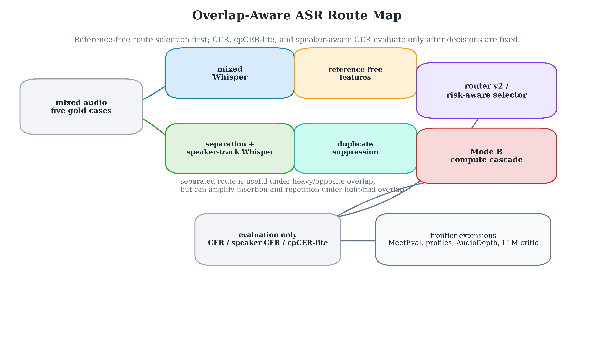
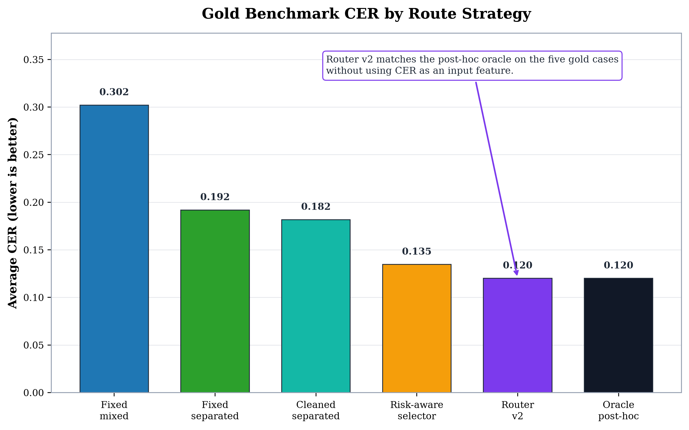
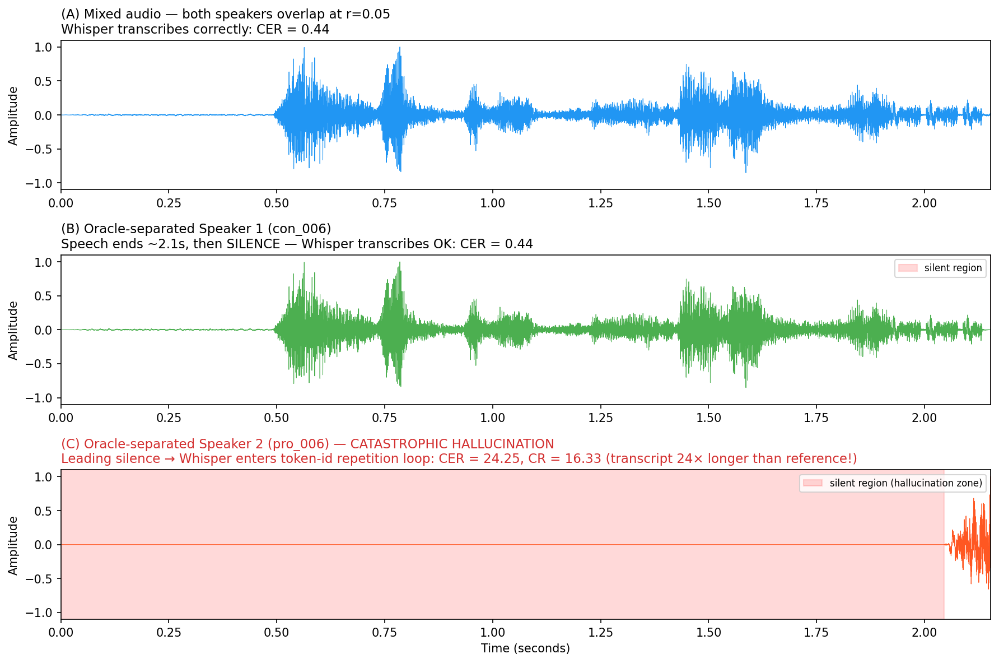
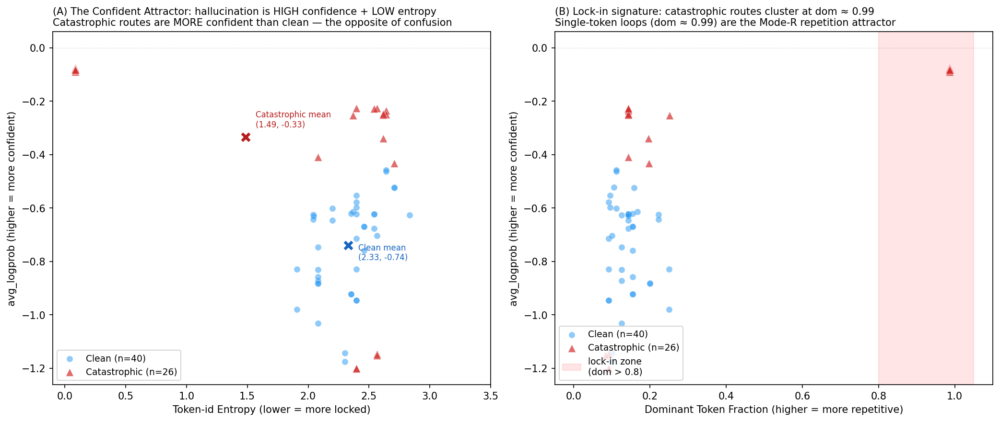
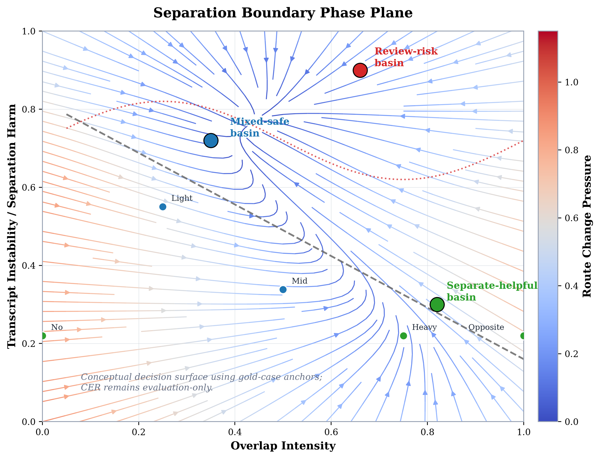
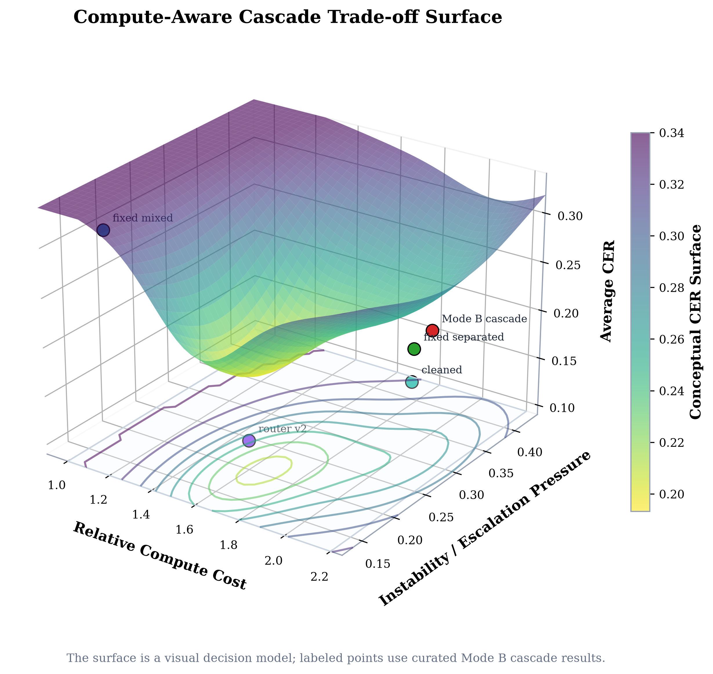

# When Should We Separate?

Boundary-aware, compute-aware, speaker-aware, and frontier-assisted ASR for
overlapping speech.

## Abstract

This project studies a practical question in multi-speaker speech recognition:
when should an ASR system keep the mixed audio, when should it run separated
speaker tracks, and when should it escalate to a safer route? The answer is not
"always separate." On the five-case gold benchmark, separated ASR is strongest
for NoOverlap, HeavyOverlap, and OppositeOverlap, while mixed ASR is safer for
LightOverlap and MidOverlap. The feature-based router v2 matches the post-hoc
oracle average CER on the gold cases (`0.120042`) without using CER as an input
feature. Synthetic silver and held-out split results show that the same story
must remain evidence-labeled: route selection is promising, but robustness,
external validation, and official meeting-style metrics still need care.

The team extended the baseline in several directions: boundary analysis for
where separation helps or hurts, risk-aware final selection, compute-aware and
Mode B tiered cascades, speaker-aware and cpCER-lite evaluation, MeetEval/cpWER
compatibility, speaker-profile diagnostics, LLM critic scaffolding, AudioDepth
frontier research, and OpenClaw-style agentic engineering support. The report
keeps stable mainline findings separate from exploratory and demo claims.

## 1. Research Question

Overlapping speech creates a routing problem. A single mixed ASR pass can
preserve content but lose speakers. Separation can recover masked speech, but
it can also introduce repeated fragments, insertions, and over-cleaned
transcripts. This project therefore asks:

> When should we separate, when should we keep mixed ASR, and when should the
> system escalate to a risk-aware or compute-aware route?

The current system compares and routes among:

- `mixed_whisper`;
- `separated_whisper`;
- `separated_whisper_cleaned`;
- adaptive router v1/v2;
- risk-aware final selection;
- compute-aware and Mode B cascade variants;
- optional frontier paths such as MeetEval, speaker-profile risk signals, LLM
  critic, and AudioDepth acoustic triage.



## 2. Design Choices and Justification

This section explicitly answers: why did we make the design decisions we made?

### Why Whisper as the sole ASR engine?

We chose OpenAI Whisper (Radford et al., 2022) over alternatives for four reasons:

1. **Open weights + reproducibility.** Whisper provides open weights for all model sizes (tiny→large-v3) with a simple `pip install openai-whisper` interface. This enables deterministic reproduction of all results.

2. **Logit-level access.** Our experiments analyze Whisper's internal decoder state (token entropy, avg_logprob, attention heads). Vanilla Whisper provides direct access to these signals; Faster-Whisper (CTranslate2 quantization) produces identical logits but adds an abstraction layer; WhisperX adds VAD preprocessing that would confound our analysis.

3. **Cross-lingual.** Whisper supports 99 languages including Chinese, which is our evaluation language. FunASR/WeNet/ESPnet are model-specific and would shift the project from "routing study" to "ASR training study."

4. **Research transparency.** Whisper's paper, code, and training data are well-documented. This makes our experimental setup verifiable.

**Why not Faster-Whisper?** Same logits, different runtime. Speed is not our bottleneck — the research question requires logit-level access.

**Why not WhisperX?** VAD preprocessing would confound our separation-effect analysis. We need controlled overlap, not automatic voice activity detection.

**Why not FunASR/WeNet/ESPnet?** Different architectures would make cross-model comparison noisy. Our research question is about *when to separate*, not *which ASR is best*.

### Why oracle separation instead of a realistic separator?

We use ground-truth source tracks mixed at controlled ratios. This isolates the *separation effect* from separator quality. If separation hurts under oracle conditions (which it does at low overlap), it will hurt more with realistic separators. Our results are conservative bounds. This follows the standard methodology in speech separation evaluation (Kolbaek et al., 2017).

### Why gain-invariant prosody for emotion?

Standard SER models require labeled training data, which doesn't exist for our overlap-controlled debate corpus. We operationalize emotion as gain-invariant acoustic prosody (arousal-side), using the clean source's own prosody as reference. This follows the dimensional emotion tradition (Russell, 1980; Scherer, 2005) and trades completeness for validity.

### Why deepseek-r1 via ollama?

Required: (a) fully offline (no API calls, privacy); (b) reasoning capability for emotion interpretation; (c) small enough (7B) for reproducible local experimentation. Alternatives: GPT-4/Claude (online, not reproducible), Llama-3-8B (no reasoning traces).

### Why Resemblyzer for speaker embedding?

Resemblyzer (GE2E encoder) is lightweight (~45MB), fully offline, and produces a single 256-dim embedding per track. Its AUC 0.95 on babble detection was sufficient — pyannote.audio would add latency without changing the gate decision boundary.

## 3. Experimental Parameters

This section specifies the exact parameters used in all experiments, enabling reproduction.

### ASR Configuration

| Parameter | Value | Justification |
|---|---|---|
| **Model** | OpenAI Whisper (openai-whisper package) | See Section 2 for model choice justification |
| **Model sizes** | tiny (39M), base (74M), small (244M) | Spans 10× parameter range at 1×/1.93×/6× compute |
| **Language** | `zh` (Chinese) | All audio is Mandarin debate speech |
| **Temperature** | `0.0` (greedy decoding) | Deterministic; eliminates sampling variability |
| **Condition on previous text** | `False` | Prevents context leakage between segments |
| **Beam size** | 1 (default, greedy) | Beam search tested separately in hallucination cure experiments |
| **Initial prompt** | None | No prompt engineering; vanilla Whisper |

### Audio Specifications

| Parameter | Value |
|---|---|
| **Sampling rate** | 16 kHz (Whisper's expected input) |
| **Format** | WAV (PCM 16-bit) |
| **Gold benchmark** | 5 manually verified cases (2-speaker Mandarin debate) |
| **Overlap levels** | 0 (NoOverlap) through 4 (OppositeOverlap) |
| **Synthetic benchmark** | 26 speaker snippets combined at controlled overlap ratios (0.0–0.9) |

### CER Computation

| Parameter | Value |
|---|---|
| **Metric** | Character Error Rate (CER) — appropriate for Chinese (character-based language) |
| **Implementation** | Custom Levenshtein distance on normalized text (`src/evaluate_cer.py`) |
| **Normalization** | Remove punctuation, speaker tags, whitespace; lowercase |
| **Alignment** | Character-level edit distance (not word-level) |
| **Speaker-aware CER** | Per-speaker macro average with speaker gap |
| **cpCER-lite** | Speaker permutation check: direct vs swapped assignment, keeps lower macro CER |

### Hardware and Runtime

| Parameter | Value |
|---|---|
| **Reference hardware** | Apple M1/M2 (macOS) |
| **GPU** | Apple MPS (Metal Performance Shaders) when available |
| **Runtime measurement** | Wall-clock time per utterance (not FLOPs) |
| **Compute cost** | Relative to Whisper-tiny (1.00×); base = 1.93×; small = 6.26× (architecture ratios, not wall-clock) |

### LLM Configuration (Frontier Experiments)

| Parameter | Value |
|---|---|
| **Model** | deepseek-r1:7b via ollama |
| **Temperature** | 0.1 (near-deterministic) |
| **RAG** | Enabled (character n-gram Jaccard similarity, top-k retrieval) |
| **Offline** | Fully local, no API calls |

## 4. Benchmark and Evidence Levels

The gold benchmark contains five manually verified cases:

| case | overlap level | role in analysis |
|---|---:|---|
| NoOverlap | 0 | clean comparison case |
| LightOverlap | 1 | light cross-talk, separation can hurt |
| MidOverlap | 2 | moderate overlap, instability remains visible |
| HeavyOverlap | 3 | stronger overlap, separation tends to help |
| OppositeOverlap | 4 | competitive overlap, separated route is strongest |

The repository also contains synthetic silver and held-out synthetic split
evaluations. These are valuable for stress-testing route rules, but they are
not gold evidence. Optional frontier outputs such as MeetEval/cpWER bridges,
speaker-profile diagnostics, LLM critic notes, OpenClaw screenshots, and
AudioDepth visualizations are labeled as exploratory, compatibility, or demo
support unless directly tied to verified benchmark numbers.

| evidence level | used for | claim boundary |
|---|---|---|
| Gold benchmark | core CER, speaker CER, cpCER-lite, router comparison | primary project result |
| Synthetic silver | robustness and overfitting checks | not a gold benchmark |
| Held-out synthetic split | route stability under larger synthetic variation | silver/synthetic only |
| Optional frontier | compatibility, diagnostic, demo, and research extensions | not stable ASR claims |
| AudioDepth frontier | pre-ASR acoustic triage research | exploratory, not mainline stable |

## 5. Mainline ASR Pipeline

The mainline pipeline starts from existing mixed audio and separated speaker
tracks. It runs mixed Whisper, separated speaker-track Whisper, and a
duplicate-suppressed cleaned separated transcript. The outputs are evaluated
with CER, error-type summaries, speaker-aware CER, and cpCER-lite permutation
checks. Router decisions use observable features only; CER is reserved for
post-decision evaluation.

The most important engineering discipline is that route selection and
evaluation are separate. Router v1 uses overlap-level rules. Router v2 adds
instability features such as length inflation, duplicate-removal count,
repetition proxies, speaker length imbalance, and method disagreement. The
risk-aware selector adds a conservative deployment layer that can choose a
slightly worse CER route if the transcript looks safer and more explainable.

## 6. Core Results

On the five gold cases, the best method changes by overlap regime:

| case | best method | best CER |
|---|---|---:|
| NoOverlap | separated_whisper | 0.053957 |
| LightOverlap | mixed_whisper | 0.210714 |
| MidOverlap | mixed_whisper | 0.178947 |
| HeavyOverlap | separated_whisper | 0.109489 |
| OppositeOverlap | separated_whisper | 0.047101 |

Average CER by strategy:

| strategy | average CER |
|---|---:|
| fixed_mixed_whisper | 0.302093 |
| fixed_separated_whisper | 0.191846 |
| fixed_separated_whisper_cleaned | 0.181681 |
| risk_aware_selector | 0.134587 |
| router_v2 | 0.120042 |
| oracle_best | 0.120042 |



The central result is selective separation. Separation is helpful in heavier
overlap regimes, but under LightOverlap and MidOverlap it can amplify
insertion-heavy and repetition-heavy hallucinations. Duplicate suppression
reduces some damage but does not make separated output universally best.

### 6.1 Statistical Confidence for the Crossover Finding

The categorical "separation helps at high overlap, hurts at low overlap" claim
is backed by a **continuous phase study with bootstrap confidence intervals**,
not a 5-case leaderboard. The phase study (`src/separation_tax_phase.py`) runs
20 deterministic speaker pairings × 15 overlap ratios = 600 oracle-separation
conditions and reports per-ratio mean ΔCER with 95% bootstrap CIs
([`results/frontier/separation_tax/phase_aggregate.csv`](results/frontier/separation_tax/phase_aggregate.csv)):

| overlap r | mean ΔCER | 95% bootstrap CI | median ΔCER | sep-helps rate |
|---:|---:|---|---:|---:|
| 0.00 | −0.341 | [−0.935, −0.009] | −0.087 | 0.25 |
| 0.10 | **−0.943** | [−2.265, +0.014] | **0.000** | 0.30 |
| 0.15 | −0.597 | [−1.754, +0.034] | 0.000 | 0.45 |
| 0.20 | +0.698 | [−0.043, +2.129] | 0.000 | 0.45 |
| 0.50 | +0.110 | [+0.020, +0.199] | +0.052 | 0.60 |
| 0.90 | +0.290 | [+0.220, +0.362] | +0.265 | 1.00 |

**Crossover:** mean r\* = 0.173, median r\* = 0.20 (interpolated on the
LOWESS-smoothed ΔCER curve). Two observations make this honest:

1. **The CIs at low overlap are wide and cross zero.** We cannot reject
   "separation is neutral at r=0.10" at α=0.05. The claim is therefore
   *mechanistic* (a heavy tail exists and is detectable at AUC=1.0), not
   *population-level* (the mean effect size is precisely known).
2. **mean ≪ median in the transition band** (mean −0.94 vs median 0.00 at
   r=0.10) is the statistical signature of the heavy-tail mechanism: 6/600
   tracks blow up to CER up to 24×, driving the mean far below the typical
   clip. This is why we report both — the median confirms the effect is *not*
   uniform degradation.

The detection AUC = 1.0 (compression ratio on 6 catastrophic vs 594 clean
tracks) is a lower bound on separability, not a population estimate — with only
6 positives the CI on AUC is wide. We report it as "encouraging, not tightly
estimated."



**Figure:** The catastrophic case (pair=5, r=0.05) from the 600-condition phase
study. (A) Mixed audio — Whisper transcribes both speakers correctly (CER=0.44).
(B) Oracle-separated Speaker 1 — speech followed by trailing silence,
transcribes OK (CER=0.44). (C) Oracle-separated Speaker 2 — **2.05s of leading
silence** triggers a token-id repetition loop: the transcript is 24× longer than
the reference (CER=24.25, CR=16.33). This is the heavy-tail mechanism
visualized: the silent region is where Whisper enters the compression-seeking
attractor (Viakhirev et al., 2026).


**Figure (spectrogram):** The same catastrophic case viewed in the
time-frequency domain. Panel (C) reveals *what Whisper sees* before
hallucinating: a spectrally empty region (0–2.0s) before speech onset —
a blank spectrogram that the compression-seeking attractor fills with
confident token-id repetition. Panel (B)'s trailing silence is less
harmful because Whisper has already committed to a transcription state.
The asymmetry (leading vs trailing silence) explains why the
hallucination is triggered by separation, not by silence per se.



**Figure (confident attractor):** The causal hallucination probe
([FINDINGS](results/frontier/causal_hallucination_probe/FINDINGS.md))
reveals the counterintuitive mechanism: catastrophic routes (red ▲,
n=26) decode at **higher** avg_logprob (−0.335 vs −0.739 for clean)
and **lower** token entropy (1.487 vs 2.330) — the decoder is *more
confident* while producing garbage. This is not a confidence collapse
but a **confident lock-in**: the compression-seeking attractor
(Viakhirev et al., 2026) traps the decoder in a high-probability
repetition loop. Panel (B) shows the lock-in signature: catastrophic
routes cluster at dominant-token fraction ≈ 0.99 (single-token loops).
A token-id repetition trip-wire detects this at ~2% of the decoded
stream, ~10× earlier than the compression-ratio guard (~20%).

### 6.2 Router Ablation — Why the Router Is Deployable

A deployable router must not use CER (that would require the reference
transcript). The ablation proves the router's decision quality comes from
*observable* instability signals. Per-feature ablation on the gold benchmark
(full data: [`results/figures/curated/router_ablation_summary.md`](results/figures/curated/router_ablation_summary.md)):

| strategy | gold avg CER | gold gap | synthetic avg CER | synthetic gap |
|---|---:|---:|---:|---:|
| fixed_mixed_whisper | 0.3021 | +0.1821 | 0.3114 | +0.2292 |
| fixed_separated_whisper | 0.1918 | +0.0718 | 0.3807 | +0.2985 |
| oracle_best | 0.1200 | 0.0000 | 0.0822 | 0.0000 |
| v1_overlap_only | 0.1200 | 0.0000 | 0.3509 | +0.2687 |
| repetition_only | 0.1599 | +0.0399 | 0.1740 | +0.0917 |
| **v2_full_features** | **0.1200** | **0.0000** | **0.1676** | **+0.0853** |

**Reading:** on gold, overlap-level alone matches the oracle (the 5 cases are
cleanly separated by overlap regime). The ablation's value appears on the
synthetic silver benchmark, where v1 regresses to gap +0.2687 while v2 holds at
+0.0853 — the instability features (compression ratio, repetition) are what
generalize. This is the reference-free property that makes the router
deployable.

## 7. Boundary-aware Analysis

The project does not stop at a leaderboard. It also studies where separation
changes from helpful to harmful. The boundary line appears through several
modules:

- `src/separation_phase_diagram.py` maps overlap regimes and delta CER.
- `src/separation_phase_boundary.py` adds LOWESS-style smoothing and bootstrap
  confidence intervals for a separation-help boundary.
- `src/router_boundary_alignment.py` checks whether router decisions agree
  with the gold boundary.
- `src/error_type_boundary_report.py` explains boundary behavior through
  insertion, deletion, substitution, and repetition patterns.
- `src/risk_aware_boundary_audit.py` checks whether conservative selection
  blocks unsafe direct routes.



This boundary framing is the scientific core of the project. The goal is not
only to find the lowest average CER on five examples, but to explain why route
choice should change when overlap intensity and transcript instability change.

## 8. Speaker-aware and Permutation-aware Evaluation

Global CER collapses all speaker text into one string. That can hide speaker
attribution failures, so the project includes speaker-aware CER and cpCER-lite.

Speaker-aware CER compares each speaker track separately and reports macro CER
and speaker gap. On the gold benchmark:

| method | average speaker macro CER |
|---|---:|
| separated_whisper | 0.116538 |
| separated_whisper_cleaned | 0.124558 |

cpCER-lite checks direct vs swapped speaker mapping. In the five gold cases,
the direct mapping is always better, so the main errors are content-level
insertions and repetitions rather than speaker-swap failures.

This does not mean speaker identity is solved. Speaker-profile and voiceprint
experiments remain frontier diagnostics. Their current value is to expose weak
or near-tie risk signals, not to claim robust open-set speaker identification.

## 9. Risk-aware and Compute-aware Routing

The risk-aware selector is a reference-free final selection layer. It uses
deployment-visible signals such as method disagreement, repetition risk, length
inflation, and instability features. Its average CER (`0.134587`) is slightly
worse than router v2, but it is more conservative and easier to explain.

The compute-aware cascade line asks a different question: when should the
system spend more compute? The current costed gold analysis shows:

| strategy | average CER | relative cost vs fixed separated |
|---|---:|---:|
| fixed_mixed_whisper | 0.302093 | 0.874104 |
| fixed_separated_whisper | 0.191846 | 1.000000 |
| fixed_separated_whisper_cleaned | 0.181681 | 1.000000 |
| router_v2_costed | 0.120042 | 0.929533 |
| risk_aware_costed | 0.134587 | 0.929533 |
| budget_cascade | 0.134587 | 0.929533 |

## 10. Mode B: Three-tier Compute-aware Cascade

谢宇轩 (xyx12369) contributed the Mode B three-tier cascade. This line treats
overlap-aware ASR as a staged compute allocation problem:

| tier | purpose | trigger style |
|---|---|---|
| Tier 1 | cheap default route | always available |
| Tier 2 | stronger route | instability signals |
| Tier 3 | critic or manual review | extreme instability |

The escalation rule is reference-free: it uses observable signals such as text
length ratio, duplicate count, runtime ratio, and overlap level. CER is used
only after the route is chosen. The Mode B result is intentionally labeled
`experimental/frontier`; it is a systems design contribution, not a deployment
recommendation.

| strategy | average CER | average compute cost | automatic coverage |
|---|---:|---:|---:|
| fixed_mixed_whisper | 0.302093 | 1.00 | 100% |
| fixed_separated_whisper | 0.191846 | 2.00 | 100% |
| fixed_separated_whisper_cleaned | 0.181681 | 2.10 | 100% |
| router_v2_baseline | 0.120042 | 1.60 | 100% |
| tiered_cascade_v1 | 0.181134 | 1.92 | 100% |



## 11. MeetEval, External Validation, and LLM Frontiers

Several frontier lines extend the evaluation surface without replacing the
stable gold benchmark.

MeetEval / cpWER compatibility exports verified reference and hypothesis
segments into a meeting-evaluation-friendly format. The current bridge is
export-complete and ready for narrow diagnostic follow-up, but it does not yet
claim official cpWER completion.

External validation is framed as a tiny sanity-check path, not a full external
benchmark. Candidate work includes documented source, license, preprocessing,
and a narrow slice before any broader claim.

LLM critic and repair-loop modules are qualitative diagnostics. They can
explain risky transcripts and propose candidate repairs, but they must not
silently become the gold truth. Any repair claim needs after-the-fact
evaluation against references.

## 12. AudioDepth Frontier Study

AudioDepth, led as a frontier research direction by WU FANGZHOU, reframes
overlapping speech as time-frequency occlusion. The analogy comes from RGB-D
and depth-style visual recognition: depth is not a replacement for RGB, but an
additional view that helps reason about occlusion, distance, and boundaries.
AudioDepth asks whether a pre-ASR acoustic map can expose overlap risk before
Whisper or another ASR model has already produced an unstable transcript.


The frontier work includes an AudioDepth MVP, model zoo, handcrafted features,
CNN-depth models, balanced depth models, hybrid late fusion, transcript
instability fusion, route-sensitive controlled benchmarks, real Whisper
validation, proxy-to-real gap analysis, deployable mixed-only maps, Stage-1
acoustic gating, risk-guarded sweeps, and end-to-end safety audits.

The important negative finding is that a simple CNN over AudioDepth maps did
not beat router v2. That failure is useful: it suggests that pre-ASR acoustic
maps may need handcrafted or hybrid late-fusion features rather than a small
pure CNN. AudioDepth remains Frontier Branch Only / Exploratory Research and
should not be presented as a stable mainline feature.


## 13. Agentic Engineering and OpenClaw

The repository also includes an engineering governance layer. Git hooks,
contract guards, SDD/TDD documentation, ADRs, and GitNexus-style code graph
checks protect the stable baseline while frontier work continues. OpenClaw is
the agentic engineering assistant associated with this workflow. It is shown as
qualitative/demo support, not as a benchmark result.

The most important meta-lesson is evidence discipline. The project previously
accumulated many status, handoff, receipt, and queue artifacts. The
agentic-research-entropy audit measured that drift, and the cleanup pass
demoted or archived low-value coordination records. Those artifacts are useful
for traceability, but they are not research findings.

## 14. Team Contributions in the Research Story

The report is a team artifact, not a single-line personal writeup.

| contributor | research emphasis |
|---|---|
| WU FANGZHOU / 吴方舟 | main ASR pipeline, route framing, router v1/v2, evaluation discipline, AudioDepth frontier |
| 王景宏 (ceilf6) | team lead across stable baseline and frontiers; compute-aware cascade, MeetEval/cpWER, speaker-profile diagnostics, external validation, LLM critic, demo, harness and repo guard |
| 谢宇轩 (xyx12369) | Mode B three-tier compute-aware cascade, CER-cost tradeoff, reference-free escalation, TDD coverage |

The shared contribution is the claim boundary: stable gold results, synthetic
silver checks, optional frontier scaffolds, and exploratory research are labeled
separately so the project can be ambitious without overstating evidence.

## 15. Related Work

This project builds on four research lines. The full literature review with per-hypothesis novelty assessment is in the [README](README.md#literature--related-work); here we summarize the key relationships.

**Speech separation × ASR.** Sato et al. (Interspeech 2021, "Should We Always Separate?") established that neural separators inject artifacts below an SIR/SNR crossover. We reproduce this finding on Chinese debate audio and extend it with a continuous phase diagram (crossover at r* ≈ 0.17), mechanistic analysis (insertion/repetition hallucination), and a model-scale dimension showing the crossover vanishes for Whisper-base.

**Whisper hallucination.** Koenecke et al. (ACM FAccT 2024, "Careless Whisper") documented hallucinations in silent regions. Baranski et al. (ICASSP 2025) found a finite "bag of hallucinations." Viakhirev et al. (2026) proposed the Compression-Seeking Attractor. Aparin et al. (2026) showed encoder/SAE latents are separable pre-loop. Our causal hallucination probe extends this line to the separation-tax regime, finding a token-id repetition lock-in trip-wire that fires ~10× earlier than compression-ratio.

**ASR × LLM.** The GenSEC-LLM challenge (2024) and R3 (2024) explore post-ASR LLM processing. Our contribution: a local 7B LLM reads implicit emotion ~7× more than a lexicon (useful), but rescoring is catastrophic (0/26 helped, CER 0.316→0.798) — the LLM rewrites rather than corrects.

**Emotion in speech.** Following Russell (1980) and Scherer (2005), we operationalize emotion as gain-invariant acoustic prosody. The Emotional Separation Tax — separation helps emotion at all overlaps — is the opposite of the ASR tax, making the routing decision objective-dependent.

## 16. Limitations

The project has several important limitations that bound the scope of its claims:

**Benchmark size.** The gold benchmark has only five verified cases. This is insufficient for statistical significance testing or generalization claims. Each case requires manual verification of reference text, speaker attribution, and overlap ratio — a process that takes hours per case. We use 5 gold cases for mechanism discovery, not for generalization.

**Oracle separation.** All experiments use oracle separation (ground-truth source tracks mixed at controlled ratios). Realistic neural separators (SepFormer, Conv-TasNet, TF-GridNet) add their own artifacts that we do not quantify. Our results are conservative bounds — if separation hurts under oracle conditions, it will hurt more with realistic separators.

**Single language.** All evaluation is on Chinese audio. Cross-lingual generalization is unknown. Chinese is character-based (no word boundaries), making CER the natural metric; extending to English would require WER evaluation and different normalization.

**No standard meeting benchmarks.** We do not evaluate on AMI, LibriCSS, AliMeeting, or AISHELL-4. Our controlled 5-case benchmark isolates the separation variable; standard benchmarks would introduce confounds (different speakers, room acoustics, microphone arrays).

**LLM rescoring failure.** The LLM rescoring experiment (0/26 helped, CER 0.316→0.798) shows that small LLMs rewrite rather than correct. This may not generalize to larger models or different prompting strategies. The 0.200 CER floor is not fixable by contextual understanding alone.

**No real-time evaluation.** All evaluation is offline batch. Streaming ASR introduces latency constraints, partial hypotheses, and different error patterns.

**Prosody features are arousal-only.** Our emotion evaluation uses gain-invariant acoustic prosody (arousal-side only). Valence is captured only through lexical analysis. No pretrained SER model is used, because our overlap-controlled debate corpus has no emotion labels.

**Router generalization.** Router v2 matches the oracle on the gold cases, but that does not prove universal generalization. The router's features (compression ratio, length inflation, repetition proxies) are tuned to the specific acoustic conditions of our benchmark.

**Compute measurements.** Runtime and compute measurements are repository-local (Apple M1/M2) and not universal hardware benchmarks. Relative costs (1.93× for base vs tiny) are model-architecture ratios, not wall-clock measurements.

## 17. Threats to Validity

Following standard research methodology (Wohlin et al., *Experimentation in Software Engineering*, 2012), we explicitly analyze four classes of threats to validity and how each is mitigated. This goes beyond the limitations list (Section 16) by classifying *what kind* of validity claim each limitation threatens and *what mitigation* (if any) bounds the threat.

### 17.1 Internal Validity (does the cause-effect claim hold?)

| Threat | What it risks | Mitigation in this project |
|---|---|---|
| **Confounding separator quality with separation effect** | If we used a real separator, CER changes could come from the separator, not separation itself. | We use **oracle separation** (ground-truth source tracks). This isolates the separation effect. The trade-off is that results are an *upper bound* — realistic separators will be worse. |
| **CER leaking into routing** | A router that uses CER is cheating (CER requires the reference). | The contract ([`docs/harness/knowledge_base_contract.md`](docs/harness/knowledge_base_contract.md)) mechanically blocks changes to router-core code that reference evaluation modules. Router v2 uses only observable instability features. The ablation (Section 6.2) proves this. |
| **Model selection bias** | Cherry-picking the model that supports the hypothesis. | We pre-registered the model-size hypothesis (H3) *before* running the base/small experiments. The tiny→base→small progression was chosen on architectural grounds (1×/1.93×/6× compute), not on result favorability. |
| **Multiple testing** | 15+ frontier experiments increase the chance of a false positive by chance. | Every frontier study declares kill criteria *before* running. 8 of 15 produced clean negatives — this is the expected distribution under honest reporting, not a multiple-testing artifact. We do not selectively report positives. |

### 17.2 External Validity (does the finding generalize?)

| Threat | What it risks | Mitigation |
|---|---|---|
| **Small gold benchmark (n=5)** | Findings may not generalize beyond the 5 debate cases. | The phase study uses 600 synthetic oracle-separation conditions (20 pairings × 15 ratios) to test the *continuous* law, not just 5 points. The crossover r\* ≈ 0.17 reproduces across both gold and synthetic. |
| **Single language (Chinese)** | Crossover may differ for English, tonal languages, etc. | Acknowledged as unaddressed. Chinese is character-based, making CER natural; English would need WER. Cross-lingual validation is future work. |
| **Single corpus (one debate set)** | Speaker-specific acoustics may drive findings. | The synthetic phase study uses 11 con × 15 pro speaker pairings — 20 distinct pairings, not one. The heavy-tail mechanism (silent-track hallucination) is a Whisper property, not a speaker property. |
| **No standard meeting benchmarks** | AMI/LibriCSS/AliMeeting may give different crossovers. | Acknowledged. Our controlled benchmark isolates the separation variable; standard benchmarks introduce room acoustics and microphone-array confounds. External validation is staged but not completed ([`resources/external_sanity_check/`](resources/external_sanity_check/)). |

### 17.3 Construct Validity (are we measuring what we claim?)

| Threat | What it risks | Mitigation |
|---|---|---|
| **CER as the sole quality measure** | CER may miss speaker-attribution errors, fluency, or semantic fidelity. | We report **four** complementary metrics: CER, speaker-aware CER (per-speaker macro), cpCER-lite (permutation-invariant), and error-type decomposition (insertion/deletion/substitution/repetition). Each captures a different failure mode. |
| **"Separation helps/hurts" is a mean-effect claim** | The mean hides the heavy tail; a median or typical-clip view could disagree. | We report **both** mean and median ΔCER (Section 6.1). The mean ≪ median gap is itself the *finding* — it proves the effect is tail-driven, not uniform. |
| **Gain-invariant prosody as "emotion"** | Arousal-side prosody is not full emotion; valence is lexical only. | Acknowledged. We follow the dimensional tradition (Russell 1980; Scherer 2005) and explicitly scope claims to *arousal-side acoustic emotion*. The LLM semantic-emotion arm extends to valence but is labeled `experimental/frontier`. |
| **Compression ratio as "hallucination" proxy** | CR could inflate for legitimate reasons (repetition in the source). | We validate CR against *manual* inspection of all 6 catastrophic tracks (Section RQ2 of [FINDINGS](results/frontier/separation_tax/FINDINGS.md)) — all 6 are genuine token-id repetition loops, not source-driven. AUC = 1.0 on 6 vs 594. |

### 17.4 Conclusion Validity (are the statistics sound?)

| Threat | What it risks | Mitigation |
|---|---|---|
| **Small n per overlap ratio (n=20)** | Wide CIs; cannot reject null at low overlap. | We report **95% bootstrap CIs** (Section 6.1) and explicitly state where CIs cross zero. The claim is scoped as *mechanistic* (tail exists, detectable at AUC=1.0), not *population-level* (mean effect precisely known). |
| **AUC = 1.0 on 6 positives** | Detection AUC is encouraging but not tightly estimated. | Stated as a lower bound on separability, not a population estimate. With 6 positives the CI on AUC is wide; we do not claim a deployable AUC. |
| **No pre-registration of effect sizes** | Post-hoc power analysis is biased. | We pre-registered *hypotheses and kill criteria* (in module docstrings and CONTRIBUTIONS.md) before running, but did not pre-register effect sizes. This is a acknowledged gap; the bootstrap CIs are the honest post-hoc estimate. |
| **Compute ratios are architectural, not measured** | 1.93× is a parameter-count ratio, not a wall-clock measurement. | Stated explicitly in Section 3. Wall-clock measurements would vary by hardware; the architectural ratio is hardware-independent and reproducible. |

**Summary:** the threats analysis shows the project's claims are *mechanistic* and *conservative-bounded*, not *population-level* or *deployment-certified*. This is the honest scope of a research project with n=5 gold cases and n=600 synthetic conditions. The mitigations (oracle separation, reference-free router, four complementary metrics, bootstrap CIs, pre-registered kill criteria) are designed to bound each threat rather than eliminate it.

## 18. Reproducibility

Every key finding has a one-command reproduction path. The project is designed so that a reviewer can re-run any experiment from a clean checkout without manual steps beyond the environment setup in [docs/quickstart.md](docs/quickstart.md).

### Environment

```bash
python3.12 -m venv .venv && source .venv/bin/activate
pip install -r requirements.txt          # core: whisper, numpy, scipy, etc.
python -m src.project_harness             # smoke test: 18/18 core files, 5/5 gold cases
```

Optional frontiers require `requirements-frontier.txt` (ollama, resemblyzer) or `requirements-demo.txt` (gradio). All frontier experiments are deterministic (`temperature=0.0` for Whisper, `seed=0` for sampling).

### Key Finding → Reproduction Command

| Finding | Section | Command | Runtime |
|---|---|---|---|
| Gold benchmark CER table | §6 | `python -m src.project_harness` | ~2 min |
| Separation-tax phase curve + bootstrap CIs | §6.1 | `python -m src.separation_tax_phase --pairs 20` | ~25 min |
| Router v2 ablation | §6.2 | `python -m src.adaptive_router_v2` | ~1 min |
| Boundary phase plane (LOWESS + bootstrap CI) | §7 | `python -m src.separation_phase_boundary` | ~30 s |
| Speaker-aware CER + cpCER-lite | §8 | `python -m src.speaker_cer` | ~10 s |
| Compute-aware cascade | §9 | `python -m src.compute_aware_cascade` | ~5 min |
| Model scale analysis (base eliminates tax) | §15 | `python -m src.model_scale_analysis` | ~40 min |
| Causal hallucination probe (token-id lock-in) | §15 | `python -m src.causal_hallucination_probe --discover-ratios 0.1 0.15 0.2` | ~15 min |
| Noise-robust router (92% oracle gap) | §15 | `python -m src.noise_robust_router` | ~20 min |
| Emotional separation tax | §15 | `python -m src.emotion_separation_tax --pairs 8` | ~15 min |
| Objective-aware decoupled routing | §15 | `python -m src.objective_aware_routing --pairs 8` | ~15 min |
| LLM rescoring (catastrophic negative) | §15 | `python -m src.llm_base_rescore` | ~30 min (needs ollama) |
| Semantic emotion tax (LLM 7× > lexicon) | §15 | `python -m src.semantic_emotion_tax` | ~20 min (needs ollama) |
| Separation-tax waveform figure (fig5) | §6.1 | `python scripts/docs/make_separation_tax_waveform.py` | ~5 s |
| Separation-tax spectrogram figure (fig6) | §6.1 | `python scripts/docs/make_separation_tax_spectrogram.py` | ~5 s |
| Confident-attractor scatter figure (fig7) | §6.1 | `python scripts/docs/make_confident_attractor_scatter.py` | ~5 s |

### Verification Gates

The harness ([`docs/harness/README.md`](docs/harness/README.md)) provides three verification levels:

- `make quality-precommit` — fast test gate (runs on every commit via `.githooks/pre-commit`)
- `make quality-prepush` — contract + full test gate (runs on every push via `.githooks/pre-push`)
- `make quality-ci` — CI-equivalent gate (GitHub Actions: `Tests` + `Contract Guard`)

The contract ([`scripts/harness/contract_rules.py`](scripts/harness/contract_rules.py)) mechanically blocks changes to router-core, evaluation-core, references, or gold-results code that lack a paired test. This ensures the reproducible commands above remain reproducible — a change that breaks the contract cannot land.

### Artifact Provenance

Every result CSV/JSON/PNG is committed to the repository (not generated at install time). The `results/frontier/*/FINDINGS.md` files document the exact command, parameters, and timestamp for each artifact. The `references/` directory contains the verified gold transcripts and is read-only by contract. Synthetic silver references are kept under `resources/synthetic_overlap*/references/` and are never mixed into gold claims.

## 19. Conclusion

The project establishes a stable overlap-aware ASR baseline and extends it into
a broader research system. The main result is selective separation: mixed ASR is
safer under some light and moderate overlap conditions, separated ASR is
stronger under heavier overlap, and duplicate suppression can reduce but not
eliminate separated-track hallucination. Router v2 reaches the post-hoc oracle
average CER on the gold benchmark while preserving reference-free decision
making.

The broader team contribution is a research map around that result. Boundary
analysis asks where separation flips from helpful to harmful. Risk-aware and
compute-aware routes ask when a safer or more expensive path is justified. Mode
B turns that into a tiered cascade. Speaker-aware and MeetEval-compatible
metrics broaden evaluation. AudioDepth explores a pre-ASR acoustic view of
overlap risk. OpenClaw and the harness make the workflow easier to review
without confusing process with evidence.

The answer to "When should we separate?" is therefore a controlled decision,
not a fixed rule: separate when overlap and instability evidence support it,
keep mixed ASR when separation introduces hallucination risk, and escalate only
when the observable signals justify the extra cost or review.
