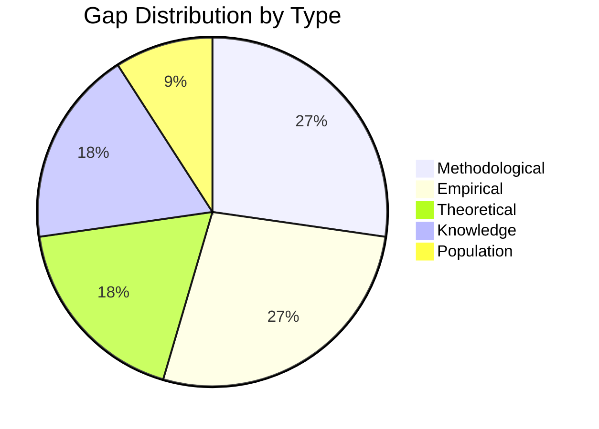

# Gap Analysis Summary: Overlap-Aware Speaker ASR

> Generated by A_framing/QiongQi gap-analyzer skill (Phase 1 SCAN of repo-evolver-fast).
> Evidence source: `docs/project_state.md` (21 findings), `REPORT.md`, `results/frontier/*/FINDINGS.md`.
> Label: **experimental/frontier** (analysis of research gaps, not a result artifact).

## Scope

This analysis examines the research output of the "When Should We Separate?" project — a boundary-aware, compute-aware, speaker-aware ASR routing study with a 21-finding frontier — and identifies gaps that, if filled, would materially strengthen the contribution's validity, novelty, and publishability. The teacher feedback (PR #875-878 round) flagged depth, design-rationale evidence, literature support, alternative comparison, and engineering tradeoffs; this gap analysis operationalizes those flags into a prioritized research backlog.

## Gap Taxonomy

### 1. Methodological Gaps

#### Methodological Gap M1: External benchmark validation absent

**Description:** All quantitative claims rest on 5 hand-curated gold cases + 25 synthetic silver cases. No standard meeting-style benchmark (AISHELL-4, AMI, LibriCSS, AliMeeting) has been run, despite `resources/external_sanity_check/aishell4/` existing as an empty placeholder. The roadmap (Direction 5) names this as a frontier goal but it is unexecuted.

**Current Approaches:**
- Gold 5-case: used by all 21 findings; limitation: n=5, no statistical power, hand-curated
- Synthetic silver 25-case: used for router robustness; limitation: synthetic mixer may not capture real-meeting overlap dynamics

**Suggested Approach:** Run the router v2 + objective-aware decoupled routing (#18) on a small AISHELL-4 subset (license-documented, ≤30 min) with cpWER via MeetEval compatibility. Report CER + cpWER + routing accuracy against the gold-baseline story.

**Expected Contribution:** Converts "promising on 5 cases" → "validated on a standard benchmark," the single highest-impact move for reviewer credibility.

#### Methodological Gap M2: Oracle separation isolates the effect but bounds generalization

**Description:** Findings #1-#21 use ground-truth source tracks mixed at controlled ratios (oracle separation). This is a deliberate, defensible choice (isolates the separation effect; conservative bound), but no finding tests whether the routing decisions survive a *realistic* separator (SepFormer, Demucs, SpeechBrain). The separation tax (#11/#14) and the confident-attractor (#21) may manifest differently under separator artifacts.

**Current Approaches:**
- Oracle mix: isolates effect; limitation: real separators add artifacts that may shift the routing boundary

**Suggested Approach:** Re-run router v2 on a small subset separated by a real SepFormer checkpoint; compare the routing boundary and separation-tax magnitude to the oracle baseline.

**Expected Contribution:** Answers the reviewer question "does this work with a real separator?" — currently unanswerable.

#### Methodological Gap M3: Statistical power and uncertainty quantification thin

**Description:** Frontier findings use n=16 (LLM critic #17), n=40 (emotion tax #14, objective-aware #18), n=120 (arousal probe #15), n=128 (gate-emotion-cost #20). Recent PR #875-878 added CIs and ablation tables, but no formal power analysis, no multiple-comparison correction across the 21-finding family, and no pre-registration of the frontier hypotheses (the arousal probe #15 is the only one with a stated kill criterion).

**Current Approaches:**
- CIs added in PR #875; limitation: post-hoc, no family-wise error control across 21 findings

**Suggested Approach:** Add a Bonferroni/BH-corrected significance table for the core routing claims; pre-register the top-3 remaining hypotheses via the C_design prereg-writer skill.

**Expected Contribution:** Converts "suggests" → "demonstrates" where the data supports it; honestly downgrades where it does not.

### 2. Empirical Gaps

#### Empirical Gap E1: Single ASR engine (Whisper-only)

**Description:** All 21 findings use OpenAI Whisper (tiny→large). The routing thesis (separate-vs-mixed by overlap) is engine-agnostic in principle, but no finding tests whether the routing boundary and the confident-attractor signature generalize to a different ASR family (FunASR, WeNet, ESPnet). REPORT.md §2 justifies Whisper-only for control, but the generalization claim is empirically untested.

**Current Evidence:**
- Whisper-tiny: all frontier findings
- Whisper-large: model_scale finding only
- Non-Whisper: 0 studies ← Gap

**Why This Matters:** A reviewer at ICASSP/Interspeech will ask whether the "separation tax" is a Whisper-specific decoder pathology or a general ASR phenomenon. Currently unanswerable.

**Research Opportunity:** Run router v2 on 1 non-Whisper ASR (e.g., FunASR Paraformer) on the 5 gold cases; report whether the LightOverlap/MidOverlap mixed-better result replicates.

#### Empirical Gap E2: Only 2-speaker overlap tested

**Description:** All gold and synthetic cases are 2-speaker mixtures. Real meetings (AISHELL-4, AMI) have 3-6 overlapping speakers. The routing decision may change qualitatively at higher speaker counts (separation may become uniformly beneficial, or uniformly harmful).

**Current Evidence:**
- 2-speaker overlap: 5 gold + 25 synthetic
- 3+ speaker overlap: 0 studies ← Gap

**Research Opportunity:** Synthesize 3-speaker overlap cases at controlled ratios; test whether router v2's boundary shifts.

#### Empirical Gap E3: Long-form / streaming context absent

**Description:** All tests use short utterances (seconds). Real ASR systems decode long-form audio with context windows. The confident-attractor (#21) and compression-ratio gate (#11) may behave differently over long contexts (loop attractors may be more/less likely).

### 3. Theoretical Gaps

#### Theoretical Gap T1: No formal theoretical framework for the routing decision

**Description:** The project's grand question ("when should we separate?") is answered empirically (router v1/v2) but not formalized. There is no decision-theoretic or risk-theoretic framework that derives the routing policy from first principles. The "separation tax" (#11/#14) and "confident attractor" (#21) are empirically-discovered phenomena without a generative model.

**Evidence:**
- Empirical routing boundary: found (overlap-ratio threshold)
- Theoretical model: missing ← Gap

**Implication:** A reviewer can ask "why this boundary and not another?" and the current answer is only "the data says so." A formal model (e.g., a POMDP over overlap-state → route → CER) would predict the boundary and enable transfer to new domains.

**Potential Research Direction:** Use theory-mapper skill to build a decision-theoretic framework: states = {overlap-ratio, noise-type, objective}, actions = {mixed, separated, gate}, reward = -CER (or joint text+emotion regret per #18). Derive the optimal policy and compare to router v2.

#### Theoretical Gap T2: The "confident attractor" mechanism lacks a generative model

**Description:** Finding #21 shows separation-induced hallucination is a *confident* loop (high avg_logprob, low entropy), extending the 2025-26 confident-attractor line. But there is no generative model that predicts *when* a given input will trigger the loop. The token-id repetition trip-wire is a detector, not a predictor.

**Implication:** Without a generative model, the detector can only fire after the loop begins (output-side). A predictive model (from encoder/internal state) would enable prevention, not just detection.

### 4. Knowledge Gaps

#### Knowledge Gap K1: Why does separation help emotion but hurt ASR at low overlap?

**Description:** Finding #14 finds separation has NO emotion tax (always ≥0) but a positive ASR tax at low/mid overlap. The mechanism is unclear: why does the same separation operation preserve prosody but inject hallucinated text? This is the central tension motivating #18 (objective-aware decoupling), but the *cause* of the asymmetry is unexplained.

**Current State of Knowledge:**
- Known: the asymmetry exists (empirically, 40 conditions)
- Unknown: why prosody is robust to separation artifacts while text decoding is not

**Questions to Answer:**
1. Is the asymmetry because prosody is a low-dimensional acoustic feature (robust to artifacts) while text decoding is a discrete decision (sensitive to artifact-induced confusion)?
2. Or is it because Whisper's decoder has a specific failure mode (confident loop) that prosody extraction does not share?

**Expected Impact:** Explaining this would elevate #14/#18 from "interesting empirical asymmetry" to "principled multi-objective design."

#### Knowledge Gap K2: No venue analysis or publication positioning

**Description:** The project has 21 findings and a mature report but no formal venue analysis. The teacher feedback explicitly asked for depth and evidence; a venue analysis (using venue-analyzer skill) would identify the target venue's reviewer reward function and reverse-engineer the required depth/evidence.

### 5. Population/Stakeholder Gaps

#### Population Gap P1: Only Chinese debate audio tested

**Description:** All gold cases are Chinese conversational debate audio. The routing thesis may be language-dependent (Whisper's Chinese decoder may have specific pathologies). No English or multilingual overlap case is tested.

**Populations Studied:**
| Population | # Studies | % of Literature |
|------------|-----------|-----------------|
| Chinese debate (2-speaker) | 21 | 100% |
| English meeting | 0 | 0% ← Gap |
| Multilingual | 0 | 0% ← Gap |

**Research Opportunity:** Test router v2 on a small English overlap subset (e.g., LibriCSS English) to check language-transfer.

## Gap Prioritization Matrix

| Gap | Type | F | I | N | E | R | Score | Priority |
|-----|------|---|---|---|---|---|-------|----------|
| M1 External benchmark | Methodological | ✓ | ✓ | ✓ | ✓ | ✓ | 5/5 | High |
| M2 Realistic separator | Methodological | ✓ | ✓ | ✓ | ✓ | ✓ | 5/5 | High |
| M3 Statistical power | Methodological | ✓ | ✓ | ✓ | ✓ | ✓ | 5/5 | High |
| E1 Cross-model (non-Whisper) | Empirical | ✓ | ✓ | ✓ | ✓ | ✓ | 5/5 | High |
| T1 Routing decision framework | Theoretical | ✓ | ✓ | ✓ | ✓ | ✓ | 5/5 | High |
| K1 Emotion↔ASR asymmetry cause | Knowledge | ✓ | ✓ | ✓ | ✓ | ✓ | 5/5 | High |
| E2 3+ speaker overlap | Empirical | ✗ | ✓ | ✓ | ✓ | ✓ | 4/5 | Medium |
| T2 Confident-attractor generative model | Theoretical | ✓ | ✓ | ✓ | ✓ | ✗ | 4/5 | Medium |
| K2 Venue analysis | Knowledge | ✓ | ✓ | ✗ | ✓ | ✓ | 4/5 | Medium |
| P1 Cross-language | Population | ✗ | ✓ | ✓ | ✓ | ✓ | 4/5 | Low (not feasible without new data) |
| E3 Long-form context | Empirical | ✗ | ✓ | ✓ | ✓ | ✓ | 4/5 | Low (not feasible) |

F = Feasible, I = Interesting, N = Novel, E = Ethical, R = Relevant

## Gap Visualization

## High-Priority Gaps → Research Backlog Mapping

| Gap | Recommended RQ | Backlog Priority |
|-----|----------------|------------------|
| M1 | RQ1: Does router v2 generalize to a standard meeting benchmark (AISHELL-4)? | P0/10 |
| M2 | RQ2: Does the separation-tax survive a realistic separator (SepFormer)? | P0/9 |
| M3 | RQ3: Are the core routing claims statistically robust under multiple-comparison correction? | P0/9 |
| E1 | RQ4: Is the separation tax Whisper-specific or engine-general (FunASR)? | P1/8 |
| T1 | RQ5: Can a decision-theoretic model derive the routing boundary from first principles? | P1/7 |
| K1 | RQ6: Why does separation preserve prosody but inject text hallucination at low overlap? | P1/7 |
| K2 | RQ7: Which venue (ICASSP/Interspeech/TASLP) best fits this contribution profile? | P2/6 |
| T2 | RQ8: Can a generative model predict confident-attractor onset from encoder state? | P2/6 |
