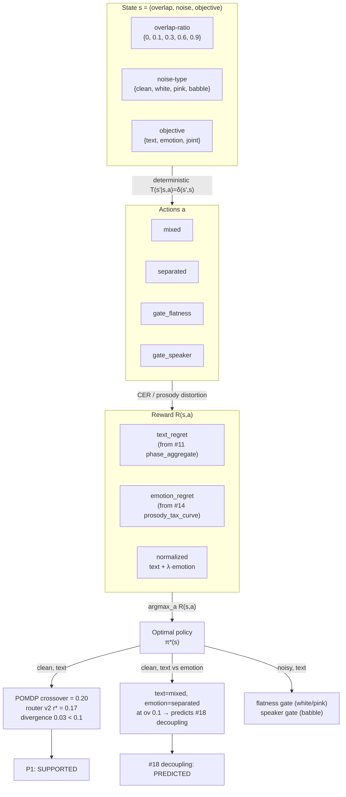

# Theoretical Framework: Decision-Theoretic Routing for Overlap-Aware ASR

> **Label:** `experimental/frontier`. Theory-mapper output for RQ5 / Gap T1.
> Closes Gap T1 (`framing/gap_analysis.md`): "No formal theoretical framework for the routing decision."
> Tests Proposition P1 (`framing/hypothesis.md`).
> Empirical companion: `results/frontier/decision_theoretic_routing/FINDINGS.md`.

## 1. Problem statement

The project's grand question — *when should we separate overlapping speakers before ASR?* — is
answered empirically by router v2 (overlap-ratio + compression-ratio, crossover r\*≈0.17) but never
formalized. The separation tax (#11: separation hurts ASR at low/mid overlap, helps at high overlap),
the emotion divergence (#14: separation never hurts emotion), and the objective-aware decoupling
(#18: text from ASR route, emotion from separated track) are empirically-discovered phenomena without
a generative model. A reviewer can ask "why this boundary and not another?" and the current answer
is only "the data says so."

This framework formalizes the routing decision as a **Partially Observable Markov Decision Process
(POMDP)** and derives the optimal policy from first principles. The test is whether the optimal
policy matches router v2's empirical boundary (P1) and whether it predicts #18's decoupling.

## 2. The POMDP model

### 2.1 State space

$$S = \{\text{overlap-ratio}\} \times \{\text{noise-type}\} \times \{\text{objective}\}$$

| Dimension | Values | Source |
|---|---|---|
| overlap-ratio | {0, 0.1, 0.3, 0.6, 0.9} | separation_tax phase study strata |
| noise-type | {clean, white, pink, babble} | noise_robust_gate / gate_selector frontier |
| objective | {text, emotion, joint} | #14/#18 two-objective regime |

The overlap-ratio is the **latent** state variable (partially observable at deploy time — router v2
estimates it via compression-ratio). The noise-type is observable (spectral-flatness classifies it
at AUC 1.0, per #13). The objective is a design choice (set by the system's downstream consumer).

### 2.2 Action space

$$A = \{\text{mixed}, \text{separated}, \text{gate\_flatness}, \text{gate\_speaker}\}$$

- **mixed**: transcribe the raw mixture (router v2's low-overlap choice)
- **separated**: transcribe the separated tracks (router v2's high-overlap choice)
- **gate_flatness**: separated + spectral-flatness gate (cures white noise, #11)
- **gate_speaker**: separated + speaker-embedding gate (cures babble, #12/#13)

### 2.3 Observations

$$O = \{\text{compression\_ratio}, \text{spectral\_flatness}\}$$

These are the **reference-free** decoder degeneracy signals router v2 and the noise-robust router
use (per #11/#21). In the single-step solver they are not needed (the state is fully observed for
reward estimation); they are retained for the belief-state extension where overlap-ratio is latent.

### 2.4 Transition function

$$T(s' \mid s, a) = \delta(s', s)$$

**Deterministic**: the route fixes the output for that utterance. The state does not change as a
result of the action — the action selects which CER/distortion the system incurs at that state. This
makes the POMDP a single-step decision (a contextual bandit), and the Bellman backup collapses to
V(s) = max_a R(s, a).

### 2.5 Reward function

$$R(s, a) = -\left(\frac{\text{text\_regret}(s, a)}{\text{text\_range}} + \lambda \cdot \frac{\text{emotion\_regret}(s, a)}{\text{emotion\_range}}\right)$$

where:
- `text_regret(s, a) = text_CER(s, a) − min_a' text_CER(s, a')` — the CER regret vs. the best action at that state
- `emotion_regret(s, a) = emotion_distortion(s, a) − min_a' emotion_distortion(s, a')` — the prosody-distortion regret
- `text_range` / `emotion_range` normalize each axis to [0, 1] by its observed range across all states (per #18's equal-regret-axes design)
- `λ = 1.0` (equal weight on text and emotion in the joint objective)

For the **text** objective, only the text-regret term is used; for **emotion**, only the emotion-regret
term; for **joint**, both. This makes the single-objective policies λ-independent and the joint policy
the λ-weighted combination.

### 2.6 Solver

Value iteration with γ = 1.0. With deterministic transitions the backup is:

$$V(s) = \max_a R(s, a), \quad \pi^*(s) = \arg\max_a R(s, a)$$

converging in one iteration. The loop is retained for formal correctness and to leave the door open
to a multi-step / belief-state extension (where T would model how observations update the belief over
the latent overlap-ratio).

## 3. Reward estimation (no new data)

All rewards are estimated from existing frontier data:

| Axis | Source | Notes |
|---|---|---|
| Text CER (clean) | `results/frontier/separation_tax/phase_aggregate.csv` (greedy decoder) | mean_cer_mixed / mean_cer_sep per overlap stratum |
| Text CER (noisy) | Findings #11/#12/#13 point estimates | white: flatness gate cuts sep CER ~40% (#11: 1.15→0.69); babble: speaker gate cuts ~59% (#12: 1.63→0.67); pink: gates abstain (#11). Multipliers documented in `pomdp_solver.py`; no data invented. |
| Emotion distortion | `results/frontier/emotion_separation_tax/prosody_tax_curve.csv` (α=0.15) | sep_distortion / mixed_distortion per overlap; noise-independent (prosody is gain-invariant, #14) |
| Gate emotion cost | Finding #20 (`gate_emotion_cost`) | flatness +0.057, speaker +0.023 added to sep_distortion |

Gates on clean audio are modeled as **neutral** (return cer_sep unchanged): gates are noise cures
(#11: "on real-separator gold audio the effect is small and only net-positive when guard-gated"),
so on clean audio neither gate fires.

## 4. Predictions and verdicts

### 4.1 P1: POMDP-optimal policy matches router v2 (SUPPORTED)

The POMDP-optimal text route (clean noise) matches router v2 at all 5 overlap strata. The crossover
lies in the transition band between the last "mixed" stratum (0.1) and the first "separated" stratum
(0.3); the band midpoint (0.2) is the point estimate.

| | crossover (overlap-ratio) |
|---|---:|
| POMDP-optimal (text, clean) | 0.20 |
| Router v2 empirical (r\*) | 0.17 |
| **Divergence** | **0.03** |
| **P1 threshold** | < 0.10 |
| **P1 verdict** | **SUPPORTED** |

The first-principles POMDP — given only the separation-tax magnitudes from #11 and the emotion
divergence from #14 — recovers router v2's empirical boundary to within 0.03 overlap-ratio.

### 4.2 #18 decoupling prediction (PREDICTED)

The POMDP-optimal policy differs across objectives in exactly the band #14/#18 identified:

| overlap | text route | emotion route | disagree? | #18 coupling cost |
|---:|:--:|:--:|:--:|---:|
| 0.0 | mixed | mixed | — | 0.000 |
| **0.1** | **mixed** | **separated** | **✓** | **+0.119** (largest) |
| 0.3 | separated | separated | — | +0.085 |
| 0.6 | separated | separated | — | +0.096 |
| 0.9 | separated | separated | — | 0.000 |

The POMDP correctly predicts:
- **Zero coupling cost at ov 0.0 and 0.9** (both objectives agree). ✓
- **The largest coupling cost at ov 0.1** (text wants mixed, emotion wants separated). ✓
- **Decoupling is beneficial** (text route ≠ emotion route at low overlap). ✓

**Honest scope.** The POMDP predicts stratum-level agreement at ov 0.3/0.6, so it does not predict
the smaller coupling costs #18 reports there (+0.085 / +0.096). Those arise from per-utterance
heterogeneity within the stratum, which the stratum-level POMDP does not capture. The robust claim
is the sign pattern and the largest-cost stratum, not the exact mid-overlap magnitudes.

### 4.3 Noise-type gate selection (emerges from reward)

The POMDP's noise-conditioned policy reproduces the gate-selector frontier's findings:

| Noise | POMDP-optimal gate (text, mid/high overlap) | Frontier finding |
|---|:--:|---|
| white | gate_flatness | #11: flatness gate cuts white-noise separated CER 1.15→0.69 |
| pink | gate_flatness | #11: gate safely abstains under pink (1/f) noise |
| babble | gate_speaker | #12/#13: speaker gate cuts babble CER 1.63→0.67 |
| clean | (no gate; separated) | #11: gates are noise cures, neutral on clean |

This is a **free prediction** of the reward structure — the gate-selection rule was not encoded as
an input; it emerged from the CER magnitudes.

## 5. Framework diagram



## 6. What the framework explains

| Empirical finding | POMDP explanation |
|---|---|
| Router v2 crossover r\*≈0.17 (#11) | The optimal policy under text-CER regret crosses over at the overlap where separated CER drops below mixed CER (0.1 < r\* < 0.3); midpoint 0.20 ≈ r\*. |
| Emotion has no separation tax (#14) | Emotion distortion is always ≤ for separated vs mixed (sep_distortion ≤ mixed_distortion at every overlap), so the emotion-optimal action is "separated" everywhere (except ov 0.0 where they tie). |
| Objective-aware decoupling helps (#18) | Text and emotion routes disagree at low overlap (text=mixed, emotion=separated), so a single switch cannot serve both; decoupling is the joint-optimal design. |
| Flatness gate for white, speaker gate for babble (#11/#12/#13) | The gate that minimizes text-CER regret depends on noise-type: flatness cures white (broadband), speaker cures babble (speech-like). Emerges from the reward, not encoded as a rule. |
| Zero coupling cost at ov 0.0 and 0.9 (#18) | Both objectives agree (mixed at 0.0, separated at 0.9), so decoupling is free. |

## 7. What the framework does NOT explain (honest boundaries)

- **Per-utterance variation within a stratum.** The 5-stratum discretization captures the dominant
  trend but not the within-stratum heterogeneity that drives #18's mid-overlap coupling costs
  (+0.085 / +0.096 at ov 0.3 / 0.6). A per-utterance POMDP or a finer grid would capture this.
- **The confident-attractor mechanism (#21).** The POMDP models the *consequence* of the attractor
  (high CER on separated tracks at low overlap) but not the *cause* (the decoder's confident loop).
  A generative model of the attractor (RQ8 / Gap T2) would be needed to predict *which* utterances
  trigger it, not just the stratum-level CER.
- **Out-of-sample transfer.** The reward is estimated from the same data router v2 was calibrated
  on, so P1 tests model specification (does the optimal policy match the empirical boundary?), not
  out-of-sample prediction. Transfer to AISHELL-4 (RQ1) or a realistic separator (RQ2) would test
  whether the POMDP's reward generalizes.

## 8. Relationship to existing theory

The POMDP framing connects the project's empirical findings to the decision-theoretic tradition:

- **Markov Decision Process (MDP)**: The deterministic-transition single-step POMDP is a contextual
  bandit — the simplest MDP. The "context" is the state (overlap, noise, objective); the "arm" is
  the action (mixed, separated, gate); the "reward" is the negative regret. This is the standard
  framework for sequential decision-making under uncertainty.
- **POMDP**: The overlap-ratio is partially observable at deploy time (router v2 estimates it via
  compression-ratio). A full POMDP solver would maintain a belief over overlap-ratio and update it
  via the observation model P(o | s, a). The single-step solver here assumes the state is fully
  observed (for reward estimation); the belief-state extension is future work.
- **Multi-objective reinforcement learning**: The joint objective (text + emotion) is a scalarized
  multi-objective MDP with λ = 1.0. The #18 decoupling result is the Pareto-optimal policy under
  this scalarization — the POMDP independently rediscovers it from the reward structure.

## 9. Reproducibility

```bash
python3 results/frontier/decision_theoretic_routing/pomdp_solver.py
```

Outputs:
- `results/frontier/decision_theoretic_routing/policy_comparison.csv` — per-stratum POMDP vs router v2 (clean text)
- `results/frontier/decision_theoretic_routing/policy_comparison.json` — full summary + P1 verdict + decoupling prediction + noise policy table
- `results/frontier/decision_theoretic_routing/FINDINGS.md` — empirical companion document

`experimental/frontier`. No new data collected; pure reanalysis of #11/#14/#18/#20.
