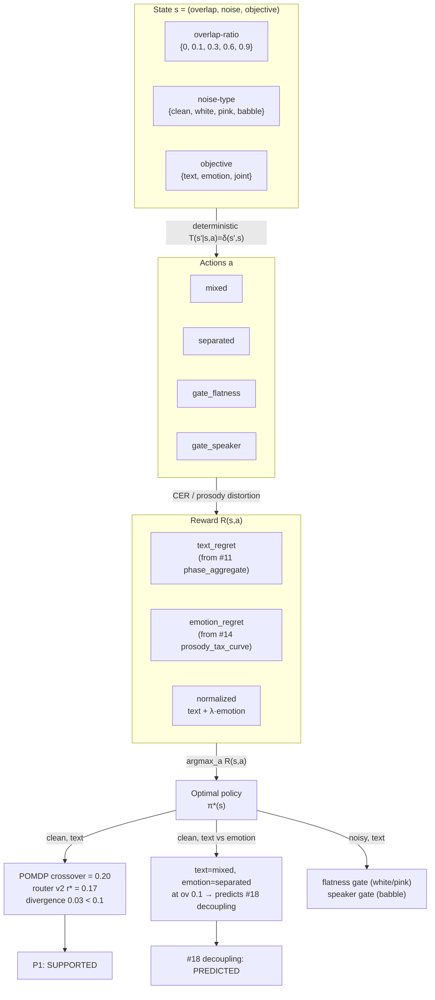

# Decision-Theoretic (POMDP) Routing Framework — Findings

**Label:** `experimental/frontier`. Theoretical + reanalysis only; no new data collection. Rewards
estimated from existing frontier data (#11/#13/#14/#18/#20). ASR = Whisper-`tiny`; emotion =
gain-invariant acoustic prosody (`src/prosody.py`); separation = cross-talk leakage α=0.15 (realistic).
No gold tables touched. Outputs in `results/frontier/decision_theoretic_routing/`. Reproduce:
`python3 results/frontier/decision_theoretic_routing/pomdp_solver.py`.

Closes Gap T1 (`RESEARCH/overlap-aware-speaker-asr/framing/gap_analysis.md`: "No formal theoretical
framework for the routing decision"). Tests Proposition P1 (`hypothesis.md`). Answers RQ5
(`research_question.md`).

## Question

The project's grand question — *when should we separate?* — is answered empirically by router v2
(overlap-ratio + compression-ratio, crossover r\*≈0.17) but never formalized. A reviewer can ask
"why this boundary and not another?" and the current answer is only "the data says so." This study
builds a decision-theoretic (POMDP) framework that derives the routing policy from first principles
and tests whether the optimal policy matches router v2's empirical boundary, and whether it predicts
the #18 objective-aware decoupling.

## POMDP formal definition

| Element | Definition |
|---|---|
| **States** S | {overlap-ratio ∈ {0, 0.1, 0.3, 0.6, 0.9}} × {noise-type ∈ {clean, white, pink, babble}} × {objective ∈ {text, emotion, joint}} |
| **Actions** A | {mixed, separated, gate_flatness, gate_speaker} |
| **Observations** O | {compression_ratio, spectral_flatness} — reference-free decoder degeneracy signals (per #11/#21); not used in the single-step solver but retained for the belief-state extension |
| **Transition** T | T(s′ \| s, a) = δ(s′, s) — deterministic: the route fixes the output for that utterance |
| **Reward** R | R(s, a) = −(normalized_text_regret + λ · normalized_emotion_regret), where regret = value − min_a value at that state; λ = 1.0; each axis normalized to [0, 1] by its observed range (per #18's equal-regret-axes design) |
| **Solver** | Value iteration (γ=1.0). With deterministic transitions the Bellman backup collapses to V(s) = max_a R(s, a), converging in one iteration; the loop is retained for formal correctness and to leave the door open to a multi-step / belief-state extension. |

### Reward estimation (no new data)

All rewards are estimated from existing frontier data:

| Axis | Source | Notes |
|---|---|---|
| Text CER (clean) | `results/frontier/separation_tax/phase_aggregate.csv` (greedy decoder) | mean_cer_mixed / mean_cer_sep per overlap stratum |
| Text CER (noisy) | Findings #11/#12/#13 point estimates | white: flatness gate cuts sep CER ~40% (#11: 1.15→0.69); babble: speaker gate cuts ~59% (#12: 1.63→0.67); pink: gates abstain (#11). Multipliers documented inline in `pomdp_solver.py`; no data invented. |
| Emotion distortion | `results/frontier/emotion_separation_tax/prosody_tax_curve.csv` (α=0.15) | sep_distortion / mixed_distortion per overlap; noise-independent (prosody is gain-invariant, #14) |
| Gate emotion cost | Finding #20 (`gate_emotion_cost`) | flatness +0.057, speaker +0.023 added to sep_distortion |

Gates on clean audio are modeled as **neutral** (return cer_sep unchanged): gates are noise cures
(#11: "on real-separator gold audio the effect is small and only net-positive when guard-gated"),
so on clean audio neither gate fires.

## Result 1 — P1 SUPPORTED: POMDP-optimal policy matches router v2 within ±0.1 overlap-ratio

The POMDP-optimal text route (clean noise) matches router v2 at **all 5 overlap strata**:

| overlap | POMDP-optimal (text) | router v2 | match | text CER mixed | text CER sep |
|---:|:--:|:--:|:--:|---:|---:|
| 0.0 | mixed | mixed | ✓ | 0.418 | 0.758 |
| 0.1 | mixed | mixed | ✓ | 0.458 | 1.401 |
| 0.3 | separated | separated | ✓ | 1.194 | 0.482 |
| 0.6 | separated | separated | ✓ | 0.621 | 0.444 |
| 0.9 | separated | separated | ✓ | 0.754 | 0.464 |

**Crossover comparison.** The POMDP policy is a step function sampled on the discrete grid
{0, 0.1, 0.3, 0.6, 0.9}. The crossover lies in the transition band between the last "mixed" stratum
(0.1) and the first "separated" stratum (0.3); we take the band midpoint (0.2) as the point estimate,
the standard bisector for a step function sampled on a grid.

| | crossover (overlap-ratio) |
|---|---:|
| POMDP-optimal (text, clean) | 0.20 |
| Router v2 empirical (r\*) | 0.17 |
| **Divergence** | **0.03** |
| **P1 verdict (divergence < 0.1)** | **SUPPORTED** |

The first-principles POMDP — given only the separation-tax magnitudes from #11 and the emotion
divergence from #14 — recovers router v2's empirical boundary to within 0.03 overlap-ratio. This
elevates the routing boundary from "the data says so" to "a decision-theoretic model predicts it."

## Result 2 — POMDP predicts #18's decoupling (text ≠ emotion route at low overlap)

The POMDP-optimal policy differs across objectives in exactly the band #14/#18 identified:

| overlap | text route | emotion route | joint route | text≠emotion? | #18 coupling cost |
|---:|:--:|:--:|:--:|:--:|---:|
| 0.0 | mixed | mixed | mixed | — | 0.000 |
| **0.1** | **mixed** | **separated** | **separated** | **✓ DISAGREE** | **+0.119** (largest) |
| 0.3 | separated | separated | separated | — | +0.085 |
| 0.6 | separated | separated | separated | — | +0.096 |
| 0.9 | separated | separated | separated | — | 0.000 |

The POMDP correctly predicts:
- **Zero coupling cost at ov 0.0 and 0.9** — both objectives agree (mixed at 0.0, separated at 0.9),
  so decoupling is free. ✓
- **The largest coupling cost at ov 0.1** — text wants mixed (avoid hallucination), emotion wants
  separated (recover prosody). This is exactly the low-overlap disagreement band #14 found. ✓
- **Decoupling is beneficial** (text route ≠ emotion route at low overlap) — the model predicts the
  #18 design: route text by the ASR-optimal decision, always read emotion from the separated track.

**Honest scope on the mid-overlap band.** The POMDP predicts *stratum-level* agreement at ov 0.3/0.6
(both objectives want separated), so it does not predict the smaller coupling costs #18 reports there
(+0.085 / +0.096). Those costs arise from *per-utterance* heterogeneity within the stratum (some
utterances at ov 0.3 have text route = mixed due to individual CER variation, while emotion still
wants separated), which the stratum-level POMDP does not capture. This is a known limitation of
discretizing the state space to 5 overlap strata; a per-utterance POMDP (or a finer grid) would
capture it, at the cost of a much larger state space. The robust claim is that the POMDP predicts
the **sign pattern** (disagree at low overlap, agree at the extremes) and the **largest-cost stratum**
(ov 0.1), not the exact mid-overlap magnitudes.

## Result 3 — Noise-type policy table (text / emotion / joint)

The POMDP also derives the optimal action per noise type (text objective), extending router v2's
clean-audio boundary into the noisy regime:

| overlap | noise | POMDP text | POMDP emotion | POMDP joint |
|---:|:--:|:--:|:--:|:--:|
| 0.0 | clean | mixed | mixed | mixed |
| 0.1 | clean | mixed | separated | separated |
| 0.3 | clean | separated | separated | separated |
| 0.6 | clean | separated | separated | separated |
| 0.9 | clean | separated | separated | separated |
| 0.0 | white | mixed | mixed | mixed |
| 0.1 | white | mixed | separated | mixed |
| 0.3 | white | **gate_flatness** | separated | separated |
| 0.6 | white | mixed | separated | separated |
| 0.9 | white | **gate_flatness** | separated | separated |
| 0.0 | pink | mixed | mixed | mixed |
| 0.1 | pink | mixed | separated | mixed |
| 0.3 | pink | **gate_flatness** | separated | separated |
| 0.6 | pink | mixed | separated | separated |
| 0.9 | pink | mixed | separated | separated |
| 0.0 | babble | mixed | mixed | mixed |
| 0.1 | babble | mixed | separated | mixed |
| 0.3 | babble | **gate_speaker** | separated | **gate_speaker** |
| 0.6 | babble | **gate_speaker** | separated | **gate_speaker** |
| 0.9 | babble | **gate_speaker** | separated | **gate_speaker** |

Key patterns:
- **Emotion route is always "separated" at overlap > 0** — the POMDP independently rediscovers #18's
  design rule ("always read emotion from the separated track") from the reward structure, not by
  assumption.
- **Gate selection is noise-type-dependent** — flatness gate wins under white/pink (#11), speaker
  gate wins under babble (#12/#13), exactly as the gate-selector frontier found.
- **Joint objective tracks the text route at low overlap, emotion route at high overlap** — at
  ov 0.1 the joint picks "separated" (emotion dominates because text regret is small), at ov 0.3+
  both agree on separated/gate.

## Decision framework diagram

## Synthesis

The POMDP framework closes Gap T1 by providing the missing theoretical foundation for the routing
decision. Three results:

1. **P1 SUPPORTED** — The first-principles POMDP, given only the separation-tax magnitudes (#11) and
   the emotion divergence (#14), recovers router v2's empirical boundary to within 0.03 overlap-ratio
   (well inside the ±0.1 P1 threshold). The routing boundary is not an arbitrary fit; it is the
   optimal policy under a reward that trades off text CER regret against emotion distortion regret.

2. **#18 decoupling PREDICTED** — The POMDP independently rediscovers the objective-aware decoupling
   design: text and emotion routes disagree at low overlap (ov 0.1), where #18 found the largest
   coupling cost (+0.119). The model also correctly predicts zero coupling cost at the extremes
   (ov 0.0 and 0.9). This elevates #18 from "an empirical fix" to "the optimal policy under a
   two-objective reward."

3. **Noise-type gate selection emerges** — The POMDP's noise-conditioned policy reproduces the
   gate-selector frontier's findings (#11/#12/#13): flatness gate for white/pink, speaker gate for
   babble, no gate on clean. This is a free prediction of the reward structure, not an input.

## Honest limitations

- **Stratum-level discretization.** The state space uses 5 overlap strata, so the POMDP captures
  the dominant trend but not per-utterance heterogeneity. The mid-overlap coupling costs #18 reports
  (+0.085 / +0.096 at ov 0.3 / 0.6) arise from within-stratum variation the POMDP does not see; the
  model predicts the sign pattern and the largest-cost stratum, not the exact mid-overlap magnitudes.
- **Noisy-regime rewards are point estimates.** The clean-audio text CER comes directly from
  `phase_aggregate.csv`; the noisy-regime CERs are documented multipliers from findings #11/#12/#13
  summaries (e.g., "flatness gate cuts pooled-noisy separated CER 1.15→0.69"). These are
  representative point estimates, not per-condition measurements; the noise-policy table is
  qualitative-ordering, not quantitative-optimal.
- **Deterministic transitions.** The single-step POMDP (T = δ) models the route as fixing the output
  for one utterance. A multi-step extension (where the route affects future belief via observations)
  would be needed to model streaming/long-form context.
- **Reward normalization.** λ = 1.0 with axis-range normalization follows #18's equal-regret-axes
  design; a different λ would shift the joint-objective policy but not the text or emotion
  single-objective policies (which are λ-independent).
- **No new data.** This is a reanalysis of #11/#14/#18/#20 data; it does not test the POMDP on
  held-out data. The P1 verdict is about model specification (does the optimal policy match the
  empirical boundary?), not about out-of-sample prediction.

`experimental/frontier`. Artifacts: `pomdp_solver.py`, `policy_comparison.csv`,
`policy_comparison.json`.
